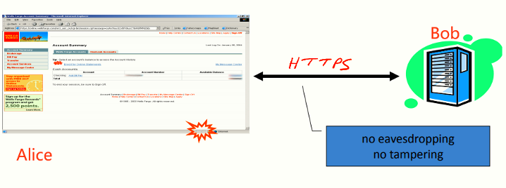
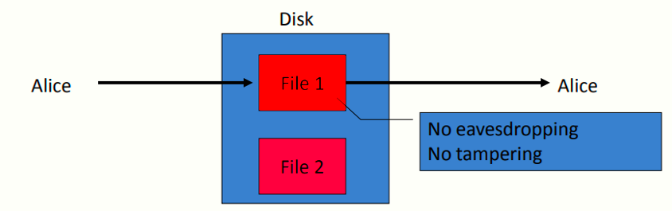
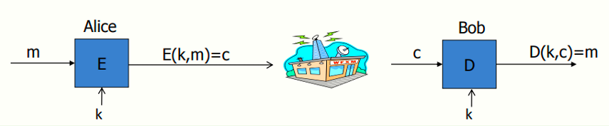

# W1 1-1 Course Overview

## 1、Course objectives:

* 了解密码原语（crypto primitives）的工作原理

* 了解如何正确使用这些密码原语和其安全性原理（会涉及一些定理证明）

目标：能够对密码构造的安全性进行推理，并且能够分析并破坏一些不安全的构造

## 2、Cryptography is everywhere

有计算机的地方密码学都有广泛应用，它是用来保护数据的一种常见工具

（1）加密通信场景：

* web通信：HTTPS

* 无线通信：WPA2（802.11i），GSM机制（移动通信），包括蓝牙也有加密

（2）加密磁盘文件：如EFS，TureCrypt等，即便磁盘丢失也不会导致文件泄露

（3）内容保护：如DVD，蓝光影碟等，DVD使用CSS（Content Scrambling System，比较脆弱），Blu-ray使用AACS

（4）用户认证相关：

## 3、Secure Communication

典型通信模型：C/S模式

通信过程中的期望：no eavesdropping（不被窃听） and no tampering（不被篡改）

## 4、Secure Sockers Layer/TLS

两个主要组成部分：

（1）握手协议（Handshake Protocol）：以公钥密码技术的方式建立共享密钥K，但攻击者对于该K毫不知情，Alice和Bob使用共享密钥K对来进行安全通信

（2）记录子层（Recode Layer）：表明当双方已经有了共享密钥，他们要如何使用该密钥来加密并保护通信数据

## 5、Protected files on disk

与安全通信类似，存储在磁盘上的文件也需要确保no eavesdropping and no tampering，若攻击者窃取了磁盘并修改了上面的数据，则Alice再次读取该磁盘时，Alice应当发现数据已被篡改并忽略这些内容

就本质而言，磁盘文件加密与安全通信是一样的，安全通信是确保通信双方的安全，而加密文件可以视为今天的Alice和明天的Alice通信

## 6、Building Block：symmetric encryption

​	m：plaintext，明文

​	c：ciphertext，密文

​	k：secret key，密钥，长度不定

​	E：Encryption algorithm，加密算法，接受明文和密钥输入，输出对应的密文

​	D：Decryption algorithm，解密算法，接受密文和密钥输入，输出正确的解密明文

对于对称密码技术而言，除了共享密钥外，其他一切均是公开的（包括使用的加密算法及其实现细节），绝对不要使用保密的加密方案，由于密码系统中其他一切内容已经被本领域内众多专家与学者（包括专业的密码破译者）研究分析了很多年，只有被认为是无法破解的算法才会投入使用，无论何时都要选择公开的标准算法来加密数据，反而私人设计的密码方案可能很容易被分析破解

## 7、Use Cases

（1）Single use key：one time key，一次一密，每个密钥仅用于加密一条消息，如email，每次都是用不同的密钥加密，加密信息的方法效率很高，而且实现起来也很简单

（2）Multi use key：many time key，多次密钥，密钥重复使用，如加密许多不同的文件时的密钥

## 8、Things to remember

密码学是：

* 极其强大的工具

* 很多安全机制的基石

密码学的局限性：

* 并不是所有安全问题的解决方案（如软件bug，社工等，此时cryptography也黔驴技穷）

* 只有正确的使用时才是可靠的

* Something you should try to invent yourself（？）