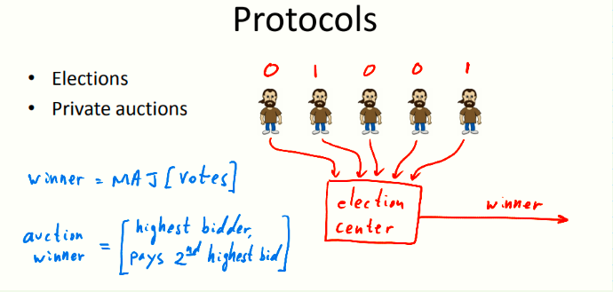

# W1 1-2 What is Cryptograhpy

## 1、Crypto core

（1）Secret key establishment：在安全协议结束时，Alice和Bob能获得相同的共享密钥K，除此之外，Alice会知道她确实是在跟Bob说话，而Bob也确定和他对话的是Alice，对于攻击者而言，即便他能够窃听会话，也不能得知共享密钥

（2）Secure communication：获得安全密钥后，他们就希望能通过密钥加密从而安全通信，而攻击者无法得知通信双方传送的消息，且攻击者若篡改了消息则一定会被发现，方案不仅提供了保密性（confidentiality）还提供了完整性（integrity）

## 2、Crypto can do much more

（1）Digital signatures：一种对现实世界签名的模拟，数字签名的工作方式基于内容的签名函数实现，即便是攻击者试图将签名者的签名从一个文档复制到另一文档，则在新的文档中由于内容不同而无法通过验证

（2）Anonymous communication：用户与服务器通信时包含隐私数据时，此时用户希望匿名交谈而服务器不知晓他是谁，实现这一目的有标准方法mixnet，允许Alice通过一系列代理最终与Bob通信，而通信结束后Bob不知晓通信对方是谁

​	Mixnet基本工作方式：通过一些列的代理（proxy，proxies），使得传输的消息经过适当的加解密后最终发送到Bob，不仅Bob不知晓在与谁通信，甚至中间的代理服务器也不知晓通信双方的信息

​	匿名通信实际上是双向通道，即便Bob不知晓通信对象是谁也能为其响应，且Alice能收到这些响应

​	简单的例子：匿名电子现金，确保Alice的钱使用且仅使用一次，若使用超过一次则会被警察带走（具体实现后续讨论）

## 3、Protocol

密码学的另一些应用，即与一些抽象的协议结合

（1）Elections：票数加密后送入精选中心，竞选结束后中心宣布获胜方而不泄露其他信息（票数仍保密），且中心需要对选民进行验证（是否仅投一次票，是否有投票权等）

（2）Private auctions：上述模型也常用于私人拍卖会上，如Vickrey auction，竞标最高者获胜但仅需要支付第二高竞标者的出价

​	计算结束时，除了得知结果之外（winner和payment），其他一切信息诸如竞标者的个人信息，最高竞标者的出价都应保密，唯独需要公开第二高出价金额和最高竞标者的身份

（3）Secure multi-party computation：多方安全计算

模型1：引入一个可信组织，收集所有个人输出，并且承诺对所有输入保密，仅有可信组织知道，该组织根据输入计算结果并公开，且不公开除结果之外的其他个人信息，但是这个组织搞名堂那就没用了

* 惊讶的事实：如果你能把一个计算交给可信组织完成，则一定可以不需要可信组织来得到结果，即我们可以使任何事情都不需要可信组织插手就能得到结果，仅需要参与者使用某种协议与其他参与者交换信息，协议结束后每个人都江之岛最终结果是什么而对计算过程一无所知（即个体的输入仍然是保密的，但没有可信的权威组织介入），看上去难以置信但确实可行

## 4、Crypto magic

一些难以归为密码学的应用，但确实很神奇

（1）Privately outsourcing computation：私人外包计算，比如Alice使用特殊的加密方案使得它可以发送加密的查询给google，然后基于这种加密特性，使得google可以计算搜索而无需知道原始文本，并将计算结果以加密方式返回给Alice，Alice解密后得到查询结果

​	google全程仅知道加密后的查询内容，并不知道Alice想搜索什么和搜索结果是什么

（2）Zero knowledge (proof of knowledge) 

​	零知识证明，比如Alice有一大整数N，且知道其因子p和q，Bob仅知道N，通过零知识证明Alice可以向Bob证明他知道N的分解而不向Bob透露因子

## 5、A rigorous science

我们描述的每个概念都将严格的按照三个步骤，我们将反反复复地遵循这三个步骤

（1）Precisely specify threat model：对于每个原语，我们要精确定义威胁模型是什么

（2）Propose a construction：接着提出一种构造方案

（3）Prove that breaking construction under threat mode will solve an underlying hard problem：再证明在特定威胁模型条件下，任何攻击者都能攻击这个构造

​	一旦攻击者成功进行攻击，则攻击者也可以解决相对应的一些复杂难题，如果难题足够复杂以至于无法破解，则证明在这个模型下没有攻击者可以破解

如整数分解被普遍认为是个困难问题，因此……