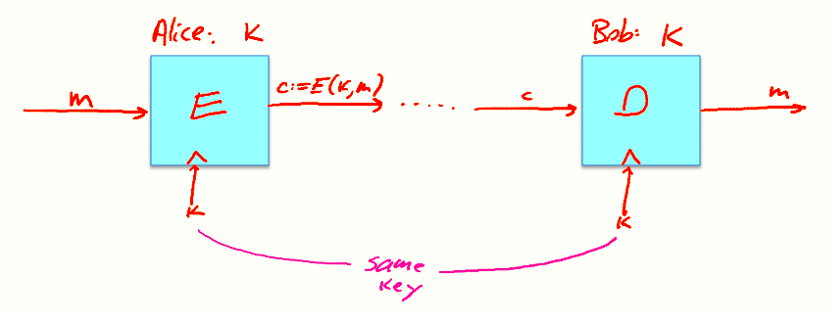

# W1 1-3 History of Cryptography

## 1、History

参考读物：David Kahn “The code breakers” 1996

## 2、Symmetric Ciphers

对于对称密码体系，通信双方使用相同的密钥加解密

## 3、Few history examples

对于现代技术而言，均已不适合实际使用

​	（1）Substitution cipher：替换密码，将26个字母按照一定规则替换为别的字母，映射唯一

​	（2）Caesar Cipher（no key）：shift by 3 （mod 26）

​	（3）对于置换密码而言密钥空间有26！这么多，约等于2^88^

## 4、How to break a substitution cipher

​	（1）Use frequency of English letters：英文中频率最高的字母为e，t和a次之

​	（2）Use frequency of pairs of letters (digrams)：英文中最常出现的两个连续字母为he、an、in、th等，极易受到唯密文攻击（CipherText only attack）

## 5、Vigener cipher (16’th century, Rome)

使用一长度固定的密钥，每次加密与密钥长度相同的明文，以mod 26加法方式加解密

仍然不能抵御频率分析，比如六位长的密钥，将密文分组后，分别统计各个位上的字母频率，密文数量足够大时仍可以分析出密钥

## 6、Rotor Machines (1870-1943)

转轮机的早期例子：the Hebern machine (single rotor)

最著名：Enigma（3-5 rotors），四个转轮的Enigma密钥空间高达26^4^≈2^18^

## 7、Data Encryption Standard (1974)

DES：密钥空间为2^56^，分块大小64 bits

现在最常用：AES（2001），Salsa20（2008）等