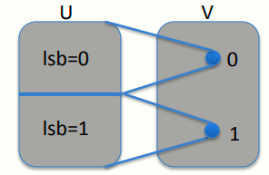
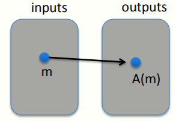
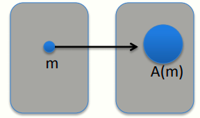
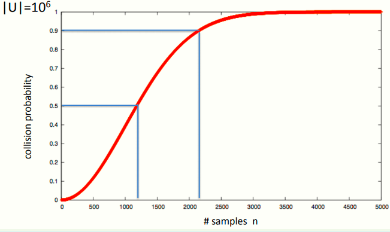

# W1 1-4,5 Discrete Probability

## 1、一些概念

U: finite set (e.g. U = {0,1}^n^ )

Def: Probability distribution P over U is a function P: U ⟶ [0,1] such that Σ P(x) = 1

Uniform distribution: for all x∈U: P(x) = 1/|U|

Point distribution at x0 : P(x0) = 1, ∀x≠x0 : P(x) = 0

Distribution vector: ( P(000), P(001), P(010), … , P(111) ) 

## 2、Events

For a set A ⊆ U: Pr[A] = Σ P(x) ∈ [0,1] （Pr[U]=1）

The set A is called an event

## 3、The union bound

For events A~1~and A~2~，Pr[ A~1~∪A~2~] ≤ Pr[A~1~] + Pr[A~2~]

不等式恒成立，当事件A1和A2相互独立时取等号

## 4、Random Variables

Def: a random variable X is a function X:U⟶V Example: X: {0,1}n^^ ⟶ {0,1} ; X(y) = lsb(y) ∈{0,1} 

More generally: rand. var. X induces a distribution on V: Pr[ X=v] := Pr[ X^-1^ (v)]

## 5、The uniform random variable

Let U be some set, e.g. U = {0,1}^n^

We write r ⟵ U to denote a uniform random variable over U for all a∈U: Pr[ r = a ] = 1/|U| 

## 6、Randomized algorithms

Deterministic algorithm: y ⟵ A(m)，对于每次相同的输入，确定性算法总能得到相同的输出

Randomized algorithm y ⟵ A( m ; r ) where r ⟵ {0,1}^n^，output is a random variable，随机化算法每一次输入往往得到不同的输出

## 7、Independence

Def: events A and B are independent if Pr[ A and B ] = Pr[A] ∙ Pr[B] 

random variables X,Y taking values in V are independent if ∀a,b∈V: Pr[ X=a and Y=b] = Pr[X=a] ∙ Pr[Y=b] 

## 8、XOR

XOR of two strings in {0,1}^n^ is their bit-wise addition mod 2

 Thm:Y a rand. var. over {0,1}^n^ , X an indep. uniform var. on {0,1}^n^ Then Z := Y⨁X is uniform var. on {0,1}^n^

## 9、The birthday paradox

Let r1 , …, rn ∈ U be indep. identically distributed random vars. Thm: when n= 1.2 × |U|^(1/2)^ then Pr[ ∃i≠j: ri = rj ] ≥ 1/2

