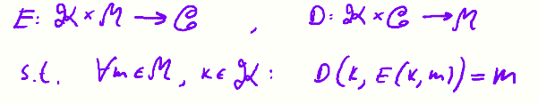
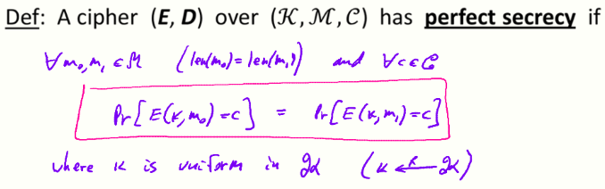

#  W1 2-1 Information Theoretic Security and The One Time Pad

## 1、Symmetric Ciphers: definition

Def：a cipher defined over is a pair of “efficient” algs (E, D) where

## 2、The One Time Pad (Vernam 1917) 

A secure cipher：key = (random bit string as long the message)

You are given a message m and its One Time Pad encryption c，you can compute the OPT key from m and c that k=m⊕c

OTP效率非常高，但是密钥长度会和明文一样长，即通信双方需要传输相当于明文一样长度的密钥，极大降低了通信效率

so，is the OTP secure，what is a secure cipher？

## 3、What is a secure cipher?

攻击者的手段：CT only attack（for now）

可能的安全需求：

* 攻击者不能恢复密钥，即E(k，m)=m would be secure

* 攻击者不能恢复全部的明文，即E(k，m~0~||m~1~)=m~0~||k⊕m~1~ would be secure

## 4、Information Theoretic Security (Shannon 1949)

香农：第一位严格研究密码算法安全性的专家

这意味着：

* 对于给定的密文，不能得知其是由m~0~还是m~1~加密而来的，且对所有消息均成立（for all m~0~，m~1~）

* 如果使用OTP，无论多么强大且聪明的敌手，都不能根据密文得知任何关于明文的消息

对于一个拥有完美安全性的加密算法，不仅仅只·只有唯密文攻击，还包含其他攻击手段（other attacks maybe possible）

​	Lemma：OTP has perfect secrecy

​	Proof：

## 5、The bad news

香农给出了证明：若一个算法有完美安全性，则密钥总数必须大于等于消息空间中消息数目的总数，即完美安全性的算法的密钥长度必须大于等于消息长度

OTP密钥长度恰好等于消息长度，因此是一个最佳的方案，但是由于其冗长的密钥导致并不使实用