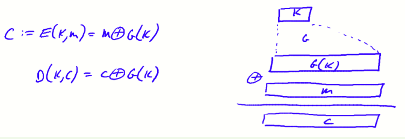
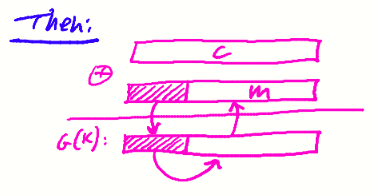
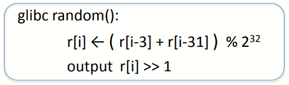

# W1 2-2 Stream Ciphers and Pseudo Random Generators

## 1、Review

Cipher over (K,M,C): a pair of “efficient” algs (E, D) s.t. ∀ m∈M, k∈K: D(k, E(k, m) ) = m 

Weak ciphers: subs. cipher, Vigener, …（由于历史原因不应再使用）

A good cipher: OTP M=C=K={0,1}^n^ E(k, m) = k ⊕ m , D(k, c) = k ⊕ c 

Lemma: OTP has perfect secrecy (i.e. no CT only attacks) ，OTP好用但不实用

Bad news: perfect-secrecy ⇒ key-len ≥ msg-len 

## 2、Stream Ciphers：making OTP practical

思路：以伪随机密钥来代替随机密钥（replace “random” key by “pseudorandom” key）

PRG是一个函数，接受一个s bit的种子（seed）作为输入，并产生n bit的输出，且n远大于s

对于G而言，必须能高效计算并产生输出，但其并不是真正的随机，仅有输入的种子是随机的

## 3、PRG must be unpredictable

假设PRG是可预测的，则任给i，对于G(k)的输出，存在某个算法，使得可由G(k)的前I bit计算出第i+1~n bit，则此时的流密码并不安全

如图所示，若攻击者知道了某些有关于明文的信息（如SMTP协议中常见的前缀消息等），攻击者可以将其与密文XOR计算后得知密钥，再加上上述所假设的PRG的可预测性，攻击者可以通过已知的前若干bit密钥来推测完整的密钥，从而恢复完整消息

Def: PRG is unpredictable if it is not predictable ⇒ ∀i: no “eff” adv. can predict bit (i+1) for “non-neg” ε

## 4、Weaks PRGs（donot use for crypto）

线性同余生成器（Linear congruential generator）：接收三个参数，a，b，p

a，b为整数，p为素数，种子seed≡r[0]，r[i]←a·r[i-1]+b mod p，输出r[i]后，i++

尽管线性同余法得到的输出有很好的统计特性，但是由于其可预测性，仅需要很少的位数即可预测剩余的位，因此不应当再使用