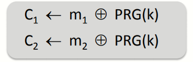
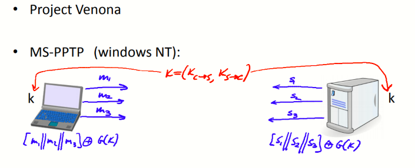
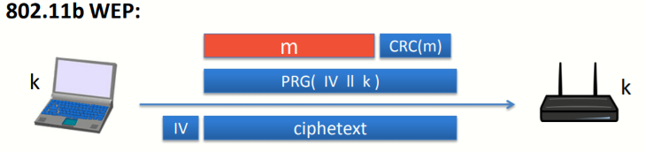
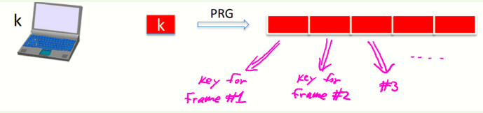
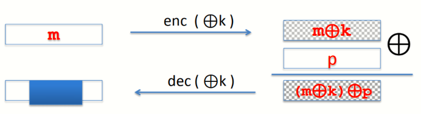
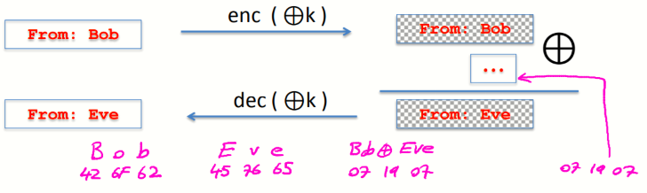

# W1 2-3 Attacks on Stream Ciphers and The One Time Pad

## 1、Review

OTP：使得OTP变实用的方法：PRG

stream cipher：E(k,m) = m ⊕ G(k) , D(k,c) = c ⊕ G(k) 

安全性：PRG必须是不可预测的

## 2、Attack 1: two time pad is insecure

对于使用同一个PRG(k)加密的两个消息，攻击者可以很容易的得到C~1~⊕C~2~=m~1~⊕m~2~，由于英文存在大量冗余，足以让攻击者从两段明文消息的异或值还原出分别还原出两段消息，若使用ASCII编码，由于ASCII编码也存在冗余，也可以还原出消息

因此攻击者用同一密码本对多段消息拦截密文，最终可以很轻易地还原明文，因此一次性密码本绝不可以使用超过一次

现实世界的失败案例：

* Venona计划的密码本通过掷骰子来产生但是每次都掷骰子太麻烦因此使用同一个密码本加密了大量消息，最后惨遭破解

* MS-PPTP（windows NT）：若客户端和服务端均使用同一个PRG(k)，则导致了两次密码本，因此对于上述通信模型，S→C和C→S需要不同的PRG(k)

* 802.11b WEP：在WEP中，初始向量IV为24 bits，加密模型如上图所示，每次通信时协议都会将IV自增后作为PRG的一部分参数，由于IV长度受限，在2^24^（约为16M）个消息后会回到最初的IV，若继续使用则会导致两次密码本

  部分802.11的芯片在断电后重新加电，会使得IV直接从0开始并用于下一个消息载荷的加密

对于PRG的输入IV||k，IV总是在一定范围内重复（可能由于断电后立即重复，或在达到最大时重复），且IV处理过程并不是随机的， 仅仅是简单的每次递增1，非常容易由一个IV推测出后续消息使用的IV，且密钥k总是以固定的104 bits种子作为PRG的输入的后缀出现，综上，攻击者可以很轻易的得到两次PRG的关系从而破解算法

总之，WEP很容易导致两次密码本（F、M、S三个人在2001年通过1M个消息即可恢复出明文，现在仅需要大约40k个消息即可攻破WEP）

## 3、A better construction

使用k作为PRG的种子生成一个足够长的随机数作为密钥，对于每个消息帧，使用这个密钥的不同部分，从而使得每个消息帧都有独立的密钥，来防止上述WEP中导致的重复密钥

## 4、Another example：disk encryption

对于磁盘文件的加密，由于磁盘的特性，文件会保存在磁盘上不同的块中，起初攻击者并不知晓加密的内容，某次用户修改了文件，且仅修改了文件的一小部分，若用户使用的加密算法不妥当，磁盘上仅有被修改的那一块发生了变化，则会导致安全问题

即便是攻击者不知道修改前或修改后的内容，也不知道修改了什么，但攻击者知道这一块发生了修改，而其他部分均是一致的，从而产生信息泄露

理想情况下。即便是文件仅修改了1 bit，也应导致整个文件的完全修改，至少应把整个块修改

## 5、Two time pad：summary

永远不要在流密码中多次使用同一个密钥

* 对于网络通信：每个新的会话（session）可以协商新的密钥（如TLS）

* 对于磁盘加密：一般来说磁盘加密不使用流密码

## 6、Attack 2：no intergrity（OTP is malleable）

事实上一次性密码本和流密码并未提供完整性，仅在密钥仅使用一次的情况下提供保密性而已

事实上修改密文很容易，且会对明文造成相应的效果（即延展性）

对于上述方案，若加密后再XOR一个消息p，则解密得到的消息为m XOR p，而接收方并不能检测出这个对密文的改动（undetected）并且能对产生明文产生影响

如图，攻击者不一定知道明文内容，但是可以主动修改密文，使之与特定的p异或，而接收者并不会发现这个修改