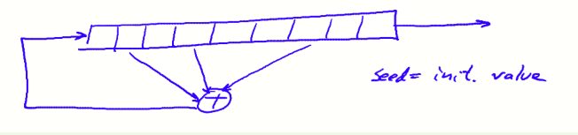
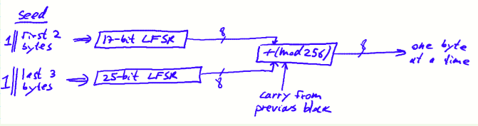
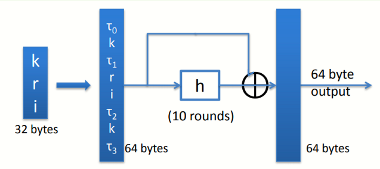

# W1 2-4 Real-World Stream Ciphers

## 1、Old example (software): RC4 (1987) 

RC4接收变长的seed作为输入密钥（如128 bits），并将其扩展至2048 bits，之后进行简单的迭代，每次迭代产生1字节输出，迭代可以无限运行并产生输出

RC4广泛用于一些协议如HTTPS和WEP

缺陷：

1. RC4的输出的第二字节为0的概率为2/256，即Pr[2nd bytes =0]=2/256，（正常来说应该为1/256），因此导致使用RC4来加密消息时，其实第二字节并没有被很好的加密，若使用RC4，最好忽略前256字节，从第257字节开始使用

2. 如果观察很长的RC4输出，字节序00的概率为1/256^2^+1/256^3^（如果RC4是完全随机的，这个概率应该是1/256^2^），这个概率偏差会在RC4加密若干GB的数据后出现，同时这个缺陷可以用于预测生成器

3. 相关密钥攻击，与上一节的WEP类似

## 2、Old example (hardware): CSS (badly broken) 

content scrambling system，用于加密DVD的流密码算法，CSS存在很明显的缺陷，可以被很轻易地破解

CSS基于线性反馈移位寄存器（Linear feedback shift register，LFSR），结构大致如下图所示

DVD encryption（CSS）采用2个LFSR，GSM encryption（A5/1或A5/2）采用三个LFSR，Bluetooth（E0）采用四个，均有严重的缺陷

CSS种子为40 bits（5字节），分为前2字节和后3字节两个部分，分别与1进行拼接后放入两个LFSR，两个LFSR分别进行8次迭代，分别产生8 bits输出，之后通过加法器进行mod 256加并忽略进位（但进位会参与到下一数据块的加法中），这样每轮产生1字节的输出

CSS很容易被破解（期望大约是2^17^轮），由于DVD加密采用的文件格式为MPEG，因此可以知道明文的一部分前缀（假设知道20字节前缀），接着推测第一个LFSR的2-17 bits，运行第一个LFSR得到20字节输出，如果猜对了第一段LFSR的数据，由于CSS系统的特性，结合已知的前缀可以得到第二段LFSR的前20字节，不断猜测可以得到两个LFSR的初始状态，从而推测CSS后续的输出，从而解密DVD

## 3、Modern stream ciphers: eStream（2008）

这个项目有五种不同的加密算法，下列其中之一

生成器PRG: {0,1}^s^ × R ⟶ {0,1}^n^，且n远大于s，其中R为一nonce

nonce：对于给定的密钥，nonce是一个用不重复的数值

加密算法E(k, m ; r) = m ⊕ PRG(k ; r)，由于nonce的特性，使得你可以重用密钥k而(k,r)序列不会被使用超过一次

## 4、eStream: Salsa 20 (SoftWare+HardWare)

 Salsa20: {0,1}^(128 or 256)^ × {0,1}^64^ ⟶ {0,1}^n^ (max n = 273 bits)

Salsa20( k ; r) := H( k , (r, 0)) ll H( k , (r, 1)) ll …

k 128 bits为密钥，r为64 bits nonce，i为64 bits index（类似于counter），τ为一系列32 bits常数，函数h为一可逆函数（invertible function），将上述64字节迭代10次后产生64字节输出，由于h是可逆函数，因此最后一轮结束后需要与初始64字节异或来防止逆向

Salsa性能很好，因此软硬件均可实现，其他现代流密码算法如Sosemanuk也有非常好的性能和安全性，因此不要使用RC4等又不安全效率又低的算法

Salsa在Crypto++ 5.6.0 [Wei Dai]上有