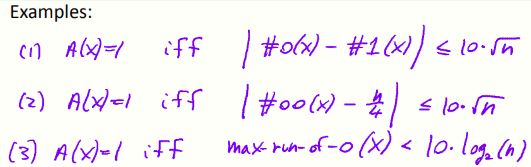
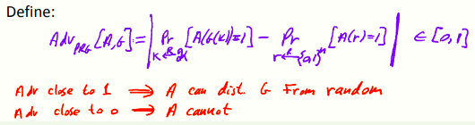
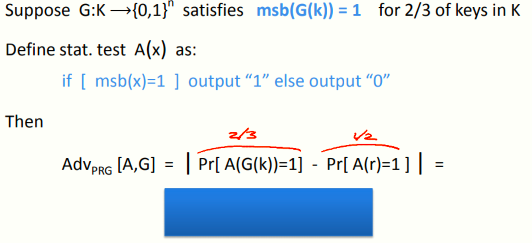
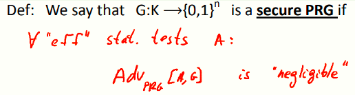
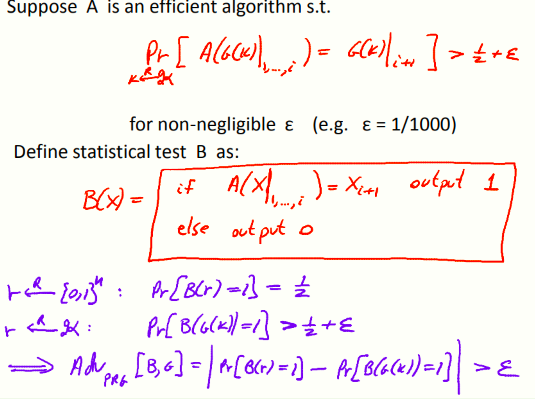
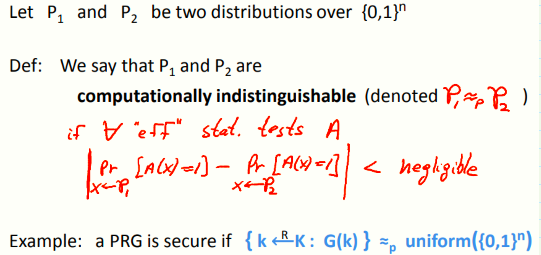

 # W1 2-5 PRG Security Definitions

## 1、PRG

G:K ⟶ {0,1}^n^ be a PRG

我们期望所有可能生成的串是等概的（indistinguishable distribution），我们定义的G仅能生成伪随机分布（pseudo random distribution），是因为种种空间非常小，导致G的输出仅占全部空间的很小一部分（{0，1}^n^的很小的子集）

## 2、Statistical Tests

Statistical test on {0,1}^n^ : an alg. A s.t. A(x) outputs “0” or “1” ，输入n bits串，输出0表示这个串并不是随机的，输出1表示是随机的，例子如下

1. S对于给定的串x，当且仅当其包含的0的个数与1的个数的差小于等于10倍根号n时，A输出1（即0和1的个数差的不是太多，10倍根号n只是举例，实际上不一定是这个值）

2. 对于给定的串x，当且仅当其连续的00出现的次数与n/4的差小于……

3. 当且仅当串中最长的连续的0的个数小于10倍lgn时，A输出1

## 3、Advantage

如何说明统计检验算法是好是坏？

Let G:K ⟶{0,1}^n^ be a PRG and A a stat. test on {0,1}^n^

定义如下：统计检验算法A的Advantage为：对于密钥空间K中随机选择的k值，A[G(k)] 输出1的概率与以真随机序列作为输入的A(r)输出1的概率的差值绝对值，Adv越接近1说明统计检验可以将G和真随机区分开来，越接近0说明不能区分

统计检验的目的：判断一个PRG是否能产生优秀的伪随机序列，如果难以区分其产生的串与真随机串，则表明是个安全的PRG

一个简单的例子

上述例子表明，A的Adv为1/6（仍然是个较大的数字），说明A仍然可以将G和真随机区分开来（breaks the generator G with advantage 1/6）

## 4、Secure PRGs: crypto definition

对于安全的PRG，其对任何有效的统计检验A，其优势Adv均可忽略不计（即输出一个非常接近于0的数，无法将其与真随机区分开来）

课后思考：是否存在可证明安全的PRG？目前未知，但如果证明了某个特定的PRG是安全的，意味着P≠NP

## 5、Easy fact: a secure PRG is unpredictable 

PRG可预测意味着PRG其实并不安全

其中alg A，对于输入G(k)的前i bit，预测第i+1 bit的概率大于1/2，alg B对于alg A预测成功时输出1，否则输出0

对于真随机序列，alg B输出1的概率为确定的1/2，而对于G(k)则是大于1/2，因此Adv[B,G]大于一个正数ε

上述例子表明：若alg A可以以ε的优势预测下一bit，则alg B可以以ε的优势区分之，即若A是优秀的预测算法，则B是优秀的统计检验算法来打破这个生成器

或者换个说法，如果G是个优秀的生成器，则意味着没有优秀的统计检验算法

## 6、Thm (Yao’82): an unpredictable PRG is secure

Let G:K ⟶{0,1}^n^ be PRG 

“Thm”: if ∀ i ∈ ,0, … , n-1} PRG G is unpredictable at pos. i then G is a secure PRG.

如果“下一位预测器”不能将G和真随机区别开来，则没有统计检验算法可以做到

一个更普遍的说法：两个分布在计算上不可区分

