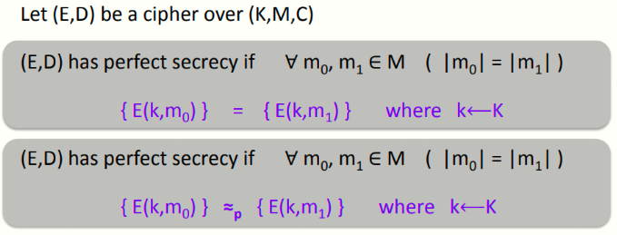
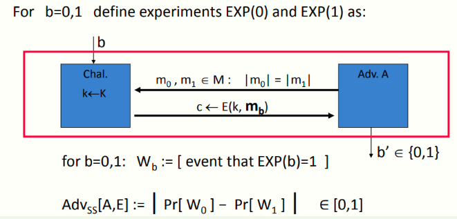
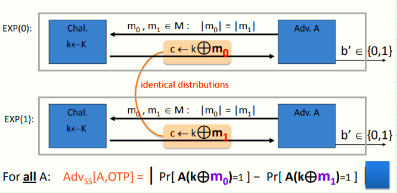

 # W1 2-6 Semantic security

## 1、What is a secure cipher? 

攻击者的能力：获取一段密文

可能的安全需求

1. 攻击者不能恢复密钥

2. 攻击者不能恢复全部的明文

香农的思路：密文不应反应出明文的任何信息（已知明文不能得出1 bit或者预测任何任何明文消息）

## 2、Shannon’s perfect secrecy

1. 对于等长的消息m0和m1和来自密钥空间K的密钥k，E(k,m~0~) 和E(k,m~1~)的分布应该是相同的，因此攻击者不仅不知道我们加密的消息是m~0~还是m~1~，同时也不知道消息的内容（但是这个定义要求非常严格，需要很长的密钥，短密钥在特定的流密码中无法满足如此严格的定义）

2. 稍微弱化一点的定义：不要求完全相同的分布，可以是计算上不可区分的分布（但条件还是稍微有些严格以至于难以满足）

3. 再增加一些约束条件：即条件不需满足任给的m~0~，m~1~，只需要满足特定的一组m~0~，m~1~（即向攻击者展示的一组）

## 3、Semantic Security (one-time key)

定义两个试验EXP(0)和EXP(1)，分别代表攻击者得到了由k加密后的m~0~和m~1~

Wb(b=0,1)表示事件：对于EXP(b)，攻击者输出1

如果说攻击者对于EXP(0)和EXP(1)均有相同概率输出1，则意味着在攻击者视角两个试验是一致的（即无法区分），若对于两个试验攻击者输出1的概率有显著差别，则表明他可以区分两个试验

语义安全优势：AdvSS[A,E] = | Pr[ W~0~]+ − Pr[ W~1~] |，取值介于0和1之间，若Adv接近于1，则表明攻击者有能力将加密后的m~0~和m~1~区分开来

严格定义：E is semantically secure if for all "efficient" A AdvSS[A,E] is negligible，即对于所有的高效的攻击者而言，其优势均可忽略不计（没有高效的攻击者可以将加密后的m~0~和m~1~区分开来）

## 4、Examples

假设A总是可以根据密文推测出明文的最后一位，消息m~0~和m~1~分别代表最低为为0和1的消息

由于A可以根据密文推测出消息的最低位，因此他总是可以将m~0~和m~1~区分开来，因此优势为1（即攻击者完全攻破了该系统）

上述例子表明，即便是攻击者可以得到关于明文的一位信息，系统也已经完全不安全，语义安全要求高效的攻击者不能得到关于明文的任何信息

## 5、OTP is semantically secure

对于所有的A而言，其优势均为0，因此OTP是语义安全的（k⊕m~0~与k⊕m~1~是同分布的，攻击者无法将两者区分开来）