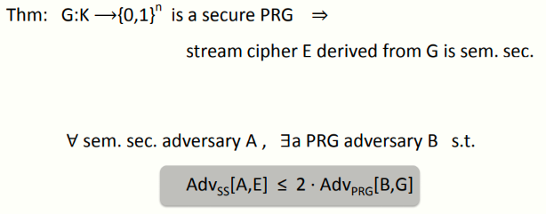
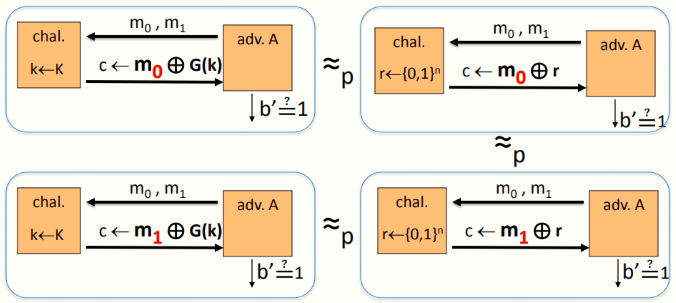
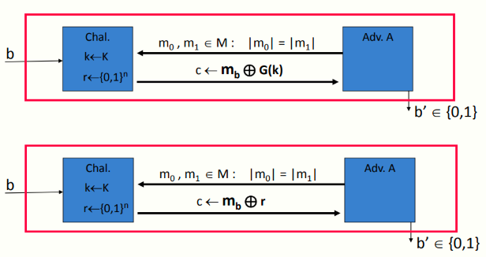
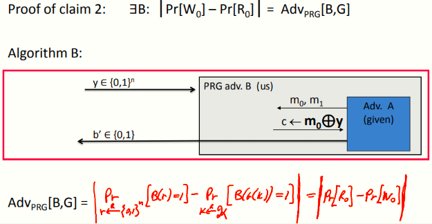

# W1 2-7 Stream Ciphers are Semantically Secure

## 1、Stream ciphers are semantically secure

定理：用安全的PRG产生的流密钥进行流加密是语义安全的（语义安全SS，不是香农的完美安全Perfect Security）

## 2、Proof: intuition

比较直观的证明如下：

对于真随机串r和PRG生成的串G(k)，如果PRG是安全的，则攻击者无法区分挑战者到底使用的是真随机还是PRG

 

符号说明：

* W~b~：在伪随机密码本下的事件（原始的语义安全游戏的事件）

* R~b~：在一次性密码本下的事件（更换为OTP后的游戏的事件）

* A：语义安全的攻击者

