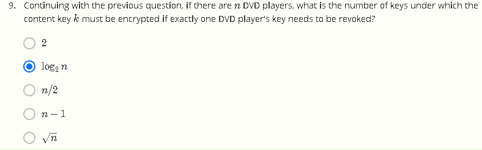

 # W1 Problem Set && Programming Assignment

## Q1：

密文看上去像随机的字符串，因此应当在加密前就进行压缩

## Q2：

## Q3:

G(k~1~)和G(k~2~))同时为1时，A输出1 

## Q4：

对于经理1和经理2而言，可以用k1和k1'解密，对于经理1和经理3，可以用k~2~和k~2~'解密，对于经理2和经理3，可以用k~2~和k~2~'解密

## Q5：

与OTP一样，只有一个密钥将给定的消息映射到密文，因此是完美安全的

## Q6：

 

## Q7：

6c73d5240a948c86981bc2808548，密钥不变，明文消息仅有最后三个字符不相同，只需要计算Hex串的最后六位

## Q8：

key~1~需要加密（确保key~0~的左子树加密而不影响右子树），key~6~需要加密（确保key~2~的右子树加密而不影响右子树)，key~11~和key~26~需要加密（若加密5则相当于也加密了25），因此，1、6、11、26需要加密

## Q9：

满二叉树，从根至叶节点每层需要加密一个key，共计lgn个key

## Q10：

同Q8，key4、6、11、15、17、26需要加密

## Programming Assignment：Many Time Pad

Let us see what goes wrong when a stream cipher key is used more than once. Below are eleven hex-encoded ciphertexts that are the result of encrypting eleven plaintexts with a stream cipher, all with the same stream cipher key. Your goal is to decrypt the last ciphertext, and submit the secret message within it as solution. 

Hint: XOR the ciphertexts together, and consider what happens when a space is XORed with a character in [a-zA-Z]. 

ciphertext #1: 315c4eeaa8b5f8aaf9174145bf43e1784b8fa00dc71d885a804e5ee9fa40b16349c146fb778cdf2d3aff021dff f5b403b510d0d0455468aeb98622b137dae857553ccd8883a7bc37520e06e515d22c954eba5025b8cc57e e59418ce7dc6bc41556bdb36bbca3e8774301fbcaa3b83b220809560987815f65286764703de0f3d524400 a19b159610b11ef3e 

ciphertext #2: 234c02ecbbfbafa3ed18510abd11fa724fcda2018a1a8342cf064bbde548b12b07df44ba7191d9606ef4081ff de5ad46a5069d9f7f543bedb9c861bf29c7e205132eda9382b0bc2c5c4b45f919cf3a9f1cb74151f6d551f44 80c82b2cb24cc5b028aa76eb7b4ab24171ab3cdadb8356f

ciphertext #3: 32510ba9a7b2bba9b8005d43a304b5714cc0bb0c8a34884dd91304b8ad40b62b07df44ba6e9d8a2368e51 d04e0e7b207b70b9b8261112bacb6c866a232dfe257527dc29398f5f3251a0d47e503c66e935de81230b59 b7afb5f41afa8d661cb

 

ciphertext #4: 32510ba9aab2a8a4fd06414fb517b5605cc0aa0dc91a8908c2064ba8ad5ea06a029056f47a8ad3306ef5021 eafe1ac01a81197847a5c68a1b78769a37bc8f4575432c198ccb4ef63590256e305cd3a9544ee4160ead45a ef520489e7da7d835402bca670bda8eb775200b8dabbba246b130f040d8ec6447e2c767f3d30ed81ea2e4c 1404e1315a1010e7229be6636aaa

 

ciphertext #5: 3f561ba9adb4b6ebec54424ba317b564418fac0dd35f8c08d31a1fe9e24fe56808c213f17c81d9607cee021d afe1e001b21ade877a5e68bea88d61b93ac5ee0d562e8e9582f5ef375f0a4ae20ed86e935de81230b59b73f b4302cd95d770c65b40aaa065f2a5e33a5a0bb5dcaba43722130f042f8ec85b7c2070

 

ciphertext #6: 32510bfbacfbb9befd54415da243e1695ecabd58c519cd4bd2061bbde24eb76a19d84aba34d8de287be84 d07e7e9a30ee714979c7e1123a8bd9822a33ecaf512472e8e8f8db3f9635c1949e640c621854eba0d79eccf 52ff111284b4cc61d11902aebc66f2b2e436434eacc0aba938220b084800c2ca4e693522643573b2c4ce350 50b0cf774201f0fe52ac9f26d71b6cf61a711cc229f77ace7aa88a2f19983122b11be87a59c355d25f8e4

 

ciphertext #7: 32510bfbacfbb9befd54415da243e1695ecabd58c519cd4bd90f1fa6ea5ba47b01c909ba7696cf606ef40c04 afe1ac0aa8148dd066592ded9f8774b529c7ea125d298e8883f5e9305f4b44f915cb2bd05af51373fd9b4af5 11039fa2d96f83414aaaf261bda2e97b170fb5cce2a53e675c154c0d9681596934777e2275b381ce2e40582 afe67650b13e72287ff2270abcf73bb028932836fbdecfecee0a3b894473c1bbeb6b4913a536ce4f9b13f1efff 71ea313c8661dd9a4ce

 

ciphertext #8: 315c4eeaa8b5f8bffd11155ea506b56041c6a00c8a08854dd21a4bbde54ce56801d943ba708b8a3574f40c0 0fff9e00fa1439fd0654327a3bfc860b92f89ee04132ecb9298f5fd2d5e4b45e40ecc3b9d59e9417df7c95bba 410e9aa2ca24c5474da2f276baa3ac325918b2daada43d6712150441c2e04f6565517f317da9d3

 

ciphertext #9: 271946f9bbb2aeadec111841a81abc300ecaa01bd8069d5cc91005e9fe4aad6e04d513e96d99de2569bc5e 50eeeca709b50a8a987f4264edb6896fb537d0a716132ddc938fb0f836480e06ed0fcd6e9759f40462f9cf57f 4564186a2c1778f1543efa270bda5e933421cbe88a4a52222190f471e9bd15f652b653b7071aec59a270508 1ffe72651d08f822c9ed6d76e48b63ab15d0208573a7eef027

 

ciphertext #10: 466d06ece998b7a2fb1d464fed2ced7641ddaa3cc31c9941cf110abbf409ed39598005b3399ccfafb61d031 5fca0a314be138a9f32503bedac8067f03adbf3575c3b8edc9ba7f537530541ab0f9f3cd04ff50d66f1d559ba 520e89a2cb2a83 

 

target ciphertext (decrypt this one): 32510ba9babebbbefd001547a810e67149caee11d945cd7fc81a05e9f85aac650e9052ba6a8cd8257bf14d1 3e6f0a803b54fde9e77472dbff89d71b57bddef121336cb85ccb8f3315f4b52e301d16e9f52f904

 

分析：查阅ASCII码表，可知[A-Z]用[0x41-0x5a]表示，[a-z]用[0x61-0x7a]表示，空格用0x20表示

简单的计算可知，大写字母与空格XOR，可得到小写字母，小写字母与空格XOR可得到大写字母

同时利用了XOR的特性，一个数与XOR运算偶数次可得到原来的数，即x ^ y ^ y = x

由于每个ciphertext均为相同的key加密，则意味着c1=m1^k，c2=m2^k，c1^c2=m1^m2，结合上述分析，可知若两段密文XOR的结果为一个有意义的字母，则对应位上的两段明文应该是一个英文字母和一个空格

答案： The secret message is: when using a stream cipher, never use the key more than once