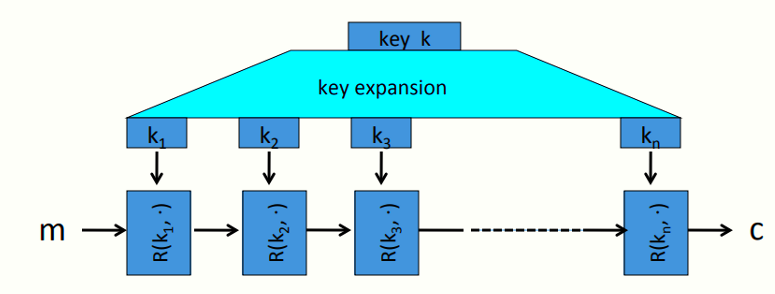

# W2 3-1 What is a block cipher?

## 1、Block ciphers: crypto work horse

块密码包含两个算法E和D，均接收k bit的密钥和N bit消息作为输入，E接收明文消息输出密文，D接收密文消息输出明文

标准算法：

* 3DES：n=64 bits，k=168 bits

* AES：n=128 bits, k = 128, 192, 256 bits（密钥越长越安全但计算速度也越慢）

## 2、Block Ciphers Built by Iteration

块密码从初始化开始，将密钥k进行密钥扩展，生成n个子密钥（即轮密钥），在每轮使用不同的轮密钥，将其作为轮函数的输入

轮函数：R(k,m），接收轮密钥和当前状态的消息，输出结果，在加密函数中，第一轮轮函数接收明文消息作为输入，最后一轮轮函数将密文作为输出，轮函数的轮次取决于算法（3DES高达48轮次，AES只有10-12轮）

## 3、Performance:

使用Crypto++ 5.6.0[Wei Dai]，块密码比流密码慢得多（效率大约只有1/6），但可以做到很多在RC4等构造中不能高效完成的任务

## 4、Abstractly: PRPs and PRFs

（1）伪随机函数：Pseudo Random Function，PRF

​	F: K × X → Y 

​	PRF是一个定义在三元组（K，X，Y）上的函数，K为密钥空间，X为输入空间，Y为输出空间

​	对F的要求：要有某种有效的方式评估函数F，可以不需要具有可逆性

（2）伪随机置换：Pseudo Random Permutation，PRP

​	E：K × X → X 

​	PRP是一个定义在二元组（K，X）上的函数，K为密钥空间，X为输入空间，并输出X中的一个元素

​	对E的要求：存在有效的确定性算法来评估E，对于给定的k，函数E是一一对应的，由于是一一对应的，因此也是可逆的，因此需要具有高效的反演算法D（k，y）（给定输出时计算对应输入）

## 5、Running example 

​	Example PRPs: 3DES, AES, … 

 * AES：K × X → X where K = X = {0,1}^128^ 

* 3DES: K × X → X where X = {0,1}^64^ , K = {0,1}^168^

从功能上来说，每个PRP都是一个PRF（PRP是一个X=Y且存在高效逆运算的PRF）

## 6、Secure PRFs

记F: K × X → Y 是一个PRF，定义下列两个记号

* Funs[X,Y]:所有由X到Y的函数的集合

* Set F（SF）：{ F(k,⋅) s.t. k ∈ K } ⊆ Funs[X,Y] 

直观上来说：若无法区分从Funs[X,Y]中随机选择的F和Set F中随机选择的F，则认为PRF是安全的（Set F大小为|K|，Funs[X,Y]则有|Y|^|X|^），或者说两个集合中的均匀分布不可区分（攻击者无法判断到底在和哪一个集合中的函数交互）

## 7、An easy application：PRF ⇒ PRG

​	记F：K × {0,1}^n^ → {0,1}^n^ 为一安全PRF

​	G：K → {0,1}^n^为一安全PRG，种子空间为PRF的密钥空间，输出空间为t个n bits块（t为可选参数）