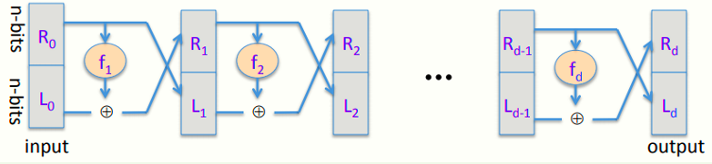
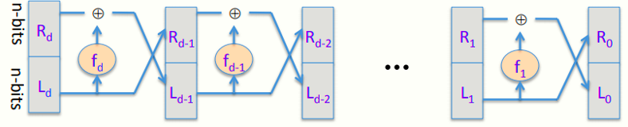
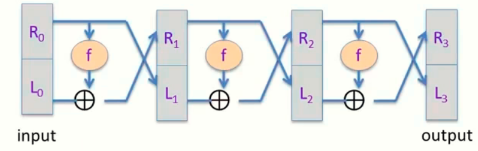
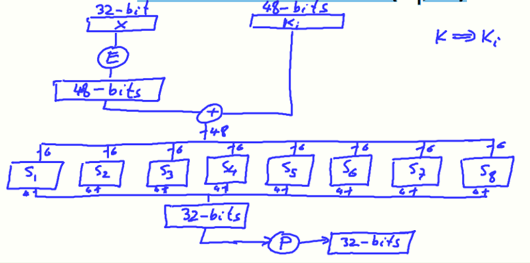
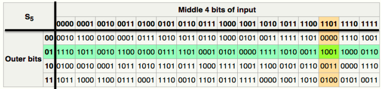
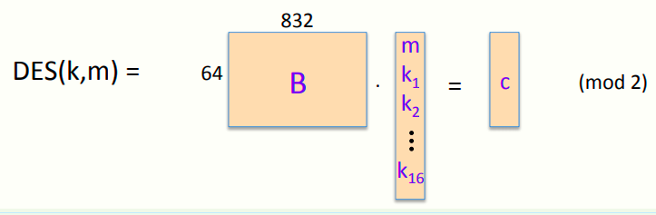

# W2 3-2 The data encryption standard（DES）

## 1、The Data Encryption Standard（DES）

历史简介：

* 1970年Feistel带领的团队设计了一个加密算法Lucifer

* 1973年IBM上交了Lucifer的变体

* 1976年NBS将DES作为标准，密钥长度56 bits，块长度64 bits

* 1997年DES被暴力破解

* 2000年NIST将Rijndael的AES代替DES

* DES曾作为商密用于银行等领域

## 2、DES: core idea – Feistel Network

DES的核心概念：feistel网络

Feistel网络是一个运用d个随机函数f~1~- f~d~（小f）来组建加密方法，f~1~, …, f~d~: {0,1}^n^ ⟶ {0,1}^n^ ，这些函数将n bits输入映射到n bits输出上，均是随机的函数（可以不需要可逆）

Feistel期望用这d个函数构建一个可逆的函数，因此需要构建一个新函数F（大F），F: {0,1}^2n^ ⟶ {0,1}^2n^，将2n bits输入映射到2n bits输出上

Feistel的每一轮将2n bits输入分为左右两部分，右半部分既作为下一轮的左半部分，又作为轮函数f~i~（i=1、2、……d）的输入，左半部分与轮函数fi的输出XOR后作为下一次迭代的右半部分，综上，有如下符号定义
$$
R_i=f_i(R_{i-1})\bigoplus L_{i-1}
$$

$$
L_{i-1}=R_{i-1}
$$

其中i=1、2、……d

对于任意的f~1~, …, f~d~: {0,1}^n^ ⟶ {0,1}^n^ ，Feistel网络的函数F: {0,1}^2n^ ⟶ {0,1}^2n^是可逆的，其逆如下图所示

## 3、Decryption circuit

如图所示，解密与加密有相似的结构，只是将轮函数f放在左侧，且要逆序使用轮函数f

Feistel网络在许多块加密中均有使用（AES除外）

定理：若f: K × {0,1}^n^ ⟶ {0,1}^n^是一个安全的PRF，则3轮Feistel函数F: K~3~ × {0,1}^2n^ ⟶ {0,1}^2n^ 是一个安全的PRP

三轮加密，每轮使用独立的密钥

## 4、DES: 16 round Feistel network

f~1~, …, f~16:~ {0,1}^32^ ⟶ {0,1}^32^，fi (x) = F( k~i~ , x )，其中ki为第i轮的轮密钥，由初始密钥k计算得出

DES算法先对输入进行初始置换IP（initial permutation），之后过16轮Feistel网络，最后再做一次初试逆置换IP~-1~，最终输出结果

DES会将初始密钥k进行密钥扩展，将其扩展成16个48 bits的子密钥，每个子密钥用于每轮的轮函数

解密算法中，只需要逆序使用这些轮密钥即可

## 5、The function F（k~i~，x）

如图所示

* E盒：expand，位扩展，将一些位重复输出，目的是将32 bits的部分扩展到48 bits，以用于与轮密钥XOR

* 扩展后的输入与轮密钥XOR后分为8个部分，每部分6 bits，作为各个S盒的输入

* S盒：function {0,1}^6^ ⟶ {0,1}^4^ ，将6 bits的输入转化为4 bits输出

* 最后将各个S盒的输出拼接成32 bits，经过P盒置换后得到32 bits输出

## 6、The S-boxes

Si : {0,1}^6^ ⟶ {0,1}^4^ ，接收6 bits输入，输出4 bits

S盒将输入的6 bits中的最高位和最低位作为行，中间四位作为列，之后选择对应位置的4 bits输出

## 7、Example: a bad S-box choice

如果说S盒可以被表示一些等式如：Si (x) = Ai ⋅x (mod 2)（mod 2矩阵乘法），则S盒是不安全的

因为如果S盒是线性的，则导致DES仅仅是在计算XOR、置换和移动为，从而意味着DES是一个线性函数，则DES又可以被表示为一个mod 2的矩阵乘法，如下图所示

则DES(k,m~1~) ⨁ DES(k,m~2~) ⨁ DES(k,m~3~) = DES(k, m1~~⨁m~2~⨁m~3~)

综上，若S盒全部都是线性的话，DES非常不安全，即便是差不多线性的（close to being linear）也不安全，只要有一定规模的输入即可以短时间内破解出密钥

## 8、Choosing the S-boxes and P-box

如果说随机选择S盒和P盒，会导致得到一个不安全的块密码

因此设计者对S盒和P盒的选择上有一定的要求：

* 必须非常的不像线性函数，即没有函数与S盒的大部分输出相同

* 为了防止攻击，还有其他一些规则如4到1映射规则（每个输出正好有四个前像）