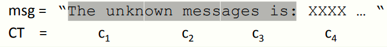
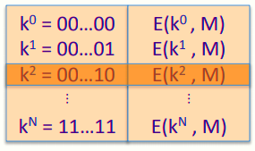
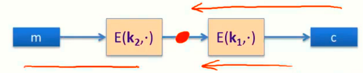

# W2 3-3 Exhaustive Search Attacks

## 1、Exhaustive Search for block cipher key

目标：对于一些给定的输入输出消息对， (m~i~ , c~i~ = E(k, m~i~ ) ) ，i=1,..，找到其密钥k使得c~i~ = E(k, m~i~ )

引理：若DES为一个理想的密码（有2^56^个随机可逆函数，将56 bits密钥映射到64 bits密文），则对于任给的明文与密文m，c，则有超过99.5%的概率有最多一个密钥k满足c = DES(k, m) 

证明：Pr[∃k'≠k，c = DES(k, m) = DES(k', m) ]≤ΣPr[DES(k, m) = DES(k', m) ]≤（2^56^）*2^-64^=1/256

可能的密钥有2^56^，可能的密文输出有2^64^，求和即可

上述引理表明，对于DES而言，若对于给定的一对PT-CT消息对，其密钥几乎是完全确定的，即该消息对只有一个密钥能将PT映射到CT

而对于两对消息对，上述概率在DES算法中约为1-2^-71^，AES约为1-2^-128^

引理表明，两对消息对完全可以满足穷举攻击，问题在于如何找到上述密钥

## 2、DES challenge

曾经RSA公司发起过一个挑战，对于给定的PT-CT分组，求其对应的密钥，并用于解密后续消息c4，c5……

1997年花了3个月破解，之后更快，因此56 bits密钥不应再继续使用（DES is completely dead）

## 3、Strengthening DES against exhaustive search

1. Triple-DES：

   3E( (k~1~,k~2~,k~3~), m) =E（k~1~，D（k~2~，E（k~3~，m））），即DES重复运行三次（三个密钥不能一样，否则和DES没区别）

   3DES密钥空间为3x56=168 bits，由于是运行三次，因此效率也为DES的1/3

2. Why not double DES?

   密钥长度为112 bits，加密算法为2E（（k~1~，k~2~），m）=E（k~1~，E（k~2~，m）），但很容易遭到中途相遇攻击，攻击者只需要找到密钥对（k~1~，k~2~），满足E（k~2~，m）=D（k~1~，c）即可（根据DES对称性可知）

3. Meet in the middle attack：

   经典的空间换时间的算法，利用了DES的对称性，极大程度减少了攻击时间开销

   构建密钥表，如下图所示，包含56 bits全部密钥及其对应加密后的消息

​		对于所有可能的k值（k∈{0,1}^56^），计算D(k,c)是否等于上表中第二列的值，若等于，则意味E(k~i~ ,M) = D(k,C) ，即(k~i~ ,k) = (k~2~,k~1~) ，从而找到2DES的碰撞（collision）

​		时间开销约为2^63^，空间开销为2^56^，相同的攻击作用于3DES的时间开销会急剧增大到2^118^，且对于3DES而言，当计算找到了上述碰撞，也意味着找到了3DES的三个密钥

4. DESX：

   记E为n bits到n bits的块密码，定义EX如下

   EX( (k~1~,k~2~,k~3~), m) = k~1~ ⨁ E(k~2~, m⨁k~3~ ) 

   由于是一个块密码与两次XOR计算，因此效率损失不会太大

   若EX中的块密码为DES，则记为DESX，其密钥长度为64+56+64=184 bits（XOR需要与消息等长的64 bits，DES加密密钥为56 bits）

   思考题：注意到DESX在快密码的内部和外部均进行了XOR计算，这是必须的，若仅进行内部或外部的计算，则其加密强度和原始的DES没有太大差别