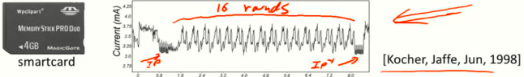
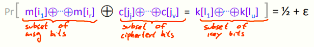

# W2 3-4 More Attacks on Block Ciphers

## 1、Attacks on the implementation

（1）侧信道攻击：

​	通过测量加解密过程中需要的时间与设备功率，如果加解密所花费的时间或功率取决于密钥位，则攻击者可以了解到密钥的相关信息甚至完全提取出密钥

​	若测量设备足够精密，将设备绘制的图表放大后甚至可以读取各个位的信息，实验表明，即便采取措施处理这些卡片，期望掩盖这些信息，效果仍然不理想

​	差分功率分析可以通过测量加密算法的许多设备参数（如电流电压等），从中推算出密钥位之间的依赖关系，只要加密算法运行足够长轮次，就能反映出这种依赖关系从而提取密钥

​	多核处理器也可能遭遇攻击，若加密算法与攻击者恰好分别运行于两个不同的内核，而内核实际上共享缓存，因此攻击者可以得知缓存中的未命中信息，从而找到使用的密钥

（2）故障攻击：

​	攻击者攻击智能卡时可以导致其故障（超频手段或在预热时导致）并输出错误的数据

​	实验结果表明，加密过程的上一轮加密出现错误，则产生的密文足以提取密钥信息

（3）结论：不应当使用自己发明的分组密码，甚至不应当自己实现这些加密，因为无法确保没有侧信道攻击和故障攻击，应当使用标准库如OpenSSL等

## 2、Linear and differential attacks

通过线性密码分析，期望能在小于2^56^的时间内恢复密钥

（1）线性密码分析：

​	将消息的一个子集与密文的某个子集进行异或，之后与密钥k比较，如果m和c是完全独立的，则上述等式成立的概率为0.5，但实际上存在一个ε的偏差，即实际概率为0.5+ε

​	通过分析一些PT-CT对，利用上述公式可以确定一些密钥位的信息

​	对于DES而言，ε=2^-21^，因此需要2^42^对随机的PT-CT，可以获取14 bits的密钥位，剩余56-41=42 bits密钥需要2^42^时间来暴力破解，因此将穷举攻击DES的时间降至2^43^

（2）量子攻击：

​	对于一个普通的问题，有函数f，在大集合X中找到x∈X，使得f(x)=1，此类问题对于传统计算机算法需要的时间复杂度与X的规模相当（线性复杂度），但量子计算机复杂度为根号级别