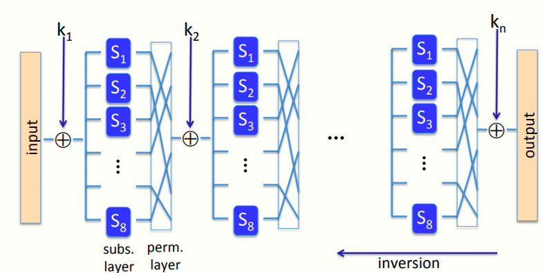
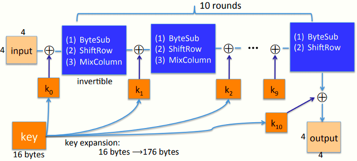
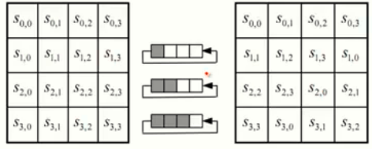
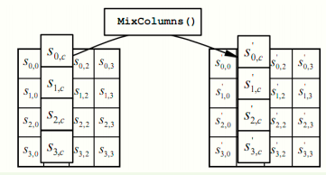

 # W2 3-5 The AES block cipher

## 1、The AES process

* 1997年NIST公开征求意见

* 1998年共提交15份提议

* 2000年最终选择Rijndael的算法作为AES

* AES分组长度128 bits，密钥长度128/192/256 bits

* 越长的密钥安全性越高，但也意味着效率越低

## 2、Subs-Perm network

AES基于代换-置换网络（Substitution-Permutation network）而非Feistel网络

两者的区别在于Feistel网络中每轮计算时分组有一半的位不会改变，直接作为下一轮计算的输入，而S-P网络中每轮计算中分组的每一位均会发生变化

S-P过程如下

由于S-P网络的构造方式，其每一步都是可逆的，因此整个过程是可逆的，由原来的输出想要得到原来的输入，则需要将上述流程完全逆用

## 3、AES-128 schematic

总体流程如上图，先将128 bits的分组划分成16个字节，按顺序排列成4 x 4的矩阵，将轮密钥k~i~与矩阵异或，然后经过可逆部分，得到本轮输出

轮密钥由128 bits的初始密钥经过密钥扩展得到11个子密钥，每个子密钥均排列成4 x 4的矩阵以便于和消息矩阵XOR计算

## 4、The round function

（1）字节替换：通过一个S盒（包含256字节），以消息矩阵作为输入，得到输出

（2）行移位：第i行的所有字节循环左移i个字节（i=0，1，2，3），如图示

（3）列混合：特殊的线性变换，使用一个特定矩阵与当前矩阵相乘，对于这些线性变换而言，所有的列都是相互独立的

## 5、AES in hardware

Intel处理器内建了对AES的支持， 通过特殊的汇编指令来加速AES算法

## 6、Attacks

（1）密钥恢复：如果期望以恢复密钥的手段攻破AES，其效率仅仅比穷举快四倍而已，并没有显著影响其安全性

（2）相关密钥攻击：针对AES-256的攻击，发现了其在密钥扩展中的缺陷，导致相关密钥攻击

相关密钥攻击：如果有2^100^对AES的PT-CT对，这些消息对均使用四个紧密相关的密钥（如任意两个密钥之间仅有1 bit不同，即汉明距离很近），此时破解复杂度为2^100^（远小于穷举的2^256^）

因此为了防止类似攻击，应确保密钥的随机性而将其局限于某个小范围（尽管这个局限性并不显著，因为2^100^仍然很大）