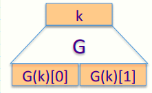
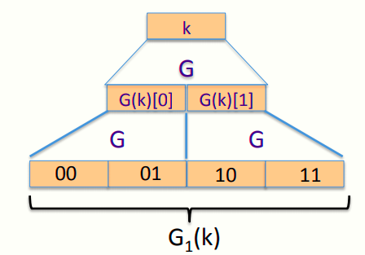
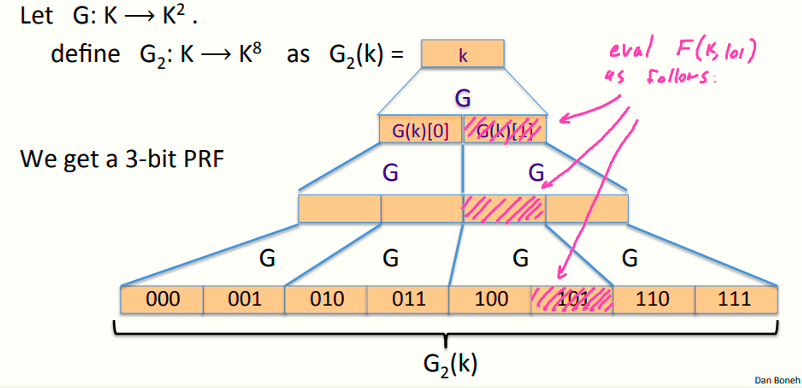
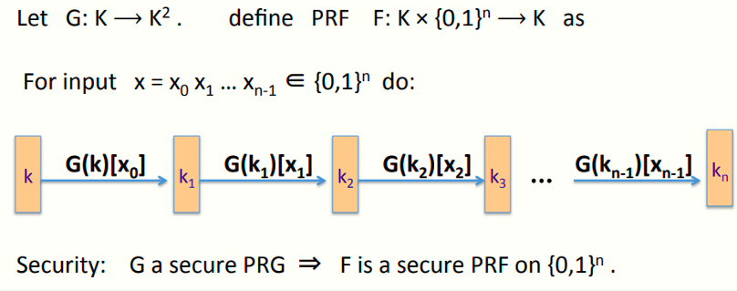

# W2 3-6 Block ciphers from PRGs

## 1、Can we build a PRF from a PRG?

记G: K ⟶ K^2^ 为一安全PRG

定义一个1 bit PRF F如下，F: K × {0,1} ⟶ K as F(k, x∈{0,1} ) = G(k)[x] 

引理：若G为一安全PRG，则F为一安全PRF

## 2、Extending a PRG

记G: K ⟶ K^2^ 为一安全PRG

定义G1：K ⟶ K^4^ as G1(k) = G(G(k)[0]) ll G(G(k)[1]) 

因此得到一个2 bits PRF：F(k, x∈{0,1}^2^ ) = G1(k)[x] 

## 3、Extending more 

套娃

## 4、Extending even more: the GGM PRF

继续套娃，但实际上不应使用这种方式（效率太低）