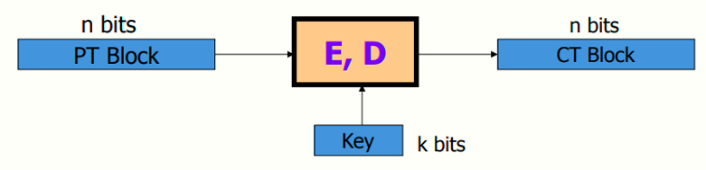
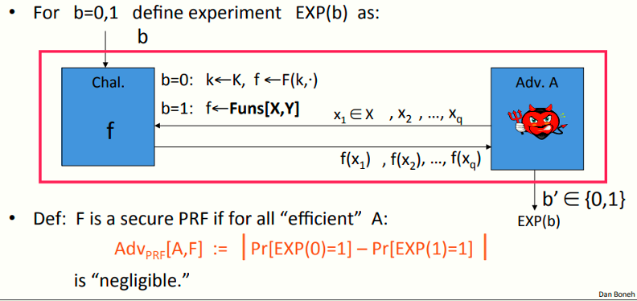
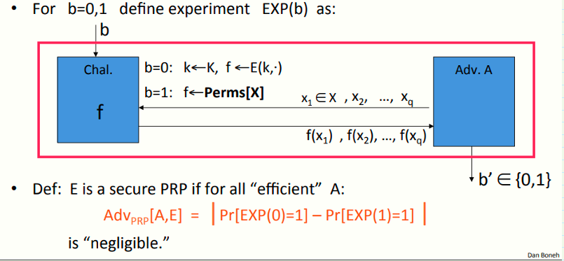

# W2 4-1 Review: PRPs and PRFs

## 1、Block ciphers: crypto work horse

## 2、Abstractly: PRPs and PRFs

（1）Pseudo Random Function (PRF) 定义为一三元组 (K,X,Y): F: K × X → Y ，且存在一有效算法以评价F(k,x) 

（2）Pseudo Random Permutation (PRP) 定义为一二元组 (K,X): E: K × X → X 满足: 

* 存在一确定性算法评价E(k,x) 

* 函数E(k,·) 为一对一映射函数（双射函数）

* 存在对应的有效的逆运算D(k,x)

## 3、Secure PRFs

详见3-1

## 4、Secure PRF: definition

## 5、Secure PRP (secure block cipher) 

## 6、PRF Switching Lemma

PRP交换引论：对于|X|足够大的情况下，一个安全的PRP同时也是个安全的PRF

引理：E为定义在二元组(K,X) 上的PRP，对任意的有最多Q个查询的攻击者A，满足如下不等式
$$
|\  Adv_{PRF} [A,E] - Adv_{PRP}[A,E] \ | < q^2 / 2|X|
$$
若|X|很大，则不等式右侧为一可忽略数，则由PRP的安全性可知，PRP的优势可忽略，则得到PRF的优势亦可忽略