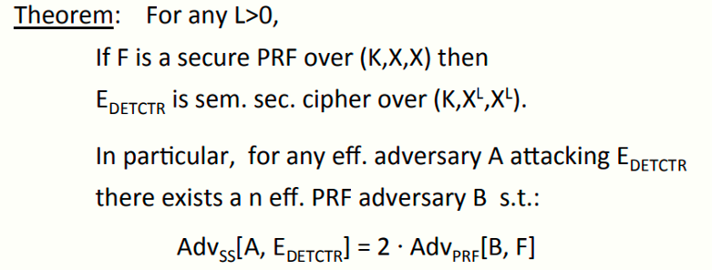

# W2 4-2 Modes of operation: one time key

## 1、Using PRPs and PRFs

目的：通过安全的PRP构建安全的加密方案，本例中旨在使用块密码来使用一次性密钥来加密

攻击者的能力：只能看到一次性密钥加密后的密文

攻击者目标：从CT中提取PT信息（即破坏语义安全）

## 2、Incorrect use of a PRP

ECB模式，流程如下

隐性问题：若消息m~1~=m~2~，则加密后的c~1~=c~2~，从而攻击者可以获取一些明文之间的关系，而这些关系不应反应在密文上

若将该模式用于加密图片信息，则可能得到如图结果，尽管没有暴露所有的信息，但是仍能反应出一些人物轮廓

## 3、Semantic Security (one-time key)

对于OTP而言，攻击者应只能看见CT，因此若要做到语义安全，上述优势Adv~SS~[A,OTP] 应可忽略

## 4、ECB is not SemanAcally Secure

ECB并不是语义安全的，因此ECB模式不应加密超过一个块的信息

## 5、Secure ConstrucAon I

## 6、Deterministic counter-mode security

定理：对于任给的L>0，若F为定义在三元组(K,X,X) 上的PRF，E~DETCTR~为定义在三元组(K,X^L^,X^L^)上语义安全的密码

特别地，对于任意高效的攻击者攻击E~DETCTR~，存在一高效的PRF攻击者B，使得：
$$
Adv_{SS}[A, E_{DETCTR}] = 2 ⋅ Adv_{PRF}[B, F]
$$

证明如下：

