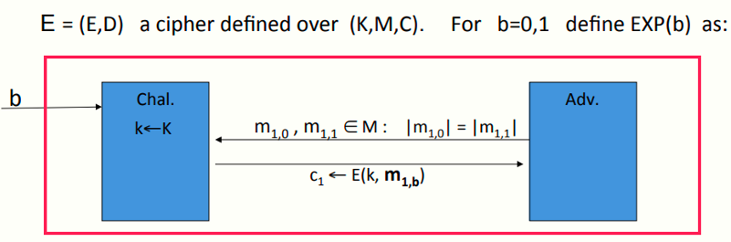
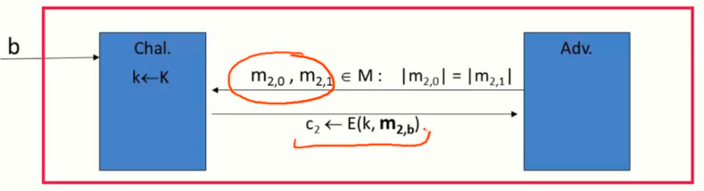
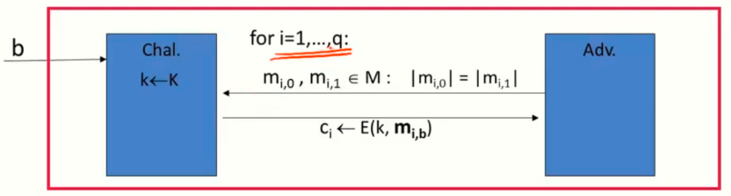
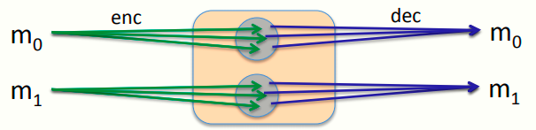
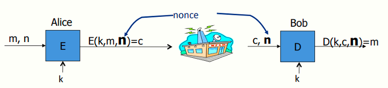
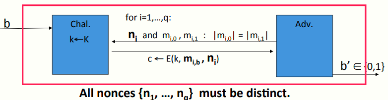
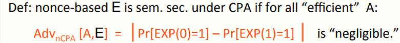

 # W2 4-3 Security for many-time key

## 1、Example application

* 文件系统：用AES，以相同的密钥加密多个文件

* IPsec：AES，相同的密钥加密多个数据包

## 2、Semantic Security for many-time key

重用密钥意味着攻击者可以获得由同一密钥加密的多个密文段

攻击者的能力：选择明文攻击（chosen-plaintext attack，CPA），意味着攻击者可以截获其选择的信息的对应密文段（日常通信者非常常见）

攻击者的目标：破坏语义安全

## 3、Semantic Security for many-time key

上述流程和标准语义安全非常类似，但是攻击者可以不断地发起这种查询（假设其最多可以发起q次，即i=1，2……q）

在CPA中，攻击者可以使m~0~=m~1~=m，即让两个消息一致，进而像挑战者提交后得到m的密文，CPA中两端消息是相同的（标准语义安全不相同）

定义：对于所有的高效的算法A，若在CPA下为语义安全的，则如下等式的优势为可忽略的
$$
Adv_{CPA}[A,E] \ = \ | \   Pr[EXP(0)=1]-Pr[EXP(1)=1]\ |
$$

## 4、Ciphers insecure under CPA

假设E(k,m)对于相同的明文消息总是输出相同的密文，则有如下模型

首先攻击者发起攻击，选择两段相同的消息m=m~0~发给挑战者，无论挑战者选择b=0或1，其均会返回消息m~0~的密文c~0~

之后攻击者再发起一次攻击，选择不同的消息m~0~和m~1~，之后挑战者返回消息时，攻击者仅需判断收到的密文c是否等于c~0~即可

综上模型，攻击者区分m~0~和m~1~的优势为1

结论：相同的明文加密成相同的密文（尽管不能知道明文的任意信息），这个机制不应被攻击者知道，因此确定性加密机制不能再CPA下保持语义安全

## 5、Solution 1: randomized encryption

E(k,m)为一随机算法

对于加密算法，消息m~0~映射到一个密文空间内的多条不同的密文而非一条，使得每次加密算法都能得到不同的输出而非相同的输出，即这种随机化算法使得每次加密相同的消息均有极高概率得到与之前不同的输出

对于不同的消息m~1~≠m~0~，其映射的密文空间必须是无交集的

但是也意味着密文一定比明文长，是因为用于生成密文的随机字符串必然要以某种方式编码到密文中从而占据一些空间，如果消息很长（GB级别）则可忽略这些额外的消息，如果只有若干字节的消息，加密后意味着消息长度翻倍

## 6、Solution 2: nonce-based Encryption

基于nonce的加密系统算法接收三个输入参数，即比传统加密算法多接收一个nonce作为输入，对应的解密算法也有这个参数

Nonce：Number used once，算法中仅使用一次的任意或随机的数，该值公开无需保密，仅需要确保只使用一次

Nonce的选择：

* 将Nonce作为一个计数器（如数据包计数器），每次计算或每发送一个包就递增，加密算法和解密算法需要同步计数器的状态来确保解密正确，好处在于没有必要将nonce包含在密文中（如HTTPS或IPsec协议等）

* 随机选择Nonce，若Nonce空间足够大，则可以确保在密钥生命周期内使用的Nonce高概率不会重复，则这种情况下基于nonce的加密转化为随机化加密，好处是发送方不必记录各条消息的状态（对不同设备之间的加密非常有用，如电脑手机打印机之间的通信）

## 7、CPA security for nonce-based encryption

即便系统的nonce为攻击者选择时，系统也必须保证安全性（因为允许攻击者选择nonce意味着攻击者可以选择其企图破解的密文）

该模型与之前的模型类似，但要求攻击者每次查询时给出对应的nonce值ni，且对于最多有q次查询的攻击者而言，这q个nonce值必须不同（实际中攻击者诱骗通信方加密多段消息时，通信方也不会使用重复的nonce，攻击者也不会收到由相同的nonce加密后的消息）

若在上述条件下，即基于nonce的加密，算法A的优势（如下）仍为可忽略的，则为CPA下的语义安全
$$
Adv_{nCPA}[A,E] \ = \ | \ Pr[EXP(0)=1] - Pr[EXP(1)=1]\ |
$$
