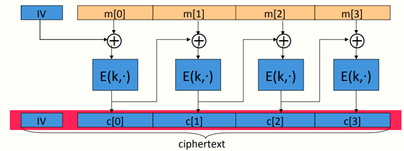
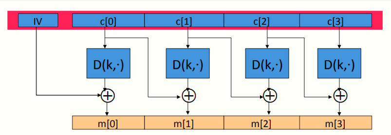
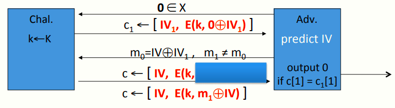
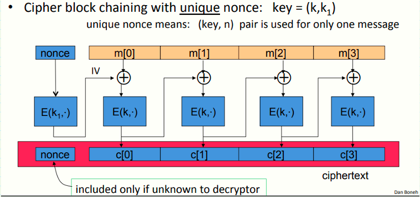

 # W2 4-4 Modes of operation: many time key (CBC)

## 1、Construction 1: CBC with random IV

记(E,D) 为一块密码，E-CBC（k，m）首先选择一随机IV（与加密的消息块等长），之后完成如下流程图

## 2、Decryption circuit

加密流程反过来操作

注意到CBC解密的一个特点，若某一块在传输或保存时损坏了，

## 3、CBC：CPA Analysis

CBC定理：对于任意的L>0，若E为一定义在(K,X) 上的安全PRP，则E~CBC~为一定义在(K, X^L^ , X^L+1^)上在CPA下语义安全的

具体来说，对于一个q次请求的攻击者A要攻击E~CBC~，则存在一个PRP攻击者B，满足如下不等式
$$
Adv_{CPA}[A,E_{CBC}] \leq 2Adv_{PRP}[B,E]+2q^2L^2/|X|
$$
CBC只有当(qL)^2^ << |X|才安全，即使用同一密钥k加密的消息个数q和消息长度L的积的平方应远小于|X|

对于AES而言，消息空间|X|=2^128^，则qL应小于2^48^，这表明在AES加密2^48^块消息后，必须更换密钥，而对于3DES而言，qL小于2^16^

## 4、Warning: an attack on CBC with rand. IV

若一个CBC的初始向量IV可被攻击者预测，则意味着他不是一个CPA安全的加密方式

假设对于给定的E~CBC~(k,m)的密文c，攻击者可以预测下一条消息使用的IV，则有如下语义安全挑战模型

## 5、Construction 1: nonce-based CBC

如图所示，原来用于加密的初始向量IV被替换成了nonce，若通信的接收方知道nonce，则可以不在密文中包含nonce，此时密文长度与明文一致（使用随机的IV则需要在密文中附带IV，导致密文变长）

但若使用基于nonce的CBC加密模式，需要两个独立的密钥（或一对密钥对）(k,k~1~)，其中k为原来用于加密各个明文分组的密钥，而k~1~为用于加密nonce的密钥

 k~1~非常关键，若不使用k~1~，则CBC模式不再安全

如上图所示，nonce先使用k~1~进行加密，然后将结果作为初始向量IV