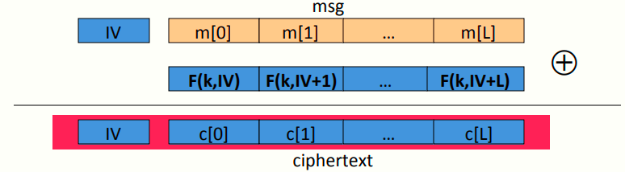
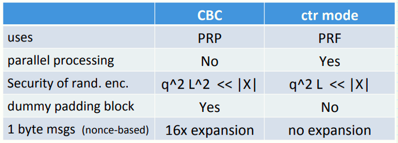

# W2 4-5 Modes of operation: many time key (CTR)

## 1、Construction 2: randomized ctr-mode

和CBC不同的是，随机计数器使用的是PRF

记F为一安全PRF，则有如下模型

首先选择一随机的初始向量IV，每次传入轮函数F时都将IV+1，且IV需要附在密文消息内

IV的选择：每次都需要随机选择新的IV，即便是将同一消息加密两次（从而得到不同的加密结果）

与CBC不同的是，CTR模式是完全并行的，而CBC是串行的

## 2、rand ctr-mode (rand. IV): CPA analysis 

计数器模式：对于任意消息长度L>0，若轮函数F为一定义在(K,X,X)上的安全PRF，则E-CTR为一定义在(K,X^L ,X^L+1)上的在CPA下语义安全的模式

具体来说，若对于至多有q次查询的攻击者A而言，存在一PRF攻击者B，使得满足如下不等式
$$
Adv_{CPA}[A,E_{CTR}] \leq 2Adv_{PRF}[B,F]+2q^2L/|X|
$$
注意到CTR模式要求q^2^L<<|X|，比CBC模式更好，对于AES而言，CBC模式加密2^48^块消息后需要更换密钥，而这个值在CTR为2^64^

## 3、Comparison: ctr vs. CBC

## 4、Summary

PRF和PRP都是块密码中常用的抽象概念

两种安全观念（都只提供防止窃听的安全措施，不提供防篡改密文的安全措施），一个仅用于加密单个消息时使用（流密码），另一个用于加密多个消息使用（CBC或CTR），均不提供完整性检验