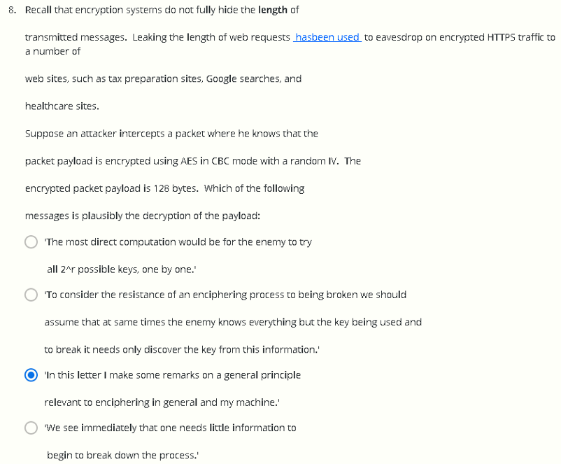

# W2 Problem Set && Programming Assignment

Q1

问：上述五个事件中，按发生的概率从大到小排序，正确的顺序为？

分析：事件1的概率为1/2^128^，事件4的概率为1/10^36^≈1/2^119.5^，事件5的概率为1/10^42^≈1/2^139^，因此5的概率要比1小更多

Q2

问：若一种硬件可以做到每秒暴力搜索AES的密钥10亿次，且一个这种硬件需要200块钱，现有预算4万亿买这种硬件，不考虑除购买硬件以外的其他费用，破解一个128 bits的AES密钥需要多久？

分析：简单的计算题，根据题意，能买2 * 10^10^个硬件，每秒计算速度总共为10^9^*(2 * 10^10^) = 2 * 10^19^，需要共计2^128^ / (2 * 10^19^) = 1.7*10^19^秒，大约是5400亿年

 

Q3

 

 

Q4

问：在两轮Feistel网络中会出现安全问题，下列四个输出中有一个为使用随机密钥的PRP F~2~的输出，其余三个为真随机替换函数f的输出，问哪个是F~2~的输出

提示：将两个值异或

第一个选项中9f970f4e932330e4与6068f0b1b645c008异或，结果的前32 bits为0xFFFF FFFF

 

Q5

问：基于nonce的CBC模式需要使用独立的密钥先将nonce加密，之后将加密结果作为CBC模式的IV，若在CBC模式中使用与加密nonce相同的密钥则会发生什么？假设……懒得翻译了

分析：一顿计算可知选第一个

 

Q6

问：Alice向Bob传输AES的加密块，使用CBC模式加密，若某一块在传输过程中出错，其他块均正确接收，Bob解密时有多少明文块会解密出错

分析：由CBC模式的特性知道，密文块出错时，解密只会影响本块和下一块的解密正确性，其余块不受影响，因此为2块

 

Q7

问：Alice向Bob传输AES的加密块，使用CTR模式加密，若某一块在传输过程中出错，其他块均正确接收，Bob解密时有多少明文块会解密出错

分析：由于CTR模式特性可知，CTR模式每块加解密均独立，因此只有一块受影响

 

Q8

问：懒得翻译

分析：数字母，第三个选项共有107个字节，填充后共有112字节，附加上IV的16字节共计128字节，满足题意

 

Q9

问：

分析：k~4~一定参与xor，三个例子分别为

1. k~1~ xor k~2~ xor k~4~ =0011

2. k~0~ xor k~2~ xor k~4~ =1010

3. k~1~ xor k~2~ xor k~3~ xor k~4~ =0110 

4. 1 和3 xor得到k~3~ = 0101 

设问可转化为k~0~ xor k~2~ xor k~3~ xor k~4~，即上述式2 xor k~3~ =1111

 

 

In this project you will implement two encryption/decryption systems, one using AES in CBC mode and another using AES in counter mode (CTR). In both cases the 16-byte encryption IV is chosen at random and is prepended to the ciphertext.

 

For CBC encryption we use the PKCS5 padding scheme discussed in the lecture (14:04). While we ask that you implement both encryption and decryption, we will only test the decryption function.  In the following questions you are given an AES key and a ciphertext (both are hex encoded ) and your goal is to recover the plaintext and enter it in the input boxes provided below.

 

For an implementation of AES you may use an existing crypto library such as PyCrypto (Python), Crypto++ (C++), or any other. While it is fine to use the built-in AES functions, we ask that as a learning experience you implement CBC and CTR modes yourself.

 

1.

CBC key: 140b41b22a29beb4061bda66b6747e14

CBC Ciphertext 1: 4ca00ff4c898d61e1edbf1800618fb2828a226d160dad07883d04e008a7897ee2e4b7465d5290d0c0e6c6822236e1daafb94ffe0c5da05d9476be028ad7c1d81

明文：Basic CBC mode encryption needs padding.

 

2.

CBC key: 140b41b22a29beb4061bda66b6747e14

CBC Ciphertext 2: 5b68629feb8606f9a6667670b75b38a5b4832d0f26e1ab7da33249de7d4afc48e713ac646ace36e872ad5fb8a512428a6e21364b0c374df45503473c5242a253

明文：Our implementation uses rand. IV

 

3.

CTR key: 36f18357be4dbd77f050515c73fcf9f2

CTR Ciphertext 1: 69dda8455c7dd4254bf353b773304eec0ec7702330098ce7f7520d1cbbb20fc388d1b0adb5054dbd7370849dbf0b88d393f252e764f1f5f7ad97ef79d59ce29f5f51eeca32eabedd9afa9329

明文：CTR mode lets you build a stream cipher from a block cipher.

 

4.

 

CTR key: 36f18357be4dbd77f050515c73fcf9f2

CTR Ciphertext 2: 770b80259ec33beb2561358a9f2dc617e46218c0a53cbeca695ae45faa8952aa0e311bde9d4e01726d3184c34451

明文：Always avoid the two time pad!