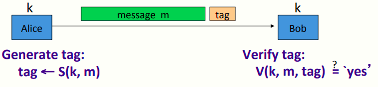
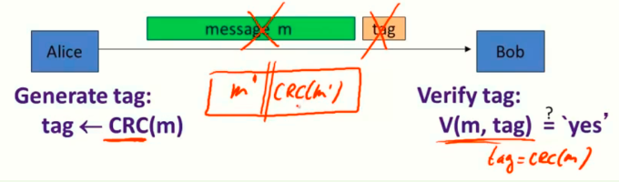
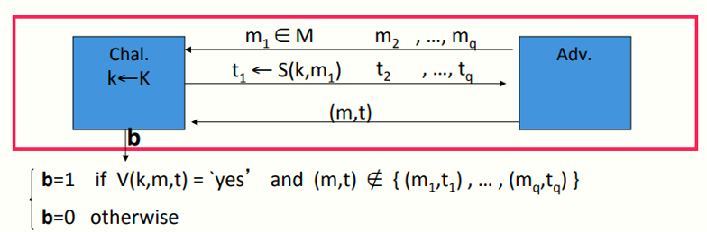
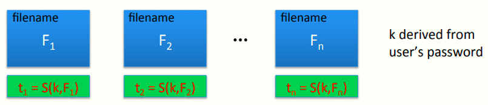

# W3 5-1 Message Authentication Codes

## 1、Message Integrity 

目标：不保密的情况下确保完整性

例子：

* 保护磁盘上的二进制文件：必须确保系统内文件完整性，而不需要进行加密

* 保护网页上广告：广告面向所有用户，因此不需要保密，但是必须确保不被修改

## 2、Message integrity: MACs

模型如图所示，实现完整性需要用到MAC，即Message Authentication Codes，Alice和Bob事先共享一个密钥k（攻击者不知道的k），之后Alice运行算法S，Bob运行算法V，Alice将计算后的tag附在原消息后一并发送给Bob，Bob收到后提取tag并验证，若通过验证则表明未被修改

定义：MAC I = (S,V) 定义在三元组(K,M,T)上的一对算法，K为密钥空间，M为消息空间，T为tag空间，算法如下：

* S(k, m) ：签名算法，接收密钥k和消息m两个输入，产生一个很短的输出tag，通常只有100 bits左右，即便是消息m很大（GB甚至TB级别），也可以输出很短的tag

* V(k, m, tag) ：验证算法，接收密钥k、消息m和tag作为输入，输出验证是否通过（yes/no）

需要注意的是，算法S和V必须满足一个条件：对于任给的k∈K，m∈M，V（k，m，S（k，m））的输出一定是yes，即必须正确验证

## 3、Integrity requires a secret key

上述模型说明了完整性需要一个安全的密钥

假设Alice与Bob以CRC（Cyclic Redundancy Check）作为其签名与验证算法，而CRC仅接受一个输入，即消息m，不接受密钥k作为输入

若攻击者企图攻击，则攻击者可以轻易的删除Alice发出的消息m及其tag，重新生成一个消息m'并计算其tag'=CRC(m')，因此上述模型中，攻击者很容易修改消息并欺骗Bob，让其认为消息有效，而此时的消息m'与Bob期望的消息m完全无关

CRC的目的：用于检验消息中的随机错误，而非恶意错误，主要用于一些路由算法中确保消息的每一位被正确传送，使其不受信道中的偶然差错影响

综上所述，若在完整性中没有密钥的加入的话，Alice和攻击者的身份是等价的（两者地位没有区别），Bob不知道消息到底是来自于谁

解决方法：引入密钥，使得Alice可以完成一些攻击者无法完成的工作，使得计算结果包含攻击者无法修改的标记

## 4、Secure MACs

攻击者的能力：选择消息攻击，即攻击者可以给Alice任意选择的消息m~1~\~m~q~，Alice可以为他计算这些消息的tag（类似于选择明文攻击）

攻击者目标：existential forgery（没看懂），即攻击者生成一些合法的消息和tag对(m,t) ，且(m,t) ∉ { (m~1~,t~1~) , … , (m~q~,t~q~) } 

若攻击者不能做到这种existential forgery，则意味着系统是安全的，若不能做到，则表明攻击者无法生成一个合法的消息-tag对(m,t)（尽管消息m可能是乱七八糟的）

为什么要对乱七八糟的消息验证：密钥可能是乱七八糟的（随机生成的），有些场景需要对密钥的完整性进行验证，因此若攻击者可以生成正确的消息-tag对，意味着系统不安全

综上，需要满足两个：

* 攻击者不能对一个新的消息生成正确的tag

* 对于给定的消息(m,t)，攻击者不能生成另一个消息-tag对(m,t')，使得t' ≠ t 

对于MAC I=(S,V)和攻击者A，定义上述模型，其中符号定义如下

* b=1：表明V(k,m,t) =yes，且(m,t) ∉ { (m~1~,t~1~) , … , (m~q~,t~q~) }

* b=0：表明其他情况

定义：若I=(S,V)为一个安全的MAC，则对所有高效的攻击者A，其如下优势为可忽略的
$$
Adv_{MAC}[A,I] \ = \ Pr[Chal.outputs 1]
$$

## 5、Example: protecting system files

例子：假设需要在机器上安装OS（如Windows），OS先要求用户输入一个密钥k，之后由k运行算法S，对每个文件单独计算tag（t~1~\~t~n~），并将这些tag附在文件后，计算完毕后删除k

假设此后的某一时间，OS遭遇病毒攻击并修改了一些文件，此时用户会将系统重启至一个干净的环境并提供一个密钥，之后系统对每个系统文件的MAC进行检验，由于MAC是安全的，因此病毒不能产生(F',t')来通过检验，因此OS能检测到被病毒修改的所有文件

病毒还可能进行如下行为：交换两个文件的位置，即用户尝试运行F~1~时，实际运行文件为F~2~，此时系统会检测到F1的文件没有正确的文件名，从而检测到病毒