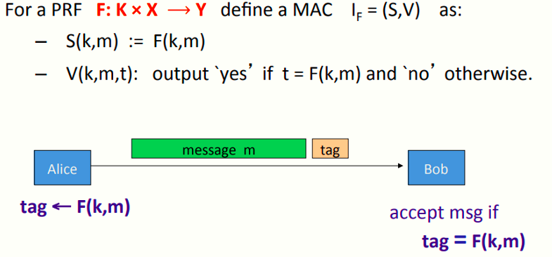
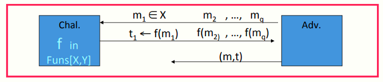

# W3 5-2 MACs based on PRFs

## 1、Secure PRF ⇒ Secure MAC

对于一个PRF，定义MAC I-F(S,V)如下：

* S(k,m) := F(k,m) 

* V(k,m,t)：若t = F(k,m)则输出yes，否则输出no

## 2、Security

定理：若F: K×X⟶Y为一安全PRF，且1/|Y| 为一可忽略数（即|Y|很大），则I~F~为安全MAC

具体而言，对于任意高效的MAC攻击者A攻击I-F，存在一高效的PRF攻击者B攻击F使得其满足如下不等式
$$
Adv_{MAC}[A,I_F]\ \leq \ Adv_{PRF}[B,F]+1/|Y|
$$
即：只要|Y|足够大（如|Y| = 2^80^），则I~F~就是安全的

## 3、Proof Sketch

假设f: X ⟶ Y为一真随机函数

若MAC的攻击者A想要赢得上述游戏模型，则必须生成一对(m,t)，使得t = f(m)且m ∉ { m~1~ , … , m~q~ } 

由于f为真随机函数，攻击者A对于前q次查询，不能得到关于f的信息（即前q次查询是完全独立的，新的查询m与之前的m~1~ , … , m~q~无关），因此A希望得到f(m)的方式只能为猜测，而其猜对的概率Pr[A wins] = 1/|Y|

综上，若我们希望确保MAC的安全性，即便是将真随机函数f替换为伪随机函数F，攻击者A也无法区分，且其在赢得上述游戏模型中最多有1/|Y|的优势

## 5、Truncating MACs based on PRFs

引理：假设F: K × X ⟶ {0,1}^n^为一安全PRF，则对于所有的1 ≤ t ≤ n，Ft (k,m) = F(k,m)[1…t]也是安全的PRF

解释：假设有一N bits的PRF，若将其输出截断到t bits，则其仍然是随机的，因为截断后攻击者能获得的信息更少了，所以其区分伪随机和真随机的工作会变得更困难

推论：若(S,V)为一个基于安全PRF的MAC，且输出n bits tag，只要1/2^w^仍可忽略（通常w≥64），则将其输出截断至w bits仍为安全的

总结：如果我们用AES来构造MAC（AES-128每块输出128 bits），意味着我们将得到128 bits的MAC，但是综上所述，我们可以将其截断至90 bits或80 bits使其仍然为安全的，从而构造长度更为合理的MAC