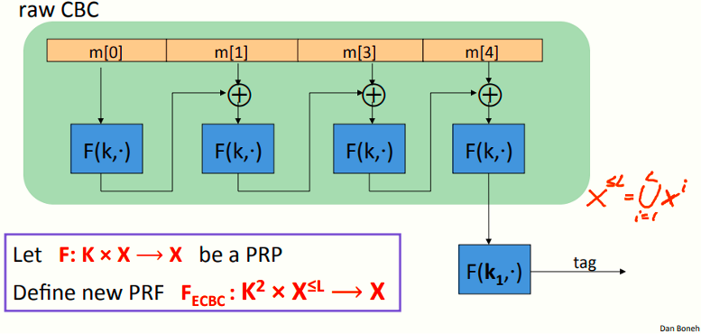
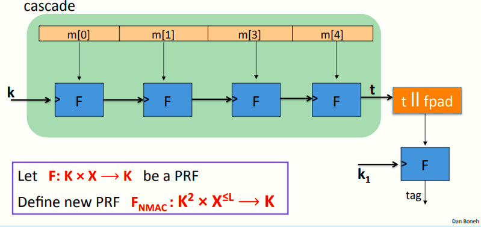
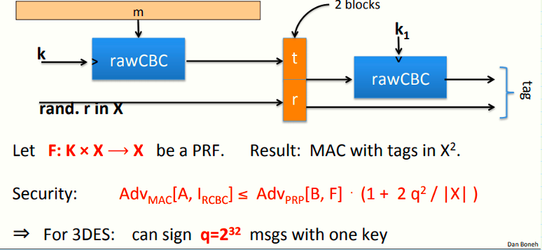

# W3 5-3 CBC-MAC and NMAC

## 1、MACs and PRFs

上节课讲到，可以通过安全的PRF来构造安全的MAC，但需要注意PRF的输出必须很大（如80 bits或128 bits）

目标：给定一个输出短消息的PRF（如AES），为长消息（GB甚至TB级别）构造一个PRF

## 2、Construction 1: encrypted CBC-MAC

CBC-MAC可以接收很长的消息，最长接收块为L（百万或十亿数量级），上图中的X≤L表明可以接收1~L之间任意数量的块

上述模型绿色部分为raw CBC，该模型先将消息分块，然后运行CBC模式，但不输出中间值，将结果与下一块继续输入F，直到最后一块时输出

由于raw CBC本质上是不安全的，为了确保MAC的安全，需要加上右下角的最后一步，将CBC的结果使用另一个独立的k~1~加密，得到最终输出

## 3、Construction 2: NMAC (nested MAC）

注意到与CBC-MAC不同的是，NMAC输出的消息来自于密钥空间K

上图模型中，初始密钥k先与第一个消息块一起输入函数F，之后F的输出作为新的密钥与下一块消息输入F，如此串联直到所有块计算完毕

由于该串联模型（绿色部分）也是不安全的，需要再加最后一步，而注意到密钥长度K与消息块长度不一致，因此需要将最后一步的输出t扩展，即拼接上fixed pad（fpad），然后再输入由另一个密钥k1作用的函数F

## 4、Why the last encryption step in ECBC-MAC?

假设定义MAC I~RAW~=(S,V)，S(k,m) = raw CBC(k,m)

则I~RAW~很容易收到单块消息的选择明文攻击，攻击者只需完成下述步骤：

1. 选择消息m∈X，使得消息长度等于分块长度

2. 请求计算m的tag，即获取t = F(k,m)

3. 伪造一个长度为2块的消息(m, t⊕m) 

完成上述步骤后，使用消息(m, t⊕m) 继续请求时，则有如下等式：
$$
rawCBC(k, (m, t⊕m) ) = F(k, F(k,m)⊕(t⊕m) ) = F(k, t⊕(t⊕m) ) = t
$$

## 5、ECBC-MAC and NMAC analysis

定理：对于任意L>0，对于有至多q次查询的高效PRF攻击者A攻击F~ECBC~或F~NMAC~，存在一高效的攻击者B，使得满足如下不等式：
$$
Adv_{PRF}[A,F_{ECBC}] \leq \ Adv_{PRP}[B,F]  \ + \ 2q^2/|X|
$$

$$
Adv_{PRF}[A,F_{NMAC}] \leq \ qLAdv_{PRF}[B,F] \ + \ q^2/2|K|
$$

需要注意的是，CBC中使用的F为PRP（计算中不必取逆），而对于MAC而言，PRF不必可逆

总结：只要密钥不被用于MAC长度超过根号|X|（ECBC）或根号|K|（NMAC）的消息时，MAC就是安全的，这个值对于AES-128而言为2^64^

 

## 6、The security bounds are tight: an attack

在ECBC-MAC下签名根号|X|条消息或在NMAC下签名|K|条消息后，这些模式就变得不安全了

假设PRF F为一PRP（如AES），则两种PRF（ECBC或NMAC）均有如下扩展性质：

∀x,y,w: F~BIG~(k, x) = F~BIG~(k, y) ⇒ F-BIG(k, xllw) = F~BIG~(k, yllw) 

上述性质表明，若对于消息x和y存在一个碰撞，则将其扩展之后（以w拼接）也会发生碰撞

因此，记F~BIG~:K × X ⟶ Y为一个由上述扩展性质的PRF，则有如下攻击：

1. 在消息空间X中构造根号|Y|条随机消息并获取其tag，即获取( m~i~ , t~i~ ) for i = 1 ,…, |Y|^1/2^

2. 找到一个碰撞t~u~ = tv且u≠v（由于生日悖论，这个碰撞高概率存在）

3. 选择某个w并请求一个tag t:= F~BIG~(k, m~u~llw) 

4. 输出伪造消息(m~v~llw, t)（此时t := F~BIG~(k, m~v~llw) ）

## 7、Better security: a rand. construction 

## 8、Comparison

ECBC-MAC通常用作基于AES的MAC（如802.11i中的CCM加密模式，或者NIST标准CMAC）

NMAC由于其串联特性，实际上每块消息都是新的密钥，因此某种程度上来收其更换密钥的速度很快，通常不会结合AES使用，但其是HMAC的基础