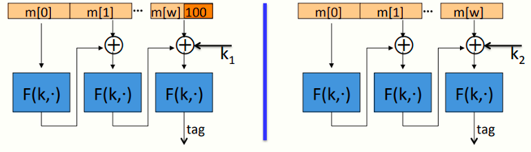

# W3 5-4 MAC padding

## 1、What if msg. len. is not multiple of block-size?

消息长度不为分组长度的倍数时该怎么办？

简单，填充很多个0，但是很笨，即pad(m) = pad(mll0)

因此CMC-MAC扩展必须是不可逆的，即若m~0~ ≠ m~1~ ⇒ pad(m~0~) ≠ pad(m~1~) 

ISO的做法：以1000…00扩展，1代表从此处开始扩展，接收时只需要右至左扫描0串直至第一个1

## 2、CMAC (NIST standard)

CMAC使用三个密钥key = (k, k~1~, k~2~)，第一个密钥k用于CBA-MAC的加密，有如下模型

显然，区别于上一节的模型，该模型没有最后一步的额外加密

对于需要消息扩展的消息而言，在最后一次计算时需要扩展，扩展后加入k~1~参与xor计算，再作为函数F的输入（图中左侧模型），而对于不需要扩展的消息（图中右侧模型），则使用k~2~作为输入参与xor计算

优点：

* 解决了消息扩展攻击，由于攻击者不知道最后使用的xor密钥，不能实施扩展攻击，同时也省去了最后的加密步骤

* 解决了未对消息进行填补的不明确状态，利用两个不同的密钥区分两种不同的状态，使得消息填补更安全