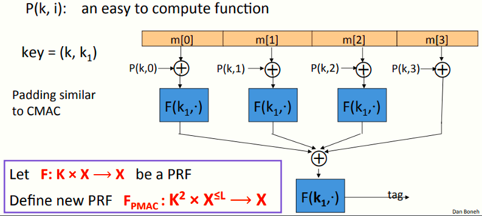

# W3 5-5 PMAC and Carter-Wegman MAC

之前的课程讨论了CBC-MAC和NMAC将一个用于短消息的PRF转化成用于更长消息的PRF，这两种结构是按次序的，表明不能通过多处理器使其变得更快

本节课将关注一种并行的方式PMAC

## 1、Construction 3: PMAC – parallel MAC 

与之前的CBC-MAC一样，上图定义的PRF可以处理更长的消息，允许处理任意长度且可以划分成尽可能多的块的消息

该模型需要密钥key = (k, k~1~)，其中函数P为一易于计算的函数，P接收密钥k和块计数作为输入，需要扩展的消息的处理方式类似于CMAC

流程：

1. 先将消息分组

2. 将每个分组独立的与函数P的结果进行xor计算

3. 将2中的输出与密钥k~1~一起作为函数F的输入

4. 前三步骤均可独立的并行运行，之后将#3中的各分块的函数F的输出一起进行一次xor计算

5. 将4中的xor结果与k~1~一起作为F输入，最终输出tag

需要注意的是，如果没有函数P（即没有P与m~i~的xor计算步骤），则上述模型不安全，因为若缺少消息与P的xor计算，则相当于将消息直接输入到F函数，攻击者可以简单的交换任意两块或多块消息的位置（如将m~1~和m~2~位置交换，或将所有消息块循环移动），但最终获得的tag值不会改变，因此攻击者有能力构造一些由特定消息块组成的消息而其tag并不会改变，从而造成攻击

结合上述分析，函数P强制规定消息块之间排列的明确的前后次序（尽管计算上是并行的），因此不仅需要一个密钥k作为输入，还需要块计数i作为输入，使得其对于每个块即便是在交换后也有不同的计算结果

函数P是一个非常容易计算的函数，只会占用模型极少的计算时间，但这也足以确保PMAC的安全

## 2、PMAC: Analysis

PMAC定理：对于任意L>0，若F为一在(K,X,X)上的安全PRF，则F-PMAC为在(K, X^≤L^ , X)上安全的PRF，对于任意至多有q次查询的高效PRF攻击者A攻击F-PMAC，存在一高效PRF攻击者B，满足如下不等式
$$
Adv_{PRF}[A,F_{PMAC}] \leq \ Adv_{PRF}[B,F]+2q^2L^2/|X|
$$
根据上述分析，若qL<< |X|^1/2^ 则为安全的，MAC的消息块接近|X|^1/2^时则需要考虑更换密钥来确保安全

## 3、PMAC is incremental

假设F使用PRP，若原消息的某一块或少数几块更改为新的消息块，则能否快速计算新的tag？

可以，由于PRP是可逆的，因此只需要计算如下表达式

F^-1(k1,tag) ⨁ F(k1, m[1] ⨁ P(k,1)) ⨁ F(k1, m’[1] ⨁ P(k,1))

然后将上述结果再输入F(k1, ⋅)即可

说明：上述表达式，先计算F^-1，取得tag在PRP之前的结果，即所有消息块的F函数xor的结果，然后与原消息的F函数的输出xor，再xor上新的消息的F函数的输出，由于xor的特性，相当于去掉了原来的m1，再加上了新的m1'，最后再通过F函数得到新的tag即可

区别于CBC-MAC，若一块或少数几块消息更新了，则需要重新完整的计算一次tag，消耗时间

 

## 4、One time MAC (analog of one time pad)

对于MAC I=(S,V)和攻击者A，定义下图MAC游戏模型

定义：若I=(S,V)为安全MAC，则其对所有高效A，其如下优势为可忽略
$$
Adv_{1MAC}[A,I] \ = Pr[Chal. outputs 1]
$$
一次性MAC和OTP一样，可以抵御有用无穷计算能力的攻击者，由于其一次性得特性，其比基于PRF的MAC更快

 

## 5、One time MAC：example

取q为一大素数（如q=2^128^+51）

记key = (a, b) ∈ {1,…,q}^2^，即a，b均为[1,q]之间随机选择的整数

记msg = ( m[1], …, m[L] )，每块消息m~i~均为128 bits

记S如下
$$
S(key,msg) \ = \ P_{msg}(a) + b \  (mod \ q)
$$
其中P~msg~为一多项式
$$
P_{msg}(x) \ = \ x^{L+1}+m[L]*x^L+...+m[1]*x
$$
不难看出，对于给定的MAC值S( key, msg~1~ )，攻击者不能获得关于另一个消息的MAC值S( key, msg~2~ ) 

## 6、One-time MAC ⇒ Many-time MAC

记(S,V)为一定义在(KI ,M, {0,1}^n^ )上的安全One-time MAC

记F: K-F × {0,1}^n^ ⟶ {0,1}^n^为一安全PRF

Carter-Wegman MAC:
$$
CW( (k~1~,k~2~), m) = (r, F(k~1~,r) ⨁ S(k~2~,m) )
$$
CW MAC需要一个随机生成的nonce r（每次计算MAC时需要重新选择），CW MAC分为两个部分，使用PRF F的部分计算较为缓慢，但只需要接收较短的输入（密钥k~1~和nonce r），S接收很长的输入并且计算很快，最终将F和S的结果进行xor计算得到输出

定理：若(S,V)为一安全one-time MAC且F为安全PRF，则CW为安全MAC，输出tag空间为{0,1}^2n^

CW MAC的验证：V( k~2~, m, F(k1, r) ⨁ t) )

## 7、Construction 4: HMAC (Hash-MAC)

互联网应用最广泛的MAC