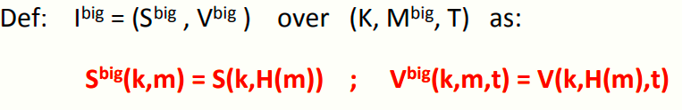
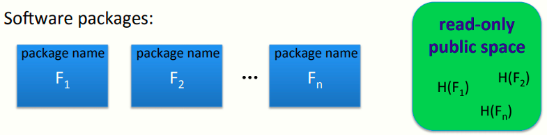

 # W3 6-1 Collision resistance Introduction

## 1、Recap: message integrity

上一章讲的四种MAC构造方式

* ECBC-MAC，CMAC：AES常用

* NMAC：HMAC的基础

* PMAC：并行计算MAC

* CW MAC：基于高速的一次性MAC

## 2、Collision Resistance 

记H: M →T为一Hash函数，其中|M|远大于|T|

碰撞：H的碰撞，即找到消息对m~0~ , m~1~ ∈ M，使得H(m0) = H(m~1~) 且 m~0~ ≠ m~1~，由鸽舍原理可知，由于|M|远大于|T|，一定会有两个消息映射到同一个tag

抗碰撞性：H若为抗碰撞的，表明其对所有explicit的高效算法A，其如下优势可忽略
$$
Adv_{CR}[A,H] \ = \ Pr[A \ outputs\  collision\  for\  H]
$$
其中explicit，即明确的，意味着不是仅仅知道该算法的存在，还需要求得这种算法，使得其能在计算机上运行并生成所需要的碰撞

常用Hash算法：SHA-256（还未被攻破）

## 3、MACs from Collision Resistance 

记I = (S,V)为定义在(K,M,T)上接收短消息的MAC

记H: M^big^ → M 

定义一新的MAC如下：

定理：若I为一安全MAC且H为一抗碰撞Hash，则I~big~为一安全MAC

抗碰撞性对于MAC安全很重要，假设攻击者可以找到一个碰撞，则上述S~big~在选择明文攻击下不再安全

* 攻击者首先获取tag t ⟵S(k, m~0~) 

* 由于攻击者可以找到碰撞，因此可以伪造消息和mac对(m~1~ , t)

## 4、Protecting file integrity using C.R. hash 

对于用户需要安装软件的场景，用户想确保其得到了官方的软件包而非攻击者恶意发布的，因此可以通过检查各个软件的Hash值，确保软件没有被篡改

由于Hash的抗碰撞性，攻击者不能在不被检测到的情况下修改软件包

对Hash的保存：仅需要其为公开且只读的，由于其公开，所以不需要密钥，但是需要确保只读以防止篡改