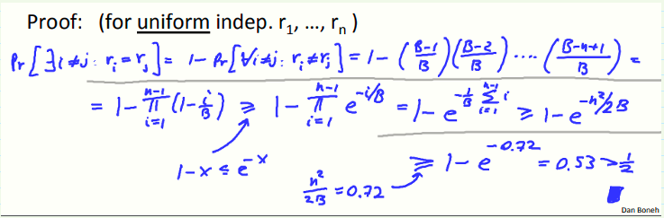
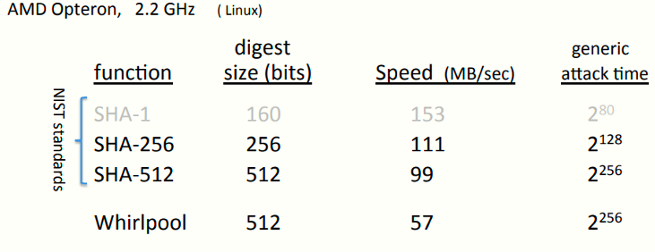

 # W3 6-2 Generic birthday attack 

## 1、Generic attack on Collision resistance functions

记H: M → {0,1}^n^为一Hash函数，且|M| >> 2^n^

常规算法可以在O(2^n/2^)内找到一个hash碰撞，算法如下

1. 在消息空间M内选择2^n/2条随机消息m~1~, …, m~2~^n/2^

2. 对于i = 1, …, 2^n/2^，计算t~i~= H(m~i~ ) ∈{0,1}^n ^

3. 找到一个碰撞t~i~=t~j~，若未找到，返回1

## 2、The birthday paradox

记r~1~, …, rn ∈ {1,…,B}为n个独立同分布整数（independent identically distributed，iid）

定理：若n= 1.2 × B^1/2^ 则Pr[ ∃i≠j: ri = rj ] ≥ ½，证明如下

## 3、Sample C.R. hash functions: 

使用Crypto++ 5.6.0 [ Wei Dai ] 

目前已知最好的找到SHA-1的碰撞的算法需要2^51^