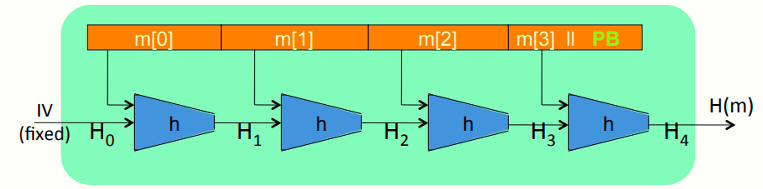
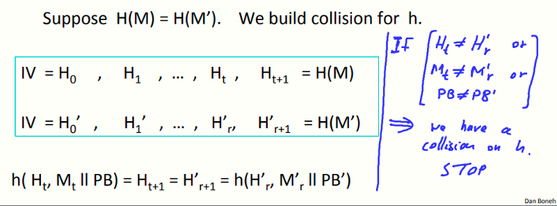
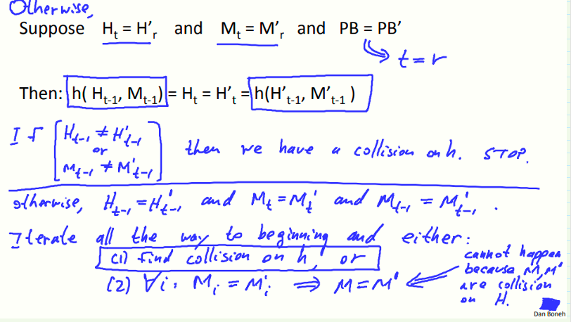

# W3 6-3 The Merkle-Damgard Paradigm

默尔克-达姆加德范式，常用于生成抗碰撞hash函数

## 1、Collision resistance: review

记H: M →T 为一hash函数（|M| >> |T|）

目标：C.R.（collision resistant）hash函数

## 2、The Merkle-Damgard iterated construction 

如图所示，记h: T × X ⟶ T为一接收短消息为输入的C.R. hash函数（也叫压缩函数），初始向量IV为固定在代码或芯片中的值，消息作为输入并分块为m~0~，m~1~，……

链式变量Hi：H: X^≤L^ ⟶ T ，对于m~0~而言，将m~0~和IV作为h的输入，输出H~1~，再与下一块消息m~1~作为下一轮h的输入

填充块PB：pandding block，包含1个1，若干个0和64 bits的消息长度，必须附加这个填充块，若消息尾部的长度不足以放下PB，则需要添加一个新的消息块

## 3、M-D collision resistance

定理：若h为一C.R. hash函数，则H也是

含义：若我们希望构造一个能接收长消息作为输入的C.R. hash函数，则我们只需要构造一个C.R.压缩函数即可

证明：反证法（collision on H ⇒ collision on h）

