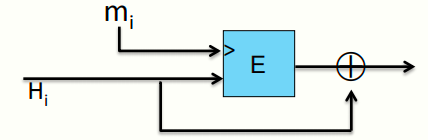
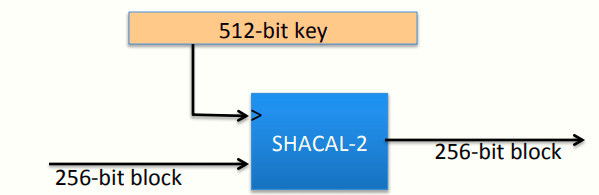

 # W3 6-5 Constructing Compression Functions

## 1、Compr. func. from a block cipher

记E: K× {0,1}^n^⟶ {0,1}^n^为一块密码

Davies-Meyer压缩函数：h(H, m) = E(m, H)⨁H，结构如下

定理：若E为一理想加密算法（集合K上的随机置换），则找到一个碰撞h(H,m)=h(H’,m’)（使用生日攻击），复杂度为O(2^n/2^)，即需要分析2^n/2^对（E，D）

## 2、Other block cipher constructions

记E: {0,1}^n^ × {0,1}^n^ ⟶ {0,1}^n^

通过分组密码构造抗冲突的压缩函数方式还有很多种，如Miyaguchi Preneel，其有12个变体提供抗冲突机制

## 3、Case : SHA-256

使用Merkle-Damgard函数，Davies-Meyer压缩函数，块密码使用SHACAL-2，结构如下

密钥长度为512 btis，意味着该算法一次可处理512 bits的消息，块大小为256 bits

## 4、Provable compression functions

另一类压缩函数，不使用块密码进行构造，而是基于数论中的数学难题

原理：选择一个2000 bits的素数p，并随机选择u、v，使得1 ≤ u, v ≤ p，对于m,h ∈ {0,…,p-1} ，定义函数h(H,m) = u^H^ ⋅ v^m^ (mod p) 

事实上，若想找到上述算法的一个碰撞，其难度可归约为解决离散对数问题

实际上并没有使用上述算法，而是使用基于块密码的压缩函数，原因是上述算法的效率实在是太低了，想要计算稍微长一点的消息的MAC值可能需要一天甚至更长