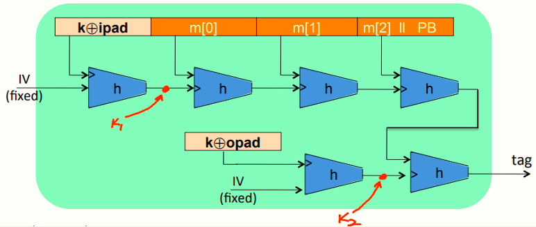

# W3 6-6 Constructing Compression Functions

## 1、Standardized method: HMAC (Hash-MAC)

因特网钟最广泛使用的MAC算法，其中的H代表hash函数（如SHA-256）

基于hash函数构建MAC的方法：
$$
HMAC: \ S(k,m)=H(\ k\bigoplus)opad \ || \ H(k\bigoplus ipad||m) \ )
$$
具体结构如下图

ipad：internal padd，与密钥k进行xor运算后得到一个512 bits的块，并将其连接到消息M的前面

opad：outer pad，同样与密钥k进行xor得到512 btis的块

ipad和opad都为标准上固定的常量，均为512 bits且相互独立

从符号意义上来说，k⨁ipad与IV作为h的输入得到的输出可以视为密钥k~1~，而k⨁opad同理与IV作为h的输入，得到的输出可以视为密钥k~2~，从而通过一个密钥k得到了两个子密钥