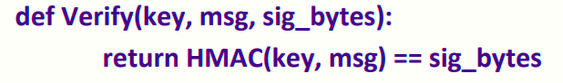
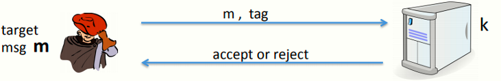
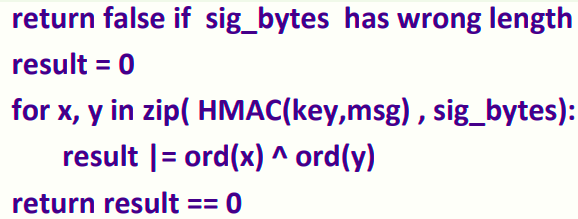
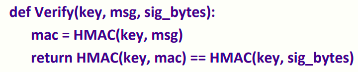

 # W3 6-7 Timing attacks on MAC verification 

## 1、Warning: verification timing attacks

如Python的Keyczar库中的算法，其摘要如下

该算法采用重新计算HMAC的tag的方式，并与传入的tag作比较

问题在于，其中的比较"=="为按字节（byte-to-byte）比较，一旦找到其中第一个不匹配的字节时立即返回false

针对上述问题，假设如图模型，攻击者有消息m和其对应的tag，服务器上存储了一个HMAC的密钥，攻击者将m和tag发送给服务器，服务器验证是否合法后返回accept或reject

步骤：

1. 选择一个消息m固定，然后随便选一个tag并将其与m一起发送给server，计算server的响应时间

2. 遍历tag的第一字节的所有可能值并与m一并提交，计算每次服务器响应的时间并与1中时间进行比较，若响应时间比1中的时间略长，说明第一字节通过验证，错误出现在下一字节
3. 重复1和2，直到全部的16字节通过验证

## 2、Defense

（1）对于tag串的比较，使其总是保持相同的时间开销，思路如下：

但上述思路由于现代编译器的优化问题，很难确保每次请求验证tag时的时间开销总是一致或保持差别不大

（2）同样使其总是保持相同的时间开销，但通过其他手段让攻击者不知道进行比较的字节的值，思路如下

使用key对msg生成mac，然后再使用相同的key生成mac的mac，之后与提交的sig_bytes的mac进行比较

利用HMAC的特性，使得攻击者并不知道被比较的字符串究竟是什么，从而不能再进行上述的时序攻击，且也避免了（1）中可能发生的编译器优化

（3）总结：实现密码库时，安全专家也可能产生错误，从而编写脆弱性代码，尽管理论上正确，但对于时序攻击而言仍不安全，从而破坏了系统的安全性

结论：永远不要自己去实现一个加密算法，自己实现的算法很可能无法应对侧信道攻击，应使用如OpenSSL之类的标准库