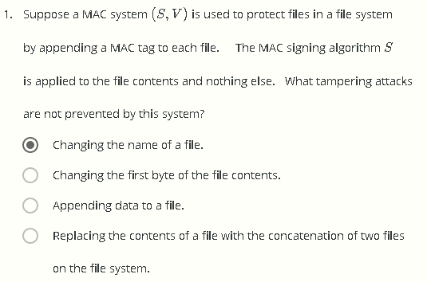
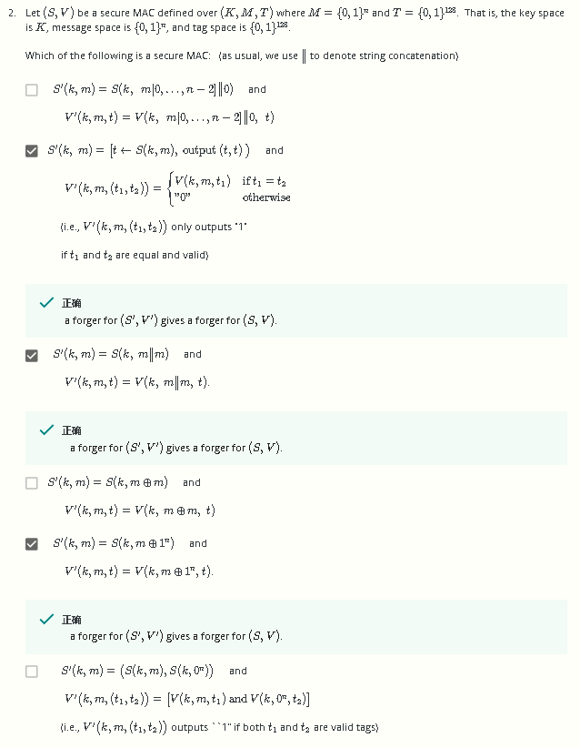
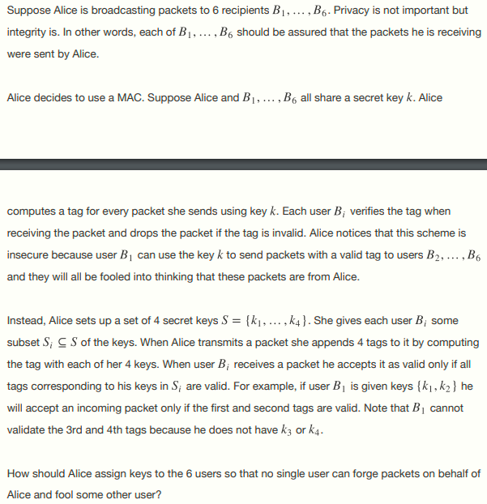
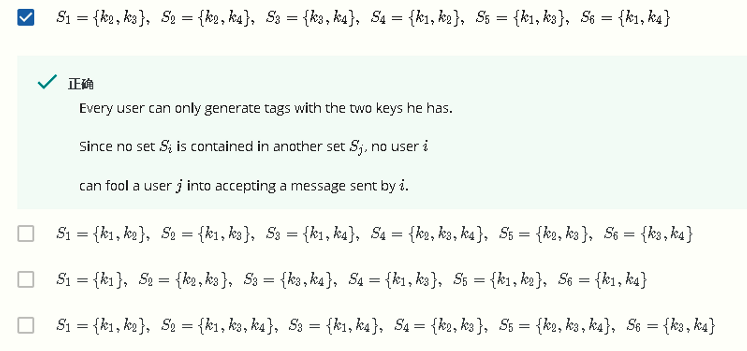
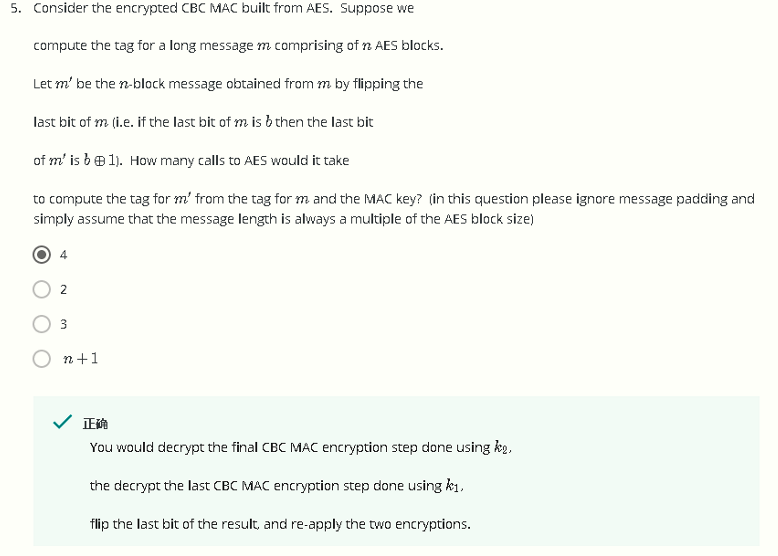
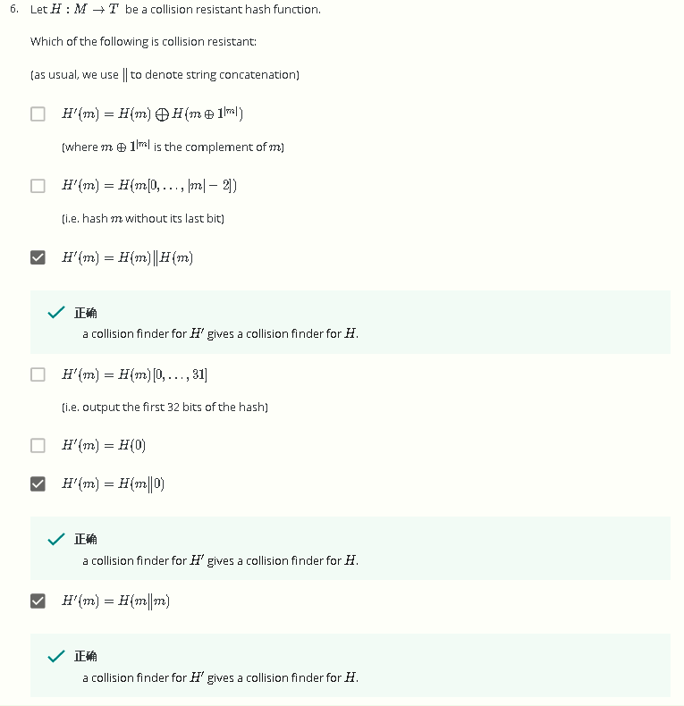
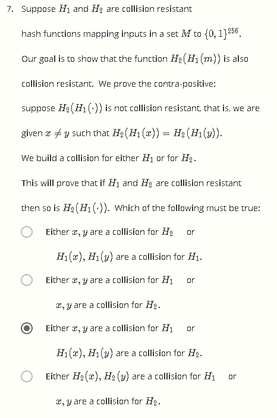
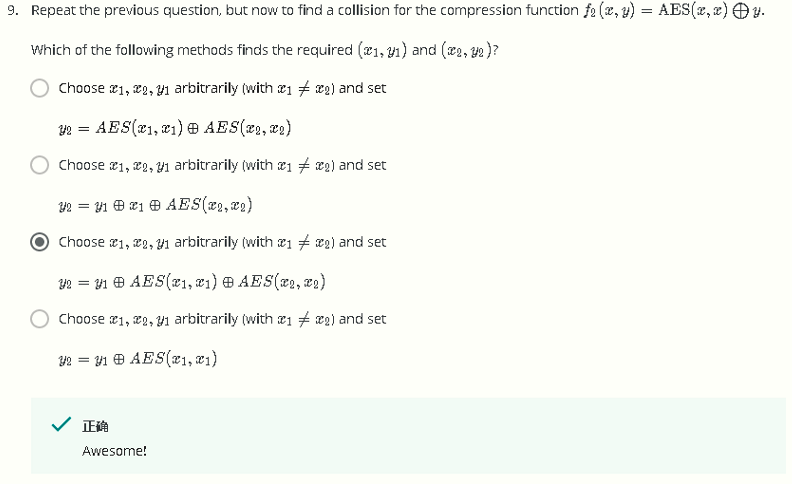
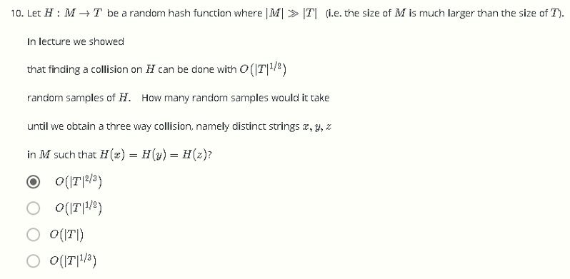

# W3 Problem Set && Programming Assignment

Q1

问：假设一MAC (S,V)用于保护文件系统，方式为将tag附在每个文件后，签名算法S作用域文件内容，以下哪种方式的攻击不会遭到该系统的保护？

分析：由于S只作用于文件内容，显然更改文件名会导致攻击	

Q2

问：经典看不懂题目

分析：看懂了再分析，所以答案是抄的

Q3

 

 

Q4

问：Alice需要向6为客户B~1~\~B~6~广播报文，需要确保完整性但无需确保安全性（即B1~B6应当确保收到的报问确实是Alice发送的）

假设Alice使用MAC，并与B~1~\~B~6~共享密钥k，对于Bi收到的报文，若验证tag错误则丢弃报文

Alice注意到上述模型中存在缺陷，B~1~可以利用共享密钥k，将报问发送给B~2~\~B~6~而tag验证不会出错，因此B~2~\~B~6~会认为报文流来自于Alice

假设新方案Alice使用一密钥集合S={k~1~,……k~4~}，对于Bi而言，分发给其的密钥为S的子集S~i~，即S~i~⊆S

问下述哪种密钥分配方案能确保没有任何一个客户能欺骗其他客户

分析：第一个选项中，任意两个客户B~i~，B~j~之间持有的密钥的交集小于等于一个密钥，由于通过验证需要两个密钥，因此任意一个用户不能产生其他用户的更多的密钥

对于选项二，B4拥有k~2~，k~3~，k~4~，可以欺骗用户B~5~和B~6~

对于选项三，同理B~4~，B~5~，B~6~可以欺骗B~1~

对于选项四，B~2~可以欺骗B~3~，B~6~，且B~5~可以欺骗B~4~，B~6~

 

Q5

问：若CBC-MAC使用AES，假设计算一长消息m的tag，该消息包含n个AES块，记m'为另一长度为n块的消息，其为消息m的最后一位取反得到，则由m的tag计算得到m'的tag需要调用多少次AES算法？

分析：基于AES的CBC-MAC使用的是PRF，因此解得最后一块消息需要调用两次，之后最后一位取反再调用两次AES，共四次

 

Q6

问：若H : M → T为一抗碰撞hash函数，则下列哪些函数仍为抗碰撞？

分析：

1. 若m取000，则H'(000)=H(000)⨁H(111)，若m取111，则H'(111)=H(111)⨁H(000)，即H'(000)=H'(111)，碰撞

2. 截断消息最后一位不抗碰撞，有H'(00)=H'(01)
3. 显然H抗碰撞则H'也是
4. 同2
5. 显然不抗碰撞，因为有H'(0)=H'(1)
6. 显然H抗碰撞则H'也是
7. 显然H抗碰撞则H'也是

 

Q7

 

 

Q8

 

Q9

问：没看懂

答：蒙对的

 

Q10

问：记H : M → T为一随机hash函数， |M|>>|T|，找到H的碰撞的期望为O(|T|^1/2^)，若希望找到三个碰撞，即找到不同的x，y，z，使得H(x)=H(y)=H(z)，期望为多少

分析：首先对于给定的集合，包含n个元素，n个任意选择3个为C n-3，即期望为O(n^3^)，对于每组特定的元素，需要求H(x)=H(y)=H(z)

而随机hash函数，产生碰撞的概率为1/|T|，则产生上述三路碰撞的概率为1/|T|^2^（需要满足H(x)=H(y)且H(x)=H(z)）

因此期望为O(n^3^/|T|^2^)