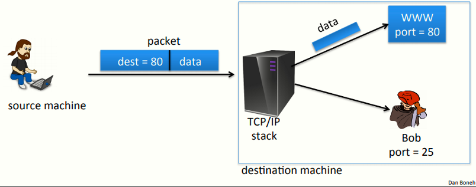
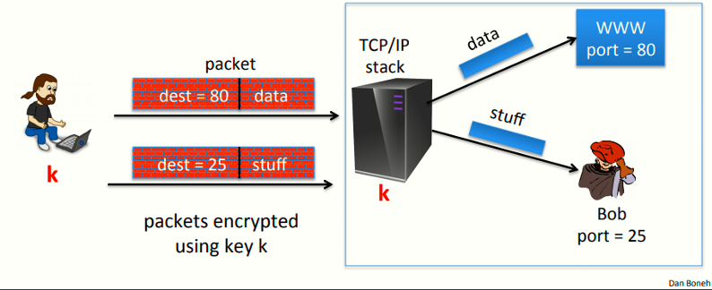
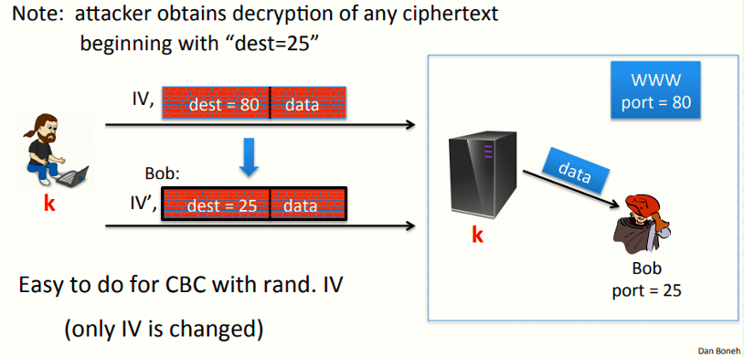
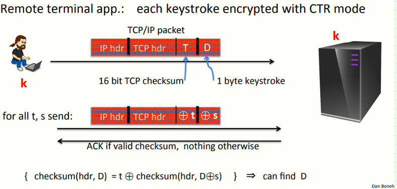

# W4 7-1 Active attacks on CPA-secure encryption 

## 1、Recap: the story so far

保密性：通过加密方案实现语义安全，从而防止选择明文攻击，但针对CPA的安全性只提供针对窃听的安全性，即攻击者仅监听网络流量而不修改任何数据包或注入攻击包

完整性：在消息不保密的请款下提供消息完整性，确保数据在传输过程中不会被修改，常见方案为MAC，提供了针对选择消息攻击的不可伪造性

## 2、Sample tampering attacks 

简单的TCP/IP模型如上图，TCP/IP堆栈收到数据包后查看数据包的目的端口，之后交付给对应的监听进程（服务），如图中80端口则交付WWW服务器，25端口交付用户

IPsec模型如上图，IPsec在发送方和接收方之间加密IP数据包，因此需要一个共享密钥k

发送方发送数据包时，使用k对其加密，接收方收到后，TCP/IP堆栈对其解密，之后查看目的端口并将其交付给对应进程

上述模型中，假设现在Bob为攻击者，加密方案使用随机IV的CBC模式，他的目标是在路由中拦截数据包，并修改其端口为25，且该操作在密文上完成，修改完成后再使其到达TCP/IP堆栈，之后堆栈解密后会将数据转发给Bob，从而读取到本来应该交付给Web服务器的数据

若解密第一块消息：m[0] = D(k, c[0]) ⨁ IV = “dest=80…” ，则构造IV'=IV ⨁ (…80…) ⨁ (…25…)，可以使得目标接收数据包后，将目的端口解密为25

总结：上述例子说明了通过简单的修改IV字段，就可以导致一个简单的数据包转移，因此若没有完整性，攻击者可以在路由中修改数据包，CPA安全加密实际上并没有提供机密性

## 3、An attack using only network access

假设有一远程终端应用，每次用户按键时，都互相服务器发送一个加密的按键，假设加密采用CTR模式

攻击者截获但不会修改数据包并将其正确的发送到服务器，对于数据包，使用值T来与校验和字段进行xor计算，使用值S与数据字段进行xor计算，由于CTR模式的属性，若将密文与T进行xor，则解密后的结果为明文与T的xor的值，S与数据字段同理

通过上述方法，攻击者使用不同的T和S组合构造大量的伪造数据包，并将其发送到服务器，之后监听服务器的响应，若未响应，则说明修改后的数据和校验和不正确，若服务器回传一个ACK，则表明修改正确

攻击者通过获得大量的T和S对，攻击者可以计算出D的值，因此此类攻击为选择密文攻击，攻击者提交了选择的密文，即该密文来自于其想要解密的密文，通过监听服务器的响应，攻击者可以了解到关于明文的信息，不断重复这个过程从而学习到实际的纯文本

## 4、总结

CPA安全不能确保来自活跃的攻击者的攻击

若需要确保完整性而不需要保密性：使用MAC

若两者都需要：则需要使用身份验证加密模式