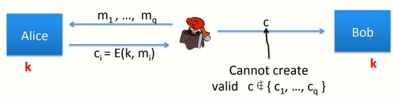

 # W4 7-2 Authenticated Encryption-Definitions 

## 1、Goals

身份验证加密系统(E,D)定义如下：

记加密E: K × M × N ⟶ C

记解密：D: K × C × N ⟶ M ∪{⊥} 

其中N为一可选的随机数nonce，和以前不同的是，解密算法不仅输入明文消息M，还输出一个特殊符号buttom，当解密算法输出buttom时，意味着该密文无效且应当被忽略

buttom应独立于明文消息空间以确保其为独一无二的元素，用于表示应当拒绝收到的密文

安全性：系统必须提供如下安全性

* CPA攻击下的语义安全

* 密文完整性：攻击者不能构造一个可以被正确解密的密文，即不能解密出非bottom元素的结果

## 2、Ciphertext integrity

 记(E,D)为一消息空间为M的密文，有上述游戏模型

定义：若(E,D) 为密文完整性，则其对于所有高效的攻击者A，其如下优势可以忽略
$$
Adv_{CI}[A,E]\ = \ Pr[Chal. \ outputs\ 1]
$$

## 3、Authenticated encryption

定义：若密文(E,D)提供认证加密，则其满足

* 在CPA下满足语义安全

* 满足密文完整性

前一节课的例子说明，使用随机IV的CBC模式不提供认证加密，即其不满足密文完整性，攻击者可以构造一些密文，而解密算法D(k,⋅)不会输出buttom元素，从而攻击者可以很轻易地赢得上述游戏模型

## 4、Implication 1: authenticity

真实性：攻击者不能欺骗接收方（Bob）使其相信发送发（Alice）发送了某些消息

模型如图，若D(k,c) ≠⊥，即未输出bottom元素，则Bob可以相信消息来自于持有密钥k的发送方（但不一定来自期望的发送方，有可能是重放）

## 5、Implication 2

认证安全是一个非常强大的手段，其安全性可以用于抵御选择密文攻击（chosen ciphertext attacks，CCA）