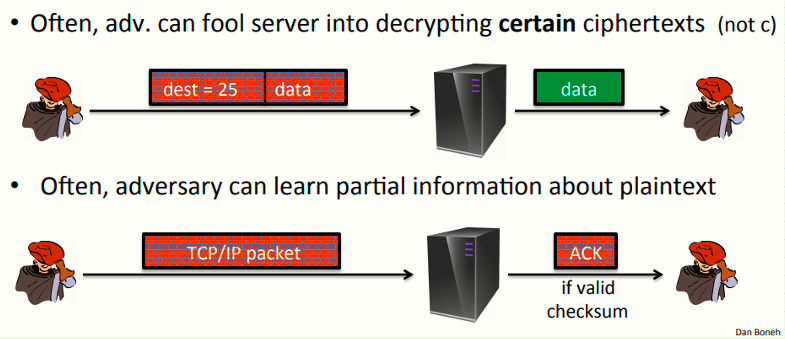
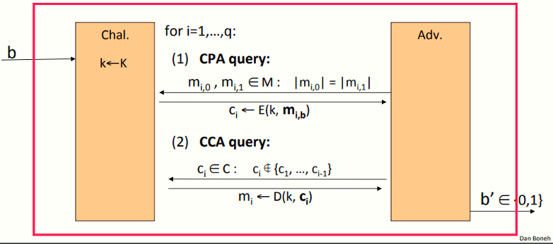
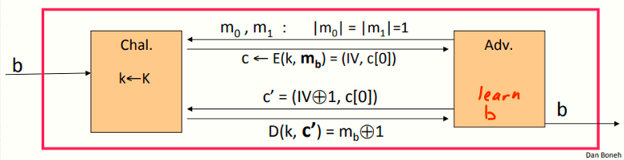
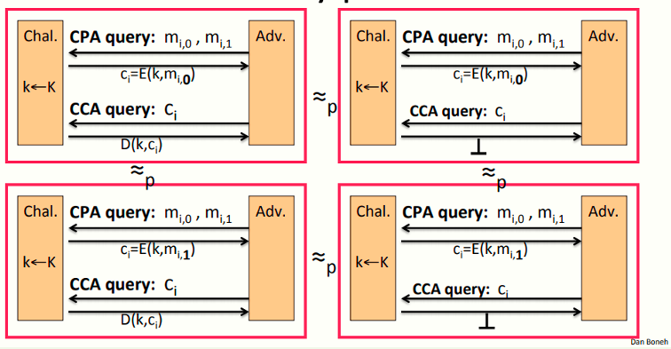

 # W4 7-3 Chosen ciphertext attacks

## 1、Example chosen ciphertext attacks

上节课讲到的一些CCA手段，模型如下

攻击者可以欺骗服务器解密特定的密文或从加密包中学习到一些关于明文消息的内容

## 2、Chosen ciphertext security

攻击者的能力：可以选择CPA或CCA，亦即

* 可以获得其任意选择的消息的加密

* 可以解密其选择的密文文本（除了一些挑战密文之外）

攻击者的目标：攻破语义安全

## 3、Chosen ciphertext security: definition 

E = (E,D)为一定义在(K,M,C)上的密码，对于b=0,1 ，定义事件EXP(b)如下：

对于攻击者而言，其可以发起至多q次查询，每次查询可以为CPA或CCA两种中的一种

对于CPA而言，攻击者选择两条等长消息，挑战者返回m~0~或m~1~的加密（取决于挑战者选择的事件）

对于CCA而言，攻击者提交密文并获得其解密，即其可以获得他选择的任意密文的解密，唯一的限制是选择的密文不能来自于CPA的查询结果，否则不公平，这意味着攻击者可以很轻易地获得一个合法密文（挑战密文，即m~0~或m~1~的密文），解密后可以很轻易地分辨其是m~0~或m~1~	

定义：若E为CCA安全的，则其对于任意高效攻击者A，其如下优势可忽略
$$
Adv_{CCA}[A,E] \ = \ |\ Pr[EXP(0)=1] \ -\ Pr[EXP(1)=1] \ |
$$
看个例子：使用随机IV的CBC不是CCA安全的，模型如下

假设攻击者提交两个消息m~0~和m~1~，长度均为1块（1 block CBC length），之后挑战者会返回该块使用的IV和密文

之后攻击者简单修改收到的密文，将其中的IV修改为IV⨁1，其他不变并将新的密文c'提交给挑战者（由于修改了密文内容，不再是原来的挑战密文，因此合法），由前几节提到的xor计算的特性，解密结果为m0⨁1或m1⨁1，从而攻击者可以轻易分辨挑战者选择的事件，从而赢得安全游戏

## 4、Authenticated enc. ⇒ CCA security

定理：记(E,D) 为一提供AE的密码，则(E,D) 为CCA安全的

具体而言，对于有至多q次查询的高效的敌手A，存在高效的敌手B1，B2满足如下不等式
$$
Adv_{CCA}[A,E] \ \leq 2q*Adv_{CI}[B_1,E]+Adv_{CPA}[B_2,E]
$$
上述不等式中，由于该方案具有认证加密，右侧第二部分是可忽略的，因此是CPA安全的，第一部分也是可忽略的，因此具有密文完整性，综上两个条件，敌在赢得cCA安全游戏的也是可忽略的

证明如下

上述左侧两个分别代表挑战者选择事件0和事件1，稍微改变一下挑战者的输出，使其不会输出CCA查询的解密，而是总是输出⊥元素，因此每当攻击者提交CCA查询时，挑战者总是输出⊥

因为方案具有密文完整性，攻击者无法生成不在C~1~C~i-1~中的密文，因此不会解密为bottom元素以外的结果

由于密文完整性，每一个攻击者选择的密文查询都会导致挑战者输出⊥，若攻击者实际上可以区分左边和右边的游戏模型，这意味着它可以在某个时刻请求一个解密到bottom元素之外的查询，并用该查询打破密文完整性

由于密文完整性，这些左右博弈是无法区分的

总结一下，即攻击者的选择密文的询问总是以同样的方式回复，不会给攻击者任何的信息，攻击者总会收到⊥的回复，而⊥意味着不会给攻击者任何的信息，因此可以将上述模型去掉CCA查询，从而模型变成了CPA查询，又因为认证加密是CPA安全的，因此图中右侧上下两个游戏无法区分，因此所有游戏等价，因此为CCA安全

## 5、总结

认证加密需要确保机密性来抵御一些活跃的攻击者（可以解密一些密文的攻击者）

结论：

* 不抗重放

* 如果泄露了为什么拒绝的信息（比如计时攻击）那么认证加密也将是不安全的