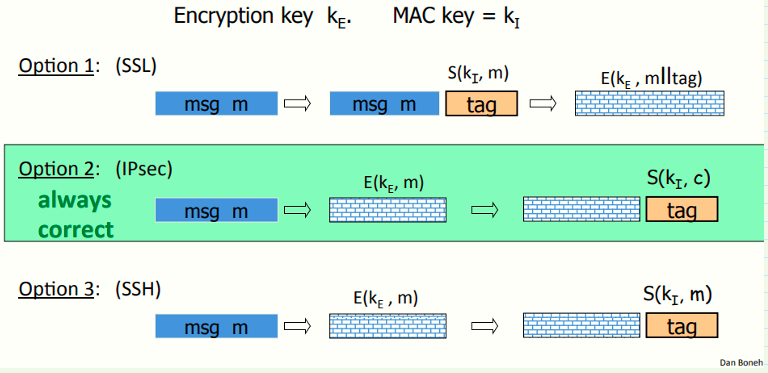
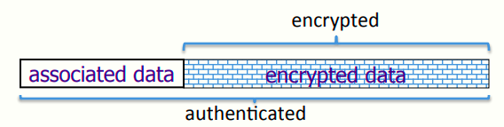
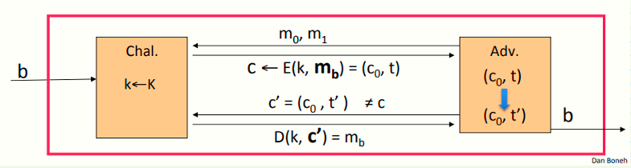
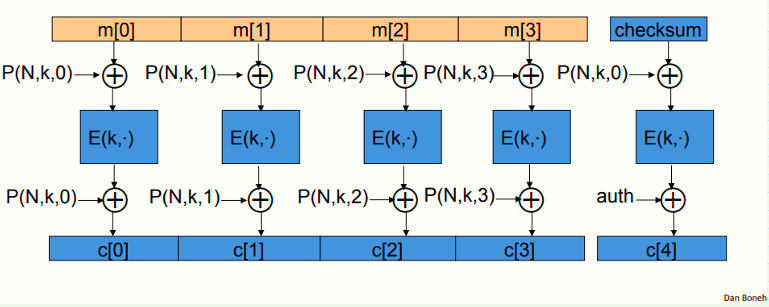
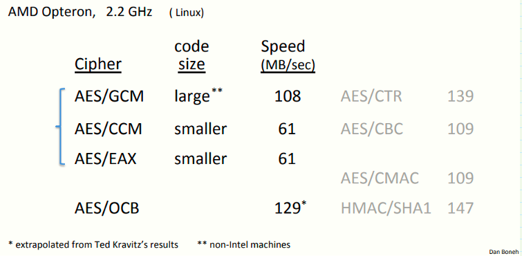

 # W4 7-4 Constructions from ciphers and MACs 

## 1、history

认证加密（Authenticated Encryption ，AE）最早在2000年提出

但在此之前，一些加密库如MS-CAPI都是单独支持CPA安全和MAC的，这意味着CPA安全加密函数和MAC函数需要单独调用，因此对于不同的开发者有不同的方式，让这两个函数结合在一起以实现认证加密

问题：这些认证加密在当时并没有被定义，因此当时的开发者并不知道哪些是正确的，也不是所有的方式都是正确的

最常见的错误的方式：将加密和完整性机制合并

## 2、Combining MAC and ENC (CCA)

记两个独立的密钥，加密密钥为KE，MAC密钥为KI，两个密钥均在会话建立时生成，有上图所示的CPA安全加密和MAC合并的三个例子

* SSL协议（mac-then-enc）：先MAC再加密，即先用KI计算MAC，然后附在消息m的后面，再将两者作为一个整体使用KE加密

* IPsec协议（enc-then-mac）：先对消息进行加密，再对密文计算MAC
* SSH协议（enc-and-mac）：先对消息加密，然后在尾部附上对消息的MAC（不是对密文的MAC）

SSL的做法：典型的错误，很容易被CCA，因此不能保证AE（导致CCA的原因：一些加密算法和MAC算法之间可能产生冲突）

对于IPsec的方案而言，总是正确的，无论使用哪种CPA安全的方案和MAC方案，IPsec的方案总能提供一个正确的认证加密

IPsec的方案：首先先对消息加密，因此消息会隐藏在密文中，之后计算MAC，MAC确保没有人能提供一段有效的而内容不同的密文，该方案确保了任何对密文的修改都会被发现（MAC校验不通过）

对于SSH协议的方案而言，MAC并不保证消息的机密性，仅确保完整性，实际上若仅输出明文中的若干bits作为MAC理论上没错，但是会完全破坏CPA安全性，因为明文中的若干bits在密文中被泄露了，该方案对于SSH来说没问题，但不建议使用，因为MAC的输出会泄露明文中的某些bits

## 3、A.E. Theorems

记(E,D) 为一CPA安全加密，(S,V) 为一安全MAC，则有如下定理

* Enc-then-MAC方式：总是可以提供AE
* MAC-then-Enc方式：在CCA下可能不安全

值得注意的是，若Enc采用rand-CTR模式或rand-CBC模式，M-then-E方式也可以提供AE

## 4、Standards

AE开始流行后，出现了一些列的标准以合并加密和MAC方式，有下列三种典型代表

1. GCM：使用CTR模式加密，CW算法生成MAC，效率很高，加密时间基本取决于CTR模式的加密时间.
2. CCM：使用CBC-MAC然后使用CTR模式加密，即本质是MAC-then-Enc（由上一节提到的，因此使用CTR加密是可以提供AE的），且CCM是完全基于AES的方案（CBC-MAC和CTR模式均使用AES，只需要一个AES模块和少量的代码即可实现），802.11i标准在使用
3. EAX：CTR模式然后CMAC

三种模式的比较：

1. 都是基于nonce，即并不使用任何随机，但是需要一个nonce作为输入，每个密钥与其对应的nonce都是独一无二的（由于nonce不必是随机的，因此计数器是个很好的生成的nonce的机制）
2. 支持附加数据的认证加密（A.E. with associated data)：一种对AE的扩展，常见于各种网络协议，即明文消息不会被完全加密，仅有一部分会被加密，但整条消息可以被确保是正确的

如IP包，AEAD确保头部不会被加密（加密了无法路由），因此仅加密数据部分，同时可以确保头部数据是正确的（可信的）

## 5、MAC Security -- an explanation

MAC的安全性：(m,t)⇏(m,t')确保了AE，但如果(m,t)⟶(m,t')，即可以对同一条消息生成不同的MAC，啧可能导致一个不安全的Enc-then-MAC加密方式，攻击如下

假设攻击者先收到了一条消息的密文及其对应的MAC，即(c~0~, t) ，若其有能力构造多条MAC，因此可以构造(c~0~, t') 并提交给挑战者，通过验证后挑战者会返回对应的明文，因此攻击者区分两个事件的优势为1

## 6、OCB: a direct construction from a PRP

AE的概念变得正式且严谨之后，人们开始思考更高效的AE方式

假如将CTR模式和CMAC绑定，对于每段明文，现在CTR下加密，再生成CBC-MAC，因此需要两次块加密，有无更高效率的方式

OCB模式：如上图所示，计算全部并行，且仅需要执行一次块加密即可

为一需要执行多次的为一个简单的函数P，接收nonce和密钥作为输入，同时接收块计数作为输入，需要在每块的块加密函数的前后分别执行该P函数

好用东西为什么不用？OCB有一些专利问题，因此最终没成为标准

## 7、Performance

使用Crypto++ 5.6.0 [ Wei Dai ] 

GCM采用高速的Hash函数，并采用CTR模式加密，开销小

CCM和EAX使用块加密和基于块加密的MAC，因此大约是CTR模式的两倍慢

OCB最快，因为对于每一块明文仅执行一次加密

