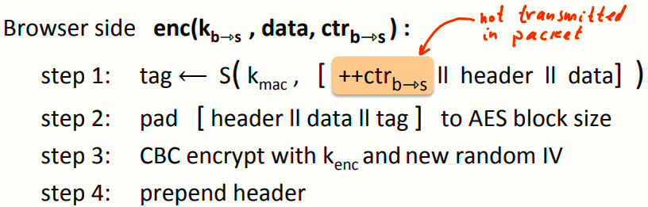

 # W4 7-5 Case study: TLS 

## 1、The TLS Record Protocol (TLS 1.2)

TLS协议中用于数据加密的协议为TLS记录协议，每个记录包含一个首部和其加密的数据，模型如下

TLS使用单向密钥，表明C到S和S到C的消息是不同的密钥，即解密C来的消息和加密发送给C的消息是两个不同的密钥，两个密钥均由TLS密钥交换协议生成

有状态的加密：对于每个数据包的加密，服务器和客户端内部均维护一个特定的状态，即一对64 bits的计数器，服务器和客户端各一对，会话开始时初始化为0，每当发送或收到一个数据包计数器+1，这两个计数器可以记录两端的流量

计数器的主要目的：防止重放攻击

## 2、TLS record: encryption

套件使用 AES-CBC加密，HMAC-SHA-1生成MAC

以客户端为例，密钥k(b⇾s) 包含两个子密钥，分别用于生成MAC和加密使用，同样由TLS密钥交换协议生成

TLS包如上图右侧所示，以客户端为例，加密算法接收三个输入（C到S的密钥，数据，计数器当前状态），具体分下述几个步骤

1. tag生成：生成算法接收k-mac密钥，计数器状态，首部，数据作为输入，其中计数器状态仅作为tag生成的输入，实际上不传输（双方均维护计数器状态）

2. 数据扩展：将数据扩展为AES块的整数倍

3. 加密：用k-enc子密钥加密，并使用一个新的随机IV

4. 添加首部：添加首部（明文）

可以看到，TLS采用MAC-then-Enc模式，但加入了一些小小的改进，即在MAC中加入了计数器的状态，从而可以有效防止重放攻击

## 3、TLS record: decryption

以服务器端为例，解密算法接收三个输入（C到S的密钥，数据，计数器），具体步骤如下：

1. 解密：使用k-enc解密记录中的数据部分
2. 检查扩展：检查数据扩展部分是否合法，若不合法返回错误MAC记录信息并终止连接
3. 检查tag：tag错误同样返回错误MAC记录信息并终止连接

其中bad_record_mac意味着输出bottom元素，即TLS记录协议提供AE，且一旦错误就发出非法信息，攻击者无法得知具体是由什么原因导致的错误

上述步骤全部执行完毕且正确后，将首部和扩展去除，从而得到明文消息

如果攻击者在一段时间后进行重放，由于每条消息的计数器的值仅会出现一次，因此旧的消息的MAC包含了旧的计数器的状态，若使用重放攻击，会导致MAC检查时不通过（不是期望的计数器状态）

##  4、Bugs in older versions (prior to TLS 1.1)

TLS早期版本存在的一些缺陷

（1）可预测的IV（链式IV）：在TLS 1.0或更早，下一条记录的IV是上一条密文的最后一块，导致若攻击者可以获取当前记录，就可以知道下一条记录使用的IV，从而打破上一条记录的语义安全

该缺陷在CPA下不安全，由于这个缺陷导致的非语义安全，有更强力的攻击（BEAST attack）可以破解TLS记录的开始部分

这个缺陷在1.1版本改为使用随机的不可预测的IV代替链式IV

（2）填充提示：在TLS 1.0或更早版本中，如果密文被拒绝时，如果是无效的填充部分，服务器会发送警告消息表示解密失败，如果是MAC不正确则返回MAC不正确警告

攻击者可以通过观察服务器返回的警告信息来分辨密文中填充部分是否有效，从而导致填充攻击，TLS 1.1中改为了解密失败也会返回MAC不正确，攻击者无法分辨为何错误

小知识：一般的网络协议，如ICMP、HTTP等，会携带一些控制信息，希望通信双方都能知道产生错误的原因，但在密码学的应用中，若解释了导致失败的原因则大概率会留下被攻击的漏洞，最简单的做法就是出错了直接拒绝，但不解释原因

## 5、802.11b WEP: how not to do it

802.11b WEP，一个蹩脚的协议，做错了几乎所有的事情，且不提供AE，模型如下

工作流程：笔记本连上接入点后，若要发送消息给接入点，需要计算该消息的一个CRC并附在消息后面，之后使用流密码（RC4）处理消息，密钥为每个包都不同的IV和长期不变的key k

存在的问题：

* 若IV重复的话可以进行二次密码本攻击
* 如果仅仅是IV变化而k不变的话，PRG的密钥彼此非常相似，导致不安全，从而导致WEP不安全

## 6、Leaking the length

TLS首部会泄露TLS记录的长度，从而可以推断出网络流量

对于许多网络应用而言，泄露数据包长度意味着泄露敏感信息：

* 税务相关网站：长度表示申报表的类型，从而泄露用户收入信息
* 健康相关网站：长度泄露了用户查阅的文件页数
* 谷歌地图：长度泄露了查询请求的信息

## 7、Active attacks

CRC的特点：线性的，意味着若给定一个消息m的CRC，要求计算m⨁p的CRC，只需要计算一个函数F(p)，然后将其与m的CRC异或即可

假定一个数据包的目的地是AP，该包目的端口为80，且攻击者也知道该包需要发至端口80，攻击者希望修改端口为25以读取该包内容

构造如上数据包，XX=25⨁80，并构造F(XX)，通过上述公式修正原数据包的CRC，由于流密码的特性，解密时会将原来的80修改为25，且CRC校验不会发生错误（即便是CRC被加密了，也可以通过异或XX对应的F函数处理后的密文即可）

上述攻击表明，攻击者即便不知道CRC的值也可以利用其线性特性对其攻击，因此CRC并没有提供完整性以对抗一些攻击，且CRC不应使用在有完整性机制的方案中，完整性需要MAC来提供而非一个自组织的机制（比如CRC）