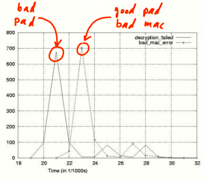
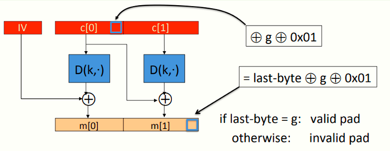
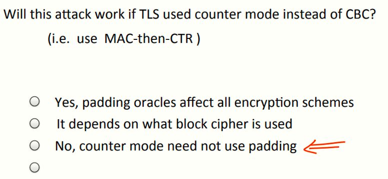

# W4 7-6 CBC paddings attacks 

## 1、Recap

Authenticated encryption：提供CPA安全和密文完整性

* 确保在活跃的攻击者下的保密性
* 确保不能再不被发觉的情况下修改密文内容

常用标准：GCM、CCM、EAX

常用方案：Enc-then-MAC

## 2、The TLS record protocol (CBC encryption)

上一讲提到，早期的TLS在解密中可能会产生两种不同的错误（填充错误或MAC错误）

若攻击者截获一条密文并尝试破解，他可以将这个数据包原样提交给服务器，服务器解密后如果出现了不同的警告，攻击者就可以知道加密的密文中最后几个字节是否是有效的填充（如果不是则会返回填充错误，如果填充正确则会返回MAC错误），因此导致攻击

## 3、Padding oracle via timing OpenSSL

旧版本TLS存在上述缺陷从而导致攻击，SSL通过返回相同的错误类型防止攻击者从错误提示中得到信息

Brice Canvel和他的小伙伴发现了一个攻击（OpenSSL 0.9.7a中修复），攻击如下

Canvel团队发现TLS解密先解密记录，检查填充，如果填充无效则终止解密并生成错误信息，如果填充有效则检查MAC，MAC错误则生成错误信息，两个错误信息生成的间隔可能导致时序攻击，如图说是

若填充错误，则错误信息生成的更快，而MAC错误导致的错误信息需要花费稍长时间，即便是返回同样的错误信息，攻击者观察生成错误的时间还是可以知道具体是哪种错误

## 4、Using a padding oracle (CBC encryption)

假设攻击者有密文c = (c[0], c[1], c[2]) ，且希望获取明文m[1]，假设使用CBC模式，有如下模型

其中g为猜测m[1]的最后一字节，将c[0]的最后一个字节xor g xor 0x01，则根据CBC模型，解密后得到的m[1]的最后一个字节为原本的最后一个字节与g和1的xor，即= last-byte ⨁ g ⨁ 0x01，若猜对了，即last-byte==g，则解密后的最后一字节应该为0x01，且为正确的填充

利用这个机制，攻击者向填充算法提交( IV, c'[0], c[1] ) ，最多尝试256次后可以知道m[1]的最后一字节的信息，并且通过将0x01替换为(0x02,0x02)，同理可以获得第二字节的信息，分组为16字节，最多需要16*256次即可得到分组全部明文信息

## 5、IMAP over TLS 

上述攻击的问题在于，TLS在收到无效的填充或MAC时会直接终止连接并协商一个新的密钥来继续，攻击者此时只能得到上一个密钥加密的密文且该密钥不会再使用，因此上述攻击虽然泄露了一些明文信息（m[1]的最后一字节），但是没有完全泄露所有信息

但是IMAP协议（通常运行在TLS上），客户端会每5分钟向服务器检查是否有新的邮件，检查邮件需要登陆服务器并发送一条包含账号和口令的信息，这意味着攻击者每5分钟就会收到同一条消息的加密

假设口令只有八个字节，即便是每次只能猜一个字节，攻击者也可以在几个小时内搞定口令

## 6、总结

* TLS如果采用了Enc-then-MAC而不是MAC-then-Enc可以避免这个问题，因为MAC会先检查，若MAC检查未通过则直接丢弃密文
* MAC-then-CBC提供AE，但填充提示的机制破坏了AE机制

## 7、例题

如果TLS使用CTR代替CBC，且仍使用MAC-then-Enc，上述攻击是否还有效？

不会，CTR模式不需要填充