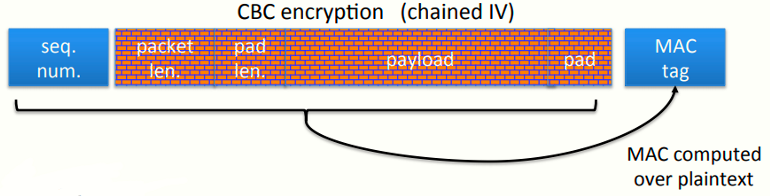
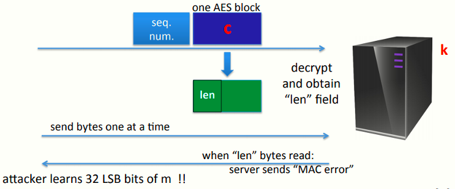
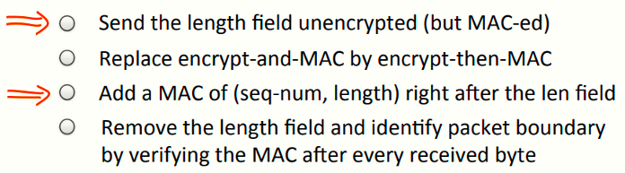
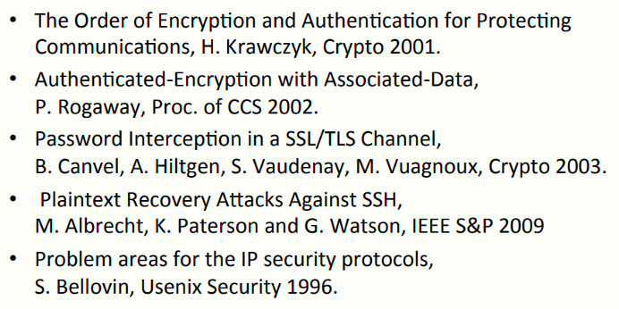

 # W4 7-7 Attacing non-atomic decryption

## 1、SSH Binary Packet Protocol

SSH二元数据包协议，用于SSH的客户端与服务端进行密钥交换的阶段，和前两节提到的一样，使用Enc-and-MAC方案，协议包如下（红色部分为加密数据）

协议数据包包含序列号、数据包长度、填充长度、载荷、填充、MAC六项

图中的红色部分采用CBC加密且使用链式IV，根据前几节的内容，链式IV在CPA下不安全

注意到MAC计算的是明文消息的MAC而非密文消息，由于MAC没有保密性要求，传输明文消息的MAC可能会暴露明文消息的一些内容

以上都不是重点，下面的攻击才是，在此之前先看看SSH的解密流程：

1. 服务器先单独解密数据包长度字段
2. 根据1中解密的字段，从网络中读取特定数量的数据
3. 解密读取到的剩余部分
4. 检查MAC，若MAC错误则发送错误消息

分析：注意到数据包长度部分，解密后没有任何的验证并直接决定了读取的数据的长度，实际上由于还没有恢复整个数据包，因此无法检查MAC的正确性，但SSH在验证MAC之前就使用了这个长度字段，从而导致一个攻击

## 2、An attack on the enc. length field (simplified)

简化的攻击流程：假设攻击者截获了一块直接由AES加密的消息块c = AES(k, m) （该消息长度只有1 AES块），并期望解密出m，模型如下

攻击者会给服务器发送一个正常启动的数据包，并在内注入截获的密文，将其作为发送到服务器的第一个密文块

服务器会解密这个包的前几个字节以获取数据包长度，并在检验MAC前，根据这个长度接收数据

攻击者要做的是，每次给服务器发一个字节，发一个服务器读一个，然后再发再读，直到服务器读取指定长度的数据并检验MAC

攻击者只需要发送垃圾数据，由于垃圾数据一定不会通过MAC验证，攻击者计算发送给到服务器的字节数，一旦等待到服务器返回MAC错误信息时，就可以知道服务器在发送MAC错误信息前接收了多少字节，即知道了密文C的前32 bits所对应的明文（数据长度字段占4字节）

## 3、总结

SSH的问题在于：

* 解密操作的非原子性：解密算法并没有以整个数据包作为输入并输出完整的明文（或者拒绝），而是分阶段的解密数据包的不同部分，非原子性的操作在加解密过程相当危险，SSH中的非原子性破环了AE
* 验证前使用：数据长度字段还未经过验证就直接使用，若要使用则应该先验证

例题：若重新设计SSH，应该做出什么最小的改变（多选）

1. 可以向TLS一样将长度以明文发送，至少攻击者无法发起CCA
2. 替换更好的加密方案没用，数据长度字段仍然会在验证前被使用
3. 在数据包长度后面添加一个seq和length的MAC，读取完length后会检查其有效性
4. 检查数据包边界，理论上可行，实际上很容易被DDOS

## 4、教训

* 永远不要实现或设计自己的AE系统，使用GCM之类的标准

* 若因为某些原因不使用标准而必须自己实现，并使用Enc-then-MAC方案，确保不要导致上述错误，即验证前使用

5、推荐几篇论文

1. 讨论了加密和验证的顺序问题
2. 讨论了OCB模式，一种非常有效的建立AE的方法，其中讨论了OCB的一个变体

后三个时针对文件的攻击，#3讨论了上一节的填充提示，#4讨论本节的长度攻击，#5讨论了针对加密的攻击，这些攻击仅讨论CPA安全，而未加入完整性

3. 中提供了一些很好的例子来说明为什么CPA安全性本身不应被用于加密，唯一允许使用的时经过身份验证的加密以确保机密性，或者无需机密性只需完整性可以使用MAC