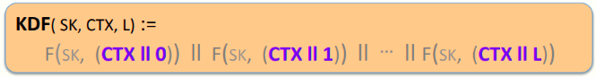
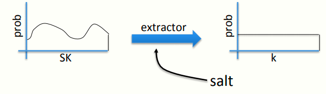

 # W4 8-1 Key Derivation

## 1、Deriving many keys from one

实际使用时，经常会出现由一个密钥推导出多个密钥的场景

典型场景：源密钥（source key，SK）来自于某些硬件随机数生成器，或来源于密钥交换协议

实际上，为了确保会话安全，需要多个密钥（如TLS中不同方向的数据采用不同的密钥，每个方向又分为加密密钥和MAC密钥和IV），基于nonce的CBC加密也需要多个密钥

目标：通过一个源密钥生成多个密钥，即SK→k~1~，k~2~，k~3~，……

方式：Key Derivation Function，KDF

## 2、When source key is uniform

有一安全PRF F，其密钥空间为K，输出空间为{0,1}^n^

假设SK为密钥空间K中一致的（？）随机密钥，则定义KDF如下

接受三个输入：

* SK：来自于PRF F 
* CTX：一个唯一标识应用程序的字符串，如果说系统中跑了很多程序且需要生成各自的密钥，CTX可以用于区分这些，即便使用同一个SK这些程序也能生成不同的密钥
* L：length，一个长度

KDF会计算0的PRF、1的PRF、……L的PRF，之后用这些输出的一些位作为想要生成的密钥

## 3、What if source key is not uniform

如果SK不是一致的，则PRF的输出其实看起来并不随机，攻击者可以预测一些密钥并攻击会话

SK不是一致的的原因：

* 密钥交换协议通常会生成一个高熵密钥（high entropy key），但这个高熵密钥实际上只是密钥空间的一个子集
* 使用的硬件随机数生成器也可能会生成高熵字符串

## 4、Extract-then-Expand paradigm

需要一些手段来解决上述问题，从而引出构造KDF的模式，即提取扩展模式，步骤如下

1. 从实际的SK中提取一个伪随机密钥：从图中来看的话SK并没有被均匀的分不到密钥空间中，需要使用提取器将他均匀分布到密钥空间，提取器不一定产生均匀分布的输出，但生成的分布与均匀分布不可区分

   提取器会输入一个盐（salt），目的是捣乱，无论输入的分布如何，输出分布依然与随机分布不可区分

   盐是一个固定的值，无需保密可以公开，但是得确保是随机的

   盐是用来防御可能会干扰提取器的恶意的坏的分布

2. 使用PRF扩展k至更多的位，直至满足会话密钥的需要

## 5、HKDF: a KDF from HMAC

HDKF：密钥的提取和扩展均使用HMAC

提取步骤：k ⟵ HMAC( salt, SK )，其中salt作为HMAC的key，SK作为HMAC的数据

扩展步骤：用HMAC作为PRF生成需要的尽可能多的位

总结：若获得了一个源密钥（无论来自硬件还是密钥交换协议），都不应该将源密钥直接用于会话密钥，需要输入KDF中并获得需要的密钥

## 6、Password-Based KDF (PBKDF)

从口令中提取密钥，由于口令通常有较低的熵，不能直接用HKDF，如果用了会很容易遭到字典攻击

PBKDF抵御低熵的方式：盐和慢hash函数

慢hash函数H^c^(pwd ll salt): 接受盐和口令作为输入，输出一个密钥，实际上是将该ahsh函数迭代c次，如c=一百万，使得攻击者对密钥的猜测更困难

相关标准：PKCS#5 (PBKDF1)