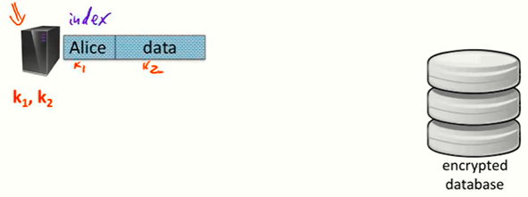
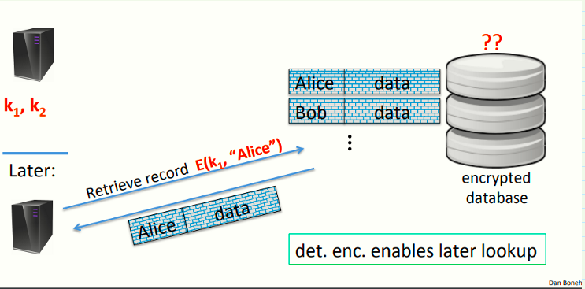
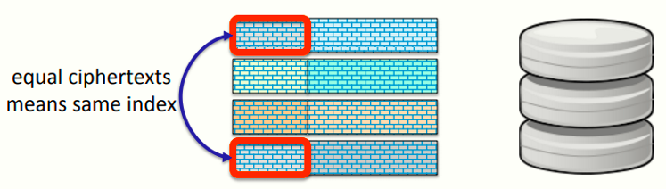
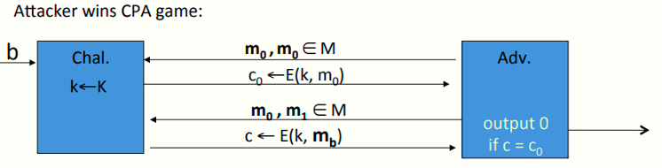
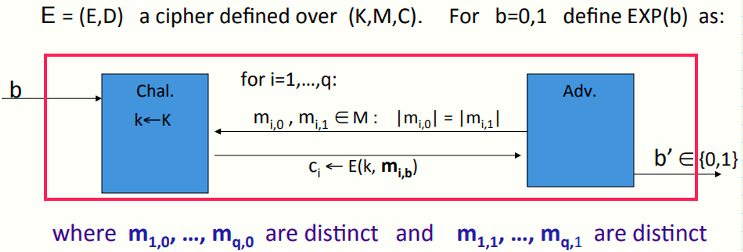
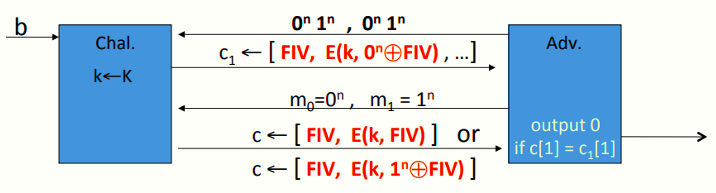
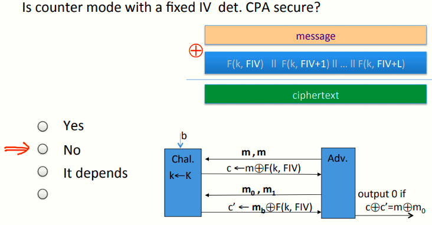

 # W4 8-2 Deterministic Encryption

确定性加密系统：永远将特定消息转换成完全相同的密文的加密系统，比如对同一消息加密三次，每次都会得到完全相同的密文（不涉及nonce）

## 1、The need for det. Encryption (no nonce) 

假设有一个在加密数据库中存储信息的服务器，每条记录都有一个索引及在记录中保存的数据，服务器会加密这个记录，如图所示

注意到索引用k~1~加密，记录用k~2~加密，然后将加密的记录发送至数据库

一段时间后服务器想从数据库中检索记录时，服务器只需要向数据库发送服务器感兴趣的索引的加密，由于加密是确定性的，因此索引加密后生成的密文与之前的一样，从而可以在数据库中找到这个索引并向服务器返回结果

## 2、Problem: det. enc. cannot be CPA secure

优点：数据库对于存储于其中的数据完全不知情，因为服务器发送的是对加密索引的请求，数据库甚至不了解服务器检索了哪些记录

缺点：确定性加密没有CPA安全，因为攻击者可以查看各种密文，如果其发现了两条相同的密文，意味着其对应的明文也一定相同

若消息空间M很小的话，会导致攻击，换句话说，如果两个记录在索引位置正好有相同的密文，那么他就知道这两条记录对应着同一个索引

以形式化的方式说明确定性加密不能做到CPA安全，即攻击者可以以某些方式赢得CPA游戏，具体如下

首先，攻击者发送两个相同的消息m~0~，在以往的CPA游戏中，攻击者会得到其发送的左边或右边的消息对应的密文，但由于本次他发送的为两条相同的消息，因此一定会得到m~0~的密文

下一步将发送消息m~0~和m~1~，并得到其中一个的密文，由于采用的是确定性算法，因此在新发起的挑战中，m~0~的密文不会改变，攻击者只要检查收到的密文是否等于上一次挑战的c~0~即可，若不等于则说明收到了m~1~的密文c~1~，即攻击者的优势为1

## 3、A solution: the case of unique messages 

解决方案：限制被同一密钥加密的消息种类

假设加密方永远不会使用同一密钥加密相同的消息，即密钥和消息的配对总是不同且用不重复，则对于每一次加密，则有消息变化、密钥变化，或者都会变化，但是不会用同一密钥加密同一消息两次

实际上这个事件很容易实现，若加密者在很大的消息空间内随机选择消息，且消息结构确保为某些特定结构

回到数据库的例子，假设加密的用户ID全是互不相同的，则每个索引均对应一个唯一的用户ID，在数据库中仅有一条记录，从而消息永远不会重复

## 4、Deterministic CPA security

有了消息不会重复的条件，就可以定义安全性了

记E = (E,D)为一定义在三元组(K,M,C)上的密码，K、M、C分别为密钥空间、消息空间、密文空间，记两个实验EXP(b)，有如下模型

和标准的CPA安全模型几乎一致，但是需要额外注意的是，若攻击者总是得到左侧消息的密文（即实验0），则左侧的消息需要互不相同，即永远不能两次得到相同消息的密文，右侧的消息同理，因此攻击者永远不会得到用特定密钥多次加密相同消息的情况（因此上面的第2点中讲的攻击模型并不是一个标准的确定性CPA模型，该模型中攻击者收到了同一消息的多次加密）

除了额外注意的点，其他和CPA安全一样，因此有如下定义

定义：若E为在确定性CPA下语义安全的密码，则其对所有高效攻击者A，其如下优势可忽略
$$
Adv_{dCPA}[A,E] \ = \ | \ Pr[EXP(0)=1]\ - \ Pr[EXP(1)=1] \ | \ \leq negligible
$$

## 5、A Common Mistake

需要注意的是，使用固定IV的CBC模式并不是确定性CPA安全的

记E: K × {0,1}^n^ ⟶ {0,1}^n^为一使用CBC模式的安全PRP，具体模型如下

首先攻击者构造两个相同的数据，包含两块，均为前n bits（第一块）为0，后n bits（第二块）为1

之后攻击者收到对该消息的加密，包含固定的IF，第一块的加密，第二块的加密等等

随后攻击者再构造两个长度为一块的消息，一个为全0另一个全1，随后发送给挑战者，挑战者返回的密文有两种可能：

* 若挑战者选择m~0~加密，则其返回的结果为FIV的加密
* 若挑战者选择m~1~加密，则其返回的结果为1^n^⨁FIV的加密

此时攻击者只需要判断收到的密文与第一次加密的第一块是否相等即可

总结：如果需要一致地加密数据库索引，不要使用固定IV的CBC模式

## 6、小练习

如果使用固定IV的CTR模式，方案是否为确定性CPA安全？

显然不是，因为这是一个一次性密码本，加密不同的消息会导致两次密码本