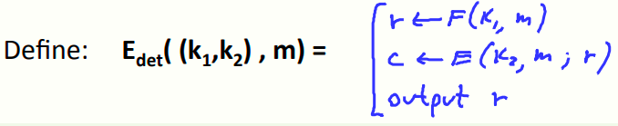
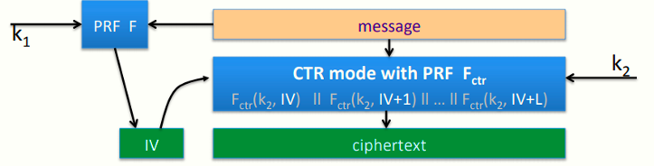
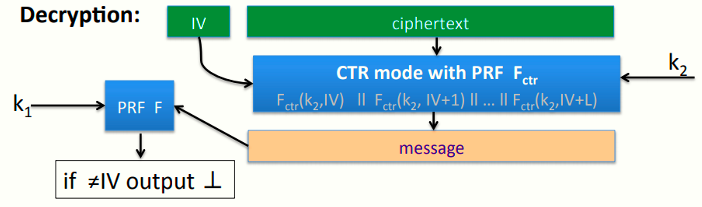
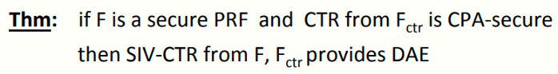
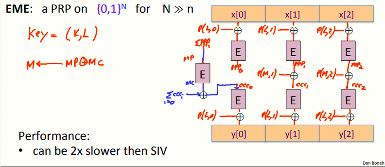
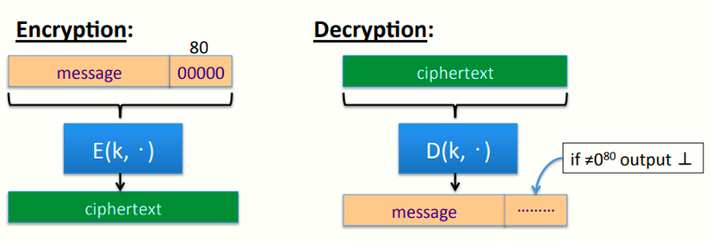
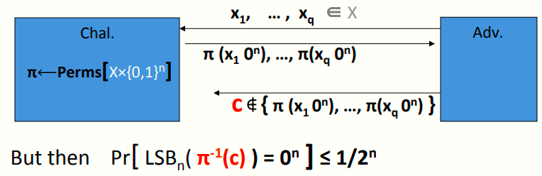

 # W4 8-3 Deterministic Encryption Constructions: SIV and wide PRP

## 1、Deterministic Encryption

上节课提到了确定性加密，如加密数据库索引时需要使用这种加密以确保写入数据库时的加密和之后的查询时的加密一致

问题在于，确定性加密在一般的CPA下是不安全的，因为若攻击者得到了两条一样的密文，则其可以知道对应的明文消息也一定一样

因此定义确定性CPA安全：只要加密同一消息不使用相同的密钥，即(key , msg) 是独一无二的，则方案是安全的

具体的形式化定义见上节课，本节给出确定性CPA安全的构造

## 2、Constructions 1：Synthetic IV （SIV）

记(E, D) 为一CPA安全加密，其中E(k,m,r) ⟶ c，k为密钥，m为消息，r为算法使用的随机性（即算法使用的随机字符串，若使用随机化CTR模式，则r为其对应的随机IV），c为密文

记F:K × M ⟶ R为一安全PRF，作用为在消息空间中接受任意消息并输出串R，可以作为CPA安全加密方案中的随机性，即上述的r实际上是R中的一个元素

定义SIV如下：

使用两个密钥k~1~和k~2~加密消息m，首先将伪随机函数F作用于消息m从而到处CPA安全加密方案E的随机性r，然后使用r对m进行加密得到c

定理：E~det~在确定性CPA下是语义安全的

证明：由于每条消息都是独立的，因此经过伪随机函数F时得到的自己字符串也都是不同的，因此CPA安全的加密方案E总是使用随机的字符串，由于这些r们（r's)和新的字符串是随机不可区分的，因此系统实际上是CPA安全的

SIV更适合用于短消息，当然也可以适用于长消息（如多个AES块的消息），更牛的是SIV可以白嫖一个密文完整性，即不必使用特殊MAC，SIV有一个内置的完整性机制

## 3、Ensuring ciphertext integrity 

目标：实现确定性认证加密（DAE，deterministic authenticated encryption），即同时实现确定性CPA安全和密文完整性

考虑SIV的一个特例，SIV-CTR，即加密使用随机IV的CTR模式，模型如下

然后看一下解密

首先解密算法接受IV和密文作为输入，使用IV解密得到明文，然后将明文作为随机函数F的输入，若消息合法，则F的输出应当与IV相同，否则输出bottom元素

定理：若F为一安全PRF，且来自F-CTR的CTR为CPA安全的，则由F和F-CTR组成的SIV-CTR提供DAE

## 4、Construction 2: just use a PRP

另一个简单的做法是直接用PRP（PRP和真随机可逆函数是不可区分的）

记(E, D)为一安全PRP，E: K × X ⟶ X

定理：(E, D)为确定性CPA下语义安全的

证明：记f: X ⟶ X为一真随机可逆函数，确定性CPA博弈中，对于实验0，所有左侧消息均不同，因此攻击者得到X中的q个不同的随机值，对于实验1，看到右侧的消息，由于两个实验对应的两个分布是相同的，因此无法区分实验0或实验1，因此直接使用PRP加密是确定性CPA安全的

因此如果想加密短消息（如一些少于16字节的消息），可以直接用AES且是安全的，即如果索引小于16字节时，不妨直接使用AES，但是需要注意的是这并不提供完整性

## 5、EME: constructing a wide block PRP

那如果消息比16字节长咋办？可以用SIV。但是如果还是想用PRP咋办

在之前的学习中，介绍了用小的消息空间的PRF构造了一个具有大的消息空间的PRF，本节介绍一个小的消息空间的PRF构造了一个具有大的消息空间的PRP，具体做法如下

记(E, D) 为一安全PRP，E: K × {0,1}^n^ ⟶ {0,1}^n^

EME模式：构造一个PRP，在N bits块上运行，且N比n大得多得多，可以允许我们对比16字节大得多的消息进行确定性加密

EME模型如下图

EME使用K和L两个密钥（但实际上L是由K派生而来的）

1. 首先将输入消息X分块，然后使用特定的填充函数对各个块异或，将异或结果作为加密算法E的输入，记输出的块为PPP~i~
2. 然后将所有的PPP们全部异或起来，结果记为MP
3. 利用密钥k对MP进行加密，输出记为MC
4. 然后计算M=MP⨁MC
5. 利用M作为填充函数的输入，得到另一个填充，并与PPP们进行xor计算，得到输出ccc~i~
6. 将所有的ccc们全部异或起来，得到ccc~0~
7. 将ccc们作为E的输入，输出和填充函数P的输出再异或一次，得到密文

其中填充函数P为一固定的简单函数，执行仅需要非常短暂的时间

可以证明的是，若E为一安全的PRP，则EME结构也是一个安全的PRP

EME的优点在于其结构非常平行，即便看上去很复杂，但是确实可以并行加密，适用于多核处理器，效率大约是SIV的一半，因此比较适合加密短消息，而长消息选择SIV更好

## 6、PRP-based Det. Authenticated Enc.

如果想给这个基于PRP的机制添加完整性，是否可以使用PRP机制实现确定性认证加密？答可以，而且非常简单，方法如下

首先在原本需要加密的消息后附上好多的0（比如说80个0），然后直接用PRP加密得到密文，解密时只需要查看明文后面的80 bits是否全为0即可，若不全为0则输出bottom

记(E, D)为一安全PRP，E: K × (X×{0,1}^n^) ⟶ X×{0,1}^n^

定理：若1/2^n^为一可忽略的数，则基于PRP的加密提供确定性认证加密

证明思路：游戏模型如下图

假设挑战者选择的是真随机置换（truly random permutation）并且输入空间为原消息空间再串联n个0，攻击者发送q个消息并收到q个消息拼接上n bits 0的加密

此时，若攻击者想要生成一个新的密文C，且C不属于收到的任何一个密文，并且期望C能够正确解密（即解密结果的最后n bits为全0），其概率小于等于1/2^n^