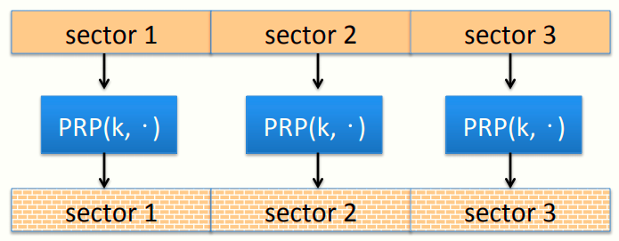
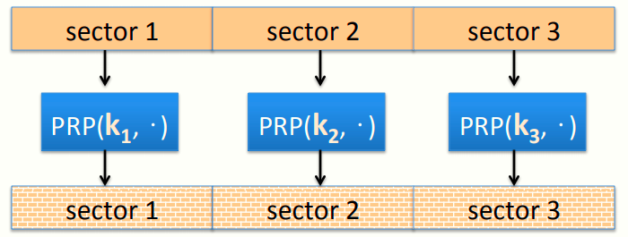
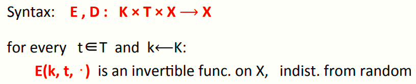
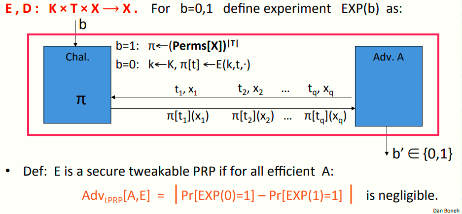
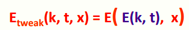
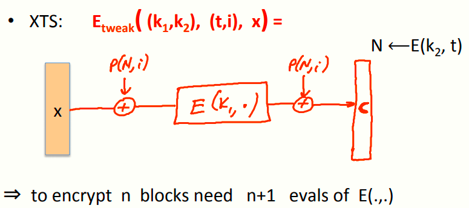
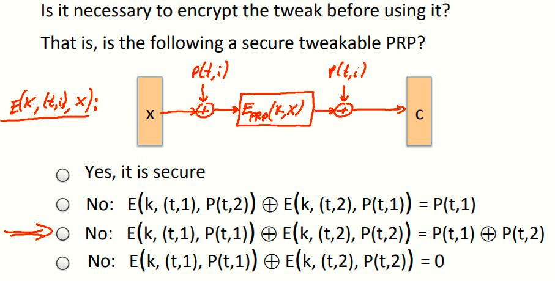
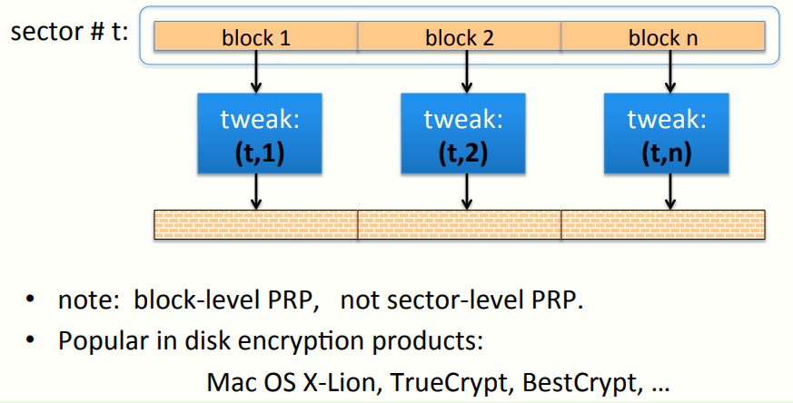

# W4 8-4 Tweakable encryption 

## 1、Disk encryption: no expansion

假设需要加密磁盘上的扇区，每个扇区大小为4KB，因此密文也必须为4KB，如果密文比明文长则没有额外的空间存储密文

目标：实现一个非扩展加密，即明文与密文大小相同

由于加密不能扩展，意味着消息空间等于密文空间，显然必须使用确定性加密（如果加密是随机的，没有额外的空间存储随机性，也没有存储完整性的空间，因为不能扩展密文并加入完整性需要的位），因此可达的最多是确定性CPA安全

引理：如果(E, D)为一确定性CPA安全加密，且有M=C（明文空间=密文空间），则(E, D)为一PRP

使用PRP加密，结构如下

如果使用相同的置换P和同一个密钥k加密所有扇区，会导致和ECB模式同样的问题，即相同内容的扇区或包含相同内容的扇区会加密成相同的密文，磁盘中存在大量的空扇区（空扇区可能全被置0），则导致所有的空扇区都被加密成相同的密文

更好的做法是不同的扇区采用不同的密钥，如上图所示，可以解决上述信息泄露问题，但是仍然存在问题

如果用户期望修改扇区中的某一位，由于使用的是伪随机置换，因此修改后的扇区会生成全新的随机密文，如果用户之后撤销修改并恢复到原始扇区，则密文也会恢复到原来的密文，此时攻击者可以判断用户对该扇区进行了修改而后又恢复了修改，因此还是存在信息泄露

实际上这种信息泄露在不牺牲性能的情况下无法做到，因此将这种泄露视为可接受的

随着存储设备的容量越来越大，采用上述方案的话也会导致密钥很多，密钥管理不方便，有一个解决办法是采用PRF和一个主密钥k，通过PRF生成每个子密钥k-t= PRF(k, t) ，其中t为扇区号，从而避免了管理大量的密钥

## 2、Tweakable block ciphers

上述方案需要用到PRF，能否做到更好？答能，接下来引入了一个可调整的分组密码的概念

目标：期望用一个主密钥k∈K，派生出很多的PRP

记E , D : K × T × X ⟶ X，其中K为密钥空间，X为消息空间，T为调整空间（Tweak space），然后输出空间为X

对于每一个微调t∈T和给定的密钥k，E(k, t, ⋅) 是X上的一个可逆函数，且由于密钥k是随机的，因此函数实际上与随机函数没有区别，即对于每个微调，我们可以得到由X到X的独立PRP

在上一节的磁盘加密方案中，采用扇区号作为微调，从而对于每个扇区都有独立的PRP

形式化定义如下

和以前一样，挑战者定义两个实验，具体如下

* 实验1：选择一个真随机置换的集合，该集合是与微调数目一样多的置换（注意到|T|写在了指数的位置）
* 实验0：选择一个随机密钥k，并根据微调空间里的微调定义置换集合π[t] ←E(k,t,⋅) 

定义：若E为一安全的微调PRP，则其对所有高效的攻击者A，其上述优势可忽略

上述模型中，攻击者需要做的是提交至多q个不同的查询，每个查询包含一个微调t和消息x，挑战者会返回使用该微调置换后的x，并区分是真随机还是伪随机置换，如果做不到则说明可调整的分组密码是安全的

和前几章提到的分组密码不同的是，常规的分组密码需要判断单独的查询是否是伪随机还是真随机置换，即只能和一个置换互动并区分真伪随即置换，而上述可微调的分组密码需要和|T|个随机置换互动，并区分真伪

## 3、Example 1: the trivial construction

来看一个简单的例子，记(E,D) 为一安全PRP，E: K × X ⟶ X，假设密钥空间等于消息空间，即K=X，也即实际上E: X × X ⟶ X，定义可调整块如下

首先使用主密钥k加密调整值得到随机密钥，然后使用生成的随机密钥加密数据

需要注意的是，每一块数据的加密需要使用E两次，若有N块数据则需要调用2N次E

## 4、Example 2: the XTS tweakable block cipher

接下来是一个更好的例子XTS（最早基于XEX）

记(E,D) 为一安全PRP,E: K × {0,1}^n^ ⟶ {0,1}^n^，其中E为一常规分组密码，期望用常规分组密码构造一个可调整分组密码，方案如下

XTS接受两个密钥作为输入，调整由两个值组成，t为微调值，i为索引值，x为一n bits字符串，步骤如下

1. 使用密钥k~2~对t加密，结果记为N
2. 将N和索引i作为扩展函数P的输入，其输出结果与消息x进行xor计算
3. 将步骤2中的计算结果使用密钥k~1~加密
4. 将步骤3的结果再与P的结果进行一次xor计算，最终得到密文

注意到生成N的过程调用了一次E，而每块消息的加密需要调用一次E，因此加密N块消息需要调用N+1次E

有个问题：在使用微调前对其进行加密是否是必要的？若有下述方案，则其是否是安全的可调整PRP？

显然不是，如果不加密的话，相当于E(k,(t,i),x)，则扩展函数P直接将t和i作为输入

而此时若输入消息x为P(t,1)，则其在第一次xor计算后结果为全0，无论加密结果是什么，其最终得到的密文为c0⨁P(t,1)，若消息x为P(t,2),同理可得最终密文为c0⨁P(t,2)，两个密文异或在一起可以消除c0从而得到P(t,1) ⨁ P(t,2)

## 5、Disk encryption using XTS

磁盘中使用XTS的例子

需要注意的是，上图是针对某一扇区的方案，对该扇区的数据进行分块，每一分块都有自己独立的PRP，因此只是块级（block level）不是扇区级（sector level），但是这个方案实际上在块级提供了确定性CPA加密

最下面一行是常用的磁盘加密方案

## 6、Summary

* 如果需要由一个密钥导出多个独立的PRP，可调整的加密是个有用的选择
* XTS比上面那个简化的方案更有效，但是两者都是窄块方案（narrow block），即都是采用16字节的AES
* 上一讲中提到的EME是一种宽块的可微调方案，但是需要调用两次E，所以需要加密的块很多时，其效率为XTS一半