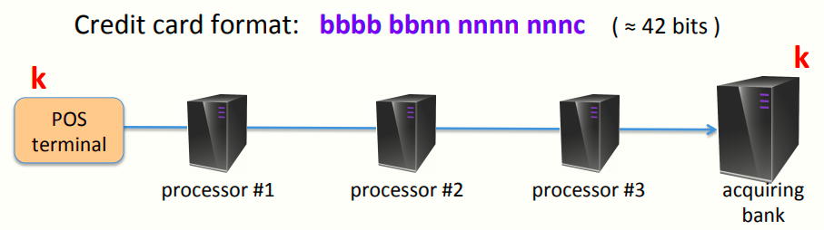
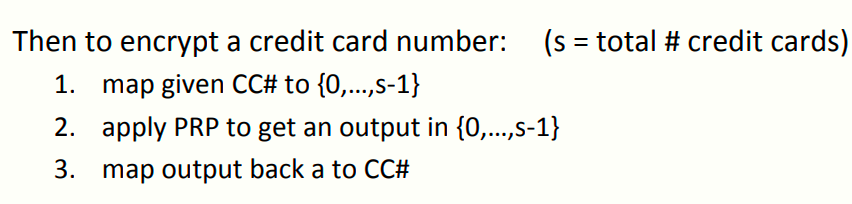
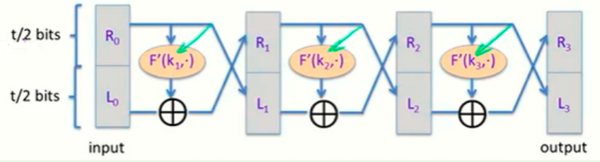
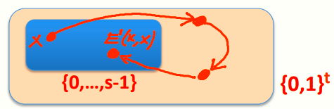
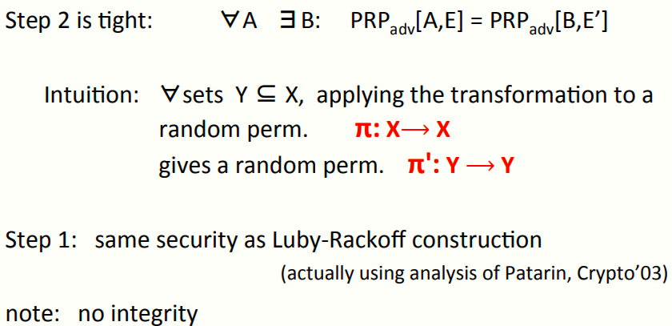
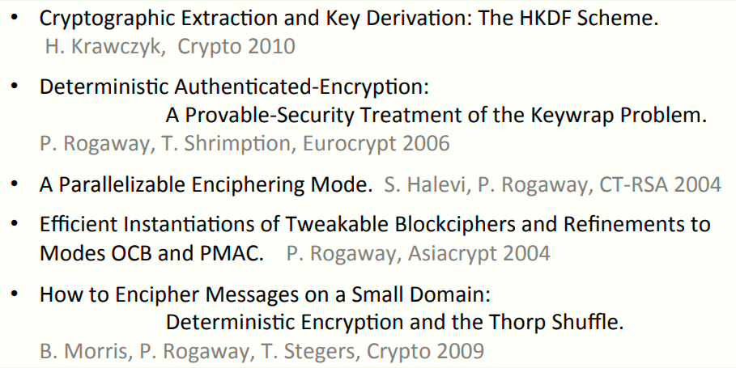

# W4 8-5 Format preserving encryption 

保留格式的加密，实际中也很常用的方案（比如加密信用卡）

## 1、Encrypting credit card numbers

外国银行卡号为16位数字（四组四位数，大约是2^42种可能的卡号）

有些时候，加密信息会经过很多中间节点（比如上图所示的三个）并最终到达银行，每个中间节点都可能获取一些信息

目标：端到端加密，即中间节点期望得到信用卡号，因此对信用卡号的加密要看起来像一个合法的信用卡号（哈？）

## 2、Format preserving encryption (FPE)

保留格式的加密FPE，更抽象化的说是，对于给定的0 < s ≤ 2^n^，通过安全的PRF F: K × {0,1}^n^ ⟶ {0,1}^n^,构造一个在{0,…,s-1}上的PRP（s为总数，对信用卡号而言，s大约是2^42^）

因此我们需要做的是输入一些PRF（如16byte-AES），然后缩小PRF的域使其适合需要加密的数据

有了上述结构，就可以用来加密信用卡号了，步骤如下

1. 将给定的信用卡号（CC#）映射至{0,…,s-1} 
2. 应用PRP来加密这个卡号
3. 将加密结果映射回卡号，使其看起来像个合法的卡号

需要注意的是，这仍然是一个非扩展的加密方案，只是将一个合法的卡号加密为另一个合法的卡号，具体步骤如下

## 3、Step 1: from {0,1}^n^ to {0,1}^t^

其中t<n，即将PRF从{0,1}^n^缩小至{0,1}^t^，t为2的幂次，需要使得2^t^最接近S，也就是他妈的找到一个t，满足这个不等式
$$
2^{t-1} \ <s\leq2^t
$$
方法：Luby-Rackoff结构，使用一种截断F'，F'具体如下图，对于t=42而言，将其截断到21 bits输出

上述方案的一种简单的方法是单独的使用AES，比如我们有一个21 bits输入，可以在后面加好多的0直至128 bits，然后作为AES的输入，得到的输出再截断位21 bits，Luby-Rackoff结构具体如下

三轮Luby-Rackoff如图所示，显然Luby-Rackoff采用了Feistel结构，然后在其内部采用了这个截断F'，并将一个安全的PRF转换为一个安全的PRP

注意到每个F'都使用了不同的密钥，实际上低轮次的Luby-Rackoff并不像其期望的那样好使，更好的办法是用七轮，同时意味着需要七个不同的密钥

## 4、Step 2: from {0,1}^t^ to {0,…,s-1} 

第一步中，得到了一个PRP (E,D): K × {0,1}^t^ ⟶ {0,1}^t^

记E'(k, x)，其中x ∈ {0,…,s-1}，令y=x，然后进行如下迭代：不断迭代计算y=E(k, y) 直到y∈ {0,…,s-1}，然后输出y

迭代过程有点类似这个简化图，蓝色区域代表{0,…,s-1}，浅黄色区域代表{0,1}^t^，然后不断使用E迭代计算直到他又回到蓝色区域，解密的话就这个红线反着走就是了（其实不断迭代不太准确，由于s是在那个范围的，所以就期望来说只需要两次迭代就可以了）

## 5、Security

构造讲完了，看看安全性

需要注意的是,Luby-Rackoff并不提供安全性

## 6、延伸阅读

