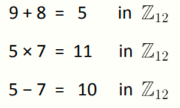
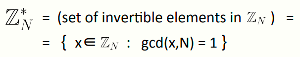
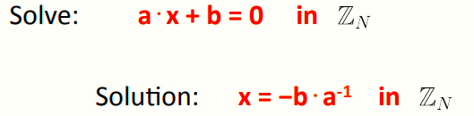

 # W5 10-1 Notation 

第十章主要讲一些数论知识，可能有点复杂，但是将要讨论基于数论的密钥交换协议

## 1、Background

我们可以用数论知识构建很多方案，如密钥交换协议、数字签名、公钥加密系统等等

## 2、Notation

先解释一些符号和记法

大写字母N：表示一个正整数

小写字母p：表示一个正素数

Z~N~：表示0~N-1组成的集合，可以对该集合内的元素做模N的加法和乘法

举个例子：模运算，若记N=12，则

注意加法和乘法都需要模N（本例中N=12）

部分加法与乘法的定律在Z~N~中仍然有效，如分配律，x⋅(y+z) = x⋅y + x⋅z

## 3、Greatest common divisor

最大公约数GCD

定义：对于整数x，y，记gcd(x, y) 为二者的最大公约数

最大公约数的一些性质：

* 对于任给的整数x，y，总是存在另两个整数a，b，满足a⋅x + b⋅y = gcd(x,y) ，即gcd(x, y)可以看作x和y的某种线性组合，a和b可以通过扩展欧式算法找到
* 若gcd(x,y)=1，则称x和y互素

## 4、Modular inversion

对于有理数而言，一个非零有理数有自己的倒数，如2的倒数为1/2，对于集合Z~N~而言，引入模逆概念

定义：Z~N~集合内的元素x的逆为该集合上的另一个元素y，且满足x·y=1，记y为x^-1^

对于Z~N~集合内的奇数a而言，其逆为（a+1）/2

 

这个Z~N~*，表示Z~N~所有可逆元素的集合，即所有x∈Zn，gcd(x,N) = 1

## 5、Solving modular linear equations

比如解决这种线性同余方程，本质就是找到a的逆，可以用扩展欧几里得找到，时间复杂度为O(n^2^) 