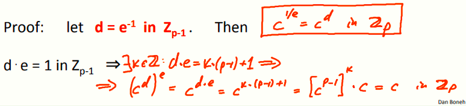
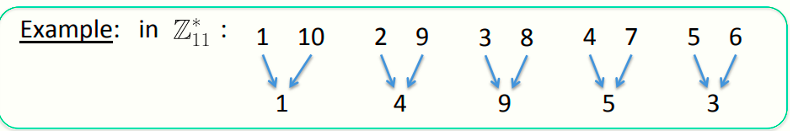
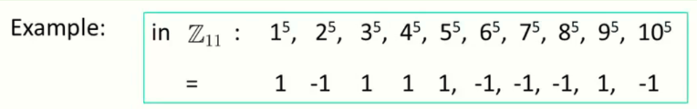
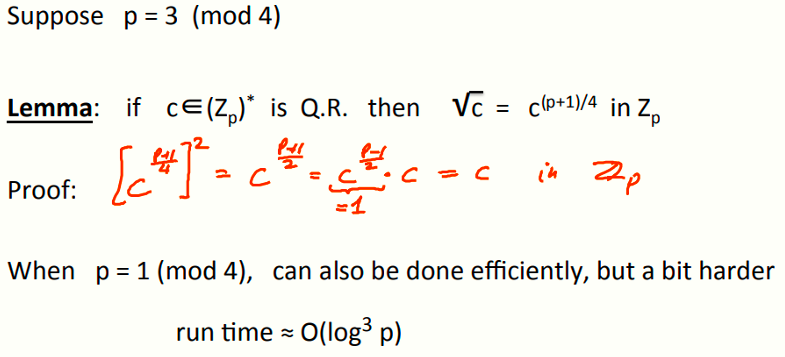
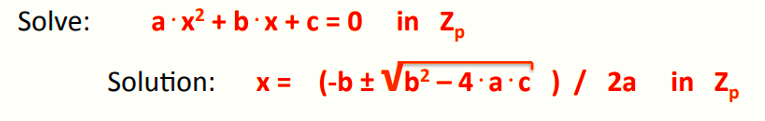

 # W5 10-3 Modular e'th roots

## 1、Modular e'th roots

上节课提到了怎么解线性同余方程，可以通过求逆元的方式解决

问题在于，有没有办法解决高次同余方程，如x^2^ – c=0,y^3^ – c=0,或者z^37^ – c=0之类的

假设p为一素数，c∈Z~p~ 

定义：x∈Z~p~，且满足x^e^ = c 在Zp内，称x为c模p的e次方根

比如，若p=11，则7的立方根为6（6^3^=216≡7 mod 11），3的立方根为5（5^2^=25≡3 mod 11），1的立方根为1，2在模11的情况下没有平方根

## 2、The easy case

c模p的e次方根何时存在？存在的情况下有没有高效的计算方法？

假设需要计算某数c的e次根，且gcd( e , p-1 ) = 1，则对于Z~p~*内的所有的c，c的e次根在Zp内，且有一种比较快速的方法找到这个根，方法如下

## 3、The case e=2: square roots 

另一个问题就是，e=2且p是奇素数的情况，此时e和p-1并不互素

问题在于，由x到x^2^的映射实际上是2对1函数（2-to-1 function ），x和-x都能映射到同一个x^2^，比如在p=11的情况下，会有如下所示

其中10和-1在p=11下同余，因此二者的平方都为1，其他数同理，因此引出二次剩余概念

定义：若x在Zp中存在平凡根，则称其为二次剩余（Quadratic Residue，Q.R.），否则为二次非剩余（Quadratic Nonresidue），当p为奇素数时，二次剩余的数量为(p-1)/2+1

## 4、Euler's theorem

给出一个Zp中的元素x，能否判断出有无平方根

定理：x为(Zp)*内的二次剩余，等价于x^[(p-1)/2]^≡1 mod p（p为奇素数，且x≠0）

p=11的例子，计算每个元素的(p-1)/2次幂，因此，只有1、3、4、5、9为模11的二次剩余，其他不是

定理只说了某个数是或者不是二次剩余，没说怎么计算某个数的平方根，即证明了其存在性，但是没说怎么计算平方根

勒让德符号（Legendre Symbol）：x^[(p-1)/2]^≡1 (mod p)的简写，=1为Q.R.，=-1为二次非剩余
$$
（\frac{a}{p})=\pm1\equiv a^{\frac{p-1}{2}}\ (mod \ p)
$$

## 5、Computing square roots mod p

如何计算模p（p为素数）的平方根？

分为两种情况

* 如果p≡3 (mod 4)，则√c =c^[(p+1)/4]^ （mod p）
* 如果p≡1 (mod 4)，没有确定性算法找到模平方根，但是随机性算法效率也还行，大约在O(log^3^p)

## 6、Solving quadratic equations mod p

计算二次同余方程，大致步骤和初中学的一元二次方程一样，前提是Zp中有平方根

需要指出的是，其中的分母2a可以用扩展欧几里得算法找到，√(b^2^ – 4⋅a⋅c)如果存在的话需要用到上面的找平方根的算法

## 7、Computing e'th roots mod N

计算某个数模N的e次根（N为合数），和之前的问题一样，这个e次根是否真的存在，又是否有高效的算法计算之

就目前已知而言，计算这个e次根和分解N一样难，因为需要分解N为若干个素因子，然后分别计算这个数对于每个素因子的e次根，然后再将这些结果合并，就可以得到模N的e次根